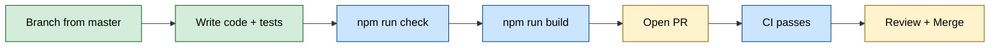

# 🤝 Contributing to Sage

Thanks for helping improve Sage! This guide covers the local workflow, expectations, and safety notes.

<p align="center">
  
</p>

---

## 📋 Quick Reference

| Action | Command |
| :--- | :--- |
| Install deps | `npm ci` |
| Onboard (recommended) | `npm run onboard` |
| Dev server | `npm run dev` |
| Local quality gate | `npm run check` |
| Local trust gate | `npm run check:trust` |
| Lint | `npm run lint` |
| Build | `npm run build` |
| Test | `npm run test` |
| Docs gate | `npm run check:docs` |
| Health check | `npm run doctor` |
| DB migrations | `npx prisma migrate deploy` |

---

## ⚖️ License and Contribution Terms

- Sage is released under the **MIT License** (`LICENSE`).
- By submitting code, docs, or other project assets, you agree that your contribution is provided under the MIT License.

---

## 🔧 Prerequisites

| Requirement | Details |
| :--- | :--- |
| **Node.js** | `>=22.12.0` locally; CI also exercises current supported Node lines |
| **Database** | PostgreSQL via Docker (see `prisma/schema.prisma`) |
| **Discord creds** | `DISCORD_TOKEN` and `DISCORD_APP_ID` in `.env` |

---

## 🚀 Setup

```bash
npm ci
npm run onboard
```

Apply tracked database migrations:

```bash
npx prisma migrate deploy
```

To reset the schema (⚠️ deletes data):

```bash
npx prisma migrate reset --force --skip-generate
```

Git hooks are installed automatically via `prepare` during `npm ci`.

---

## 🔄 Development Workflow


```mermaid
flowchart LR
    classDef action fill:#d4edda,stroke:#155724,color:black
    classDef check fill:#cce5ff,stroke:#004085,color:black
    classDef submit fill:#fff3cd,stroke:#856404,color:black

    A["Branch from master"]:::action --> B["Write code + tests"]:::action
    B --> C["npm run check"]:::check
    C --> D["npm run build"]:::check
    D --> E["Open PR"]:::submit
    E --> F["CI passes"]:::check
    F --> G["Review + Merge"]:::submit
```

`npm run check` is the fast local gate and runs lint + typecheck + one test pass.

`npm run check:trust` is the local trust gate and runs lint + typecheck + static test audit + repeated/shuffled test validation.

### Branching

- Create feature branches from `master`.
- Keep PRs focused and avoid unrelated refactors.
- Include clear, testable descriptions of changes and any operational impacts.

### Local Git Hooks

Sage uses Husky for fast local feedback:

- `pre-commit` delegates to `npm run hooks:pre-commit` and runs `npm run lint` plus `npm run docs:lint` for touched Markdown
- `pre-push` delegates to `npm run hooks:pre-push` and escalates across `npm run check`, `npm run build`, `npm run check:trust`, `npm run check:docs`, and `npm --prefix website run check` based on the touched files

CI remains the merge gate authority.

---

## 🏗️ Architecture Overview (for Contributors)

Understanding the codebase structure helps you contribute effectively:

```text
src/
├── app/                        # Bootstrap, Discord event wiring, lifecycle hooks
├── features/
│   ├── agent-runtime/          # runChatTurn, tool loop, prompt/context assembly
│   ├── chat/                   # Chat orchestration and rate limiting
│   ├── memory/                 # Profiles and memory update flows
│   ├── summary/                # Channel summarization and compaction
│   ├── social-graph/           # Query/migration/setup logic and analytics
│   ├── voice/                  # Voice presence, sessions, analytics
│   └── ...                     # Awareness, settings, ingest, embeddings, admin
├── platform/                   # Discord, DB, LLM, config, logging, security adapters
├── shared/                     # Pure cross-cutting helpers and error utilities
└── cli/                        # Operational entrypoints and diagnostics
```

> [!TIP]
> Start with `src/features/agent-runtime/agentRuntime.ts` — it's the main entry point for understanding how messages flow through Sage.

---

## 🎨 Code Style

- Follow the existing **ESLint** and **Prettier** configuration in `config/tooling/`.
- Keep tooling/config path changes aligned with [`config/README.md`](config/README.md).
- Favor **small, well-named modules** and pure functions for core logic.
- Keep runtime behavior, docs, and config in sync when you touch onboarding, prompts, tools, or env vars.
- Avoid introducing prompt or policy drift: if you change tool/runtime behavior, update the affected docs in the same PR.

Run the linter with autofix:

```bash
npm run lint -- --fix
```

---

## ✅ Pull Request Checklist

Before opening a PR, verify each item:

- [ ] Code compiles: `npm run build`
- [ ] All tests pass: `npm run test`
- [ ] Linting passes: `npm run lint`
- [ ] New features include tests
- [ ] No secrets committed (`.env` must remain ignored)
- [ ] Documentation updated if behavior changed
- [ ] `npm run doctor` and onboarding guidance still match the operator story if setup/runtime behavior changed
- [ ] Commit messages are descriptive

---

## 🛡️ Adding Features Safely

- Add tests for core logic and any new tool execution paths.
- Ensure provider payloads remain backward compatible.
- Validate inputs and handle failures gracefully.
- For behavior changes, add or update tests.

---

## 🔒 Security Notes

- **Never commit secrets.** `.env` must remain in `.gitignore`.
- Use placeholders in `.env.example` only.
- Report vulnerabilities to the project owner — see [`SECURITY.md`](SECURITY.md).
- For data storage and privacy details, see [`SECURITY_PRIVACY.md`](docs/security/SECURITY_PRIVACY.md).

---

## 🤖 CI Expectations

Required checks on PRs target these jobs:

- `build-test-matrix` (Node 22.x and 24.x matrix)
- `trust-gate` (runs `npm run check:trust`)
- `website-check`
- `dependency-review` (runs when `ENABLE_DEPENDENCY_REVIEW=true` and Dependency Graph is enabled; otherwise intentionally skipped)
- `CodeQL / Analyze (javascript-typescript)`
- `docs-lint`
- `docs-links`

Run the trust gate locally before opening a PR:

```bash
npm run check:trust
```

Run the tracked docs gate before opening a docs-heavy PR:

```bash
npm run check:docs
```

---

## 📚 Further Reading

- [📖 Getting Started](docs/guides/GETTING_STARTED.md) — Full setup walkthrough
- [🤖 Architecture Overview](docs/architecture/OVERVIEW.md) — Agentic design
- [⚙️ Configuration Reference](docs/reference/CONFIGURATION.md) — All env vars
- [🔀 Runtime Pipeline](docs/architecture/PIPELINE.md) — Message flow
