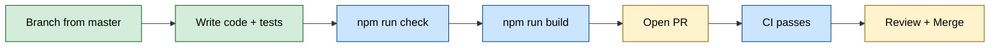

# 🤝 Contributing to Sage

Thanks for helping improve Sage! This guide covers the local workflow, expectations, and safety notes.

<p align="center">
  
</p>

---

## 📋 Quick Reference

| Action | Command |
| :--- | :--- |
| Install deps | `npm ci` |
| Onboard (recommended) | `npm run onboard` |
| Dev server | `npm run dev` |
| Local quality gate | `npm run check` |
| Local trust gate | `npm run check:trust` |
| Lint | `npm run lint` |
| Build | `npm run build` |
| Test | `npm run test` |
| Health check | `npm run doctor` |
| DB migrations | `npx prisma migrate deploy` |

---

## ⚖️ License and Contribution Terms

- Sage is source-available under **PolyForm Strict 1.0.0** (`LICENSE`).
- The public license permits noncommercial use only and does not permit redistribution, modification, or derivative works.
- The copyright owner grants a limited additional permission to create modifications solely to prepare and submit pull requests to this repository.
- By submitting code, docs, or assets, you grant the project owner the right to use, modify, relicense, and distribute your contribution under Sage's licensing model (including commercial licensing).

---

## 🔧 Prerequisites

| Requirement | Details |
| :--- | :--- |
| **Node.js** | LTS version (CI runs on Node 22.x and 24.x) |
| **Database** | PostgreSQL via Docker (see `prisma/schema.prisma`) |
| **Discord creds** | `DISCORD_TOKEN` and `DISCORD_APP_ID` in `.env` |

---

## 🚀 Setup

```bash
npm ci
npm run onboard
```

Apply tracked database migrations:

```bash
npx prisma migrate deploy
```

To reset the schema (⚠️ deletes data):

```bash
npx prisma migrate reset --force --skip-generate
```

Git hooks are installed automatically via `prepare` during `npm ci`.

---

## 🔄 Development Workflow


```mermaid
flowchart LR
    classDef action fill:#d4edda,stroke:#155724,color:black
    classDef check fill:#cce5ff,stroke:#004085,color:black
    classDef submit fill:#fff3cd,stroke:#856404,color:black

    A["Branch from master"]:::action --> B["Write code + tests"]:::action
    B --> C["npm run check"]:::check
    C --> D["npm run build"]:::check
    D --> E["Open PR"]:::submit
    E --> F["CI passes"]:::check
    F --> G["Review + Merge"]:::submit
```

`npm run check` is the fast local gate and runs lint + typecheck + one test pass.

`npm run check:trust` is the local trust gate and runs lint + typecheck + static test audit + repeated/shuffled test validation.

### Branching

- Create feature branches from `master`.
- Keep PRs focused and avoid unrelated refactors.
- Include clear, testable descriptions of changes and any operational impacts.

### Local Git Hooks

Sage uses Husky for fast local feedback:

- `pre-commit` runs `npm run lint`
- `pre-push` runs `npm run test`

CI remains the merge gate authority.

---

## 🏗️ Architecture Overview (for Contributors)

Understanding the codebase structure helps you contribute effectively:

```text
src/
├── core/
│   ├── agentRuntime/      # Runtime orchestration, prompt assembly, tool loop
│   ├── llm/               # Model resolver, catalog, health tracking
│   ├── voice/             # Voice presence, sessions, analytics
│   ├── memory/            # Profile updater, user profile repo
│   ├── summary/           # Channel summary scheduler and summarizer
│   └── relationships/     # Social graph edge tracking
└── shared/
    └── config/            # Environment validation (Zod schemas)
```

> [!TIP]
> Start with `src/core/agentRuntime/agentRuntime.ts` — it's the main entry point for understanding how messages flow through Sage.

---

## 🎨 Code Style

- Follow the existing **ESLint** and **Prettier** configuration (located in `config/ci/`).
- Keep tooling/config path changes aligned with [`config/README.md`](config/README.md).
- Favor **small, well-named modules** and pure functions for core logic.
- Avoid introducing new prompt strings or altering existing prompt templates unless fixing a bug.

Run the formatter:

```bash
npm run lint -- --fix
```

---

## ✅ Pull Request Checklist

Before opening a PR, verify each item:

- [ ] Code compiles: `npm run build`
- [ ] All tests pass: `npm run test`
- [ ] Linting passes: `npm run lint`
- [ ] New features include tests
- [ ] No secrets committed (`.env` must remain ignored)
- [ ] Documentation updated if behavior changed
- [ ] Commit messages are descriptive

---

## 🛡️ Adding Features Safely

- Add tests for core logic and any new tool execution paths.
- Ensure provider payloads remain backward compatible.
- Validate inputs and handle failures gracefully.
- For behavior changes, add or update tests.

---

## 🔒 Security Notes

- **Never commit secrets.** `.env` must remain in `.gitignore`.
- Use placeholders in `.env.example` only.
- Report vulnerabilities to the project owner — see [`SECURITY.md`](SECURITY.md).
- For data storage and privacy details, see [`SECURITY_PRIVACY.md`](docs/security/SECURITY_PRIVACY.md).

---

## 🤖 CI Expectations

Required checks on PRs target these jobs:

- `build` (Node 22.x and 24.x matrix)
- `release-readiness` (runs `npm run check:trust`)
- `dependency-review` (runs when `ENABLE_DEPENDENCY_REVIEW=true` and Dependency Graph is enabled; otherwise intentionally skipped)
- `CodeQL / Analyze (javascript-typescript)`
- `docs-markdownlint`
- `docs-linkcheck`

Run the trust gate locally before opening a PR:

```bash
npm run check:trust
```

---

## 📚 Further Reading

- [📖 Getting Started](docs/guides/GETTING_STARTED.md) — Full setup walkthrough
- [🤖 Architecture Overview](docs/architecture/OVERVIEW.md) — Agentic design
- [⚙️ Configuration Reference](docs/reference/CONFIGURATION.md) — All env vars
- [🔀 Runtime Pipeline](docs/architecture/PIPELINE.md) — Message flow
