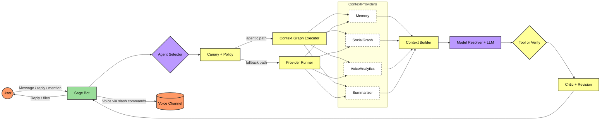

<p align="center">
  
</p>

<h1 align="center">Sage</h1>
<h3 align="center">Fully Agentic Intelligence for Discord</h3>

<p align="center">
  <a href="https://pollinations.ai"></a>
  <a href="LICENSE"></a>
  <a href="https://github.com/BokX1/Sage/actions/workflows/ci.yml"></a>
  
</p>

<p align="center">
  
  
  
  
  
  
</p>

<p align="center">
  <strong>Sage is a self-learning AI companion that grows with your community, observes social vibes, and delivers intelligent, context-aware responses.</strong>
</p>

> [!IMPORTANT]
> Sage is proprietary software (All Rights Reserved). Running, modifying, or distributing Sage requires written permission or a commercial license from the copyright owner. See LICENSE and COPYRIGHT.

<p align="center">
  <strong>🎮 <a href="docs/guides/QUICKSTART.md">I just want to run the bot</a></strong> · <strong>💻 <a href="#-developer-quick-start">I'm a developer</a></strong>
</p>

---

## 🧭 Quick navigation

- [🎯 What is Sage?](#what-is-sage)
- [🏛️ High-Level Architecture](#high-level-architecture)
- [✨ Features](#features)
- [🚀 Getting Started](#getting-started)
- [💻 Developer Quick Start](#developer-quick-start)
- [🛠️ Configuration](#configuration)
- [📚 Documentation](#documentation)
- [💚 Why Choose Sage?](#why-choose-sage)

---

<a id="what-is-sage"></a>

## 🎯 What is Sage?

Sage is a **fully agentic Discord companion** that goes beyond simple chat commands. Unlike traditional bots, Sage is designed to be a friendly member of your community who **listens and evolves alongside you**:

- 🧠 **Self-Learning Memory**: Remembers past conversations to build personalized user contexts.
- 👥 **Socially Aware**: Understands relationship tiers (Best Friend, Acquaintance) and interaction "vibes."
- 👁️ **Vision + Image Generation**: Ingests images for visual understanding, and can generate/edit images from prompts.
- 📄 **Knowledge Base**: Ingests code files and text documents to provide high-context analysis.
- 💬 **Intelligent Routing**: Uses a high-precision LLM classifier to resolve pronouns and context.
- ⚡ **Adaptive Models**: Uses route-aware model resolution with `openai-large` as the chat baseline and healthy fallbacks (for example `kimi`, `claude-fast`) based on intent and capability needs.

**Perfect for:** Coding communities • Gaming groups • Research teams • Any Discord that wants a bot that "gets it."

---

<a id="high-level-architecture"></a>

## 🏛️ High-Level Architecture



---

<a id="features"></a>

## ✨ Features

<table>
<tr>
<td width="50%">

### 🧠 Self-Learning Memory

Builds long-term user profiles and throttles updates for efficiency. Every conversation makes Sage smarter.

</td>
<td width="50%">

### 👁️ Vision + Image Generation

Analyzes attached images with multimodal vision, generates art from prompts, and edits images in-thread.

</td>
</tr>
<tr>
<td width="50%">

### 🔍 Real-Time Web Search

Route-aware search models fetch live facts and summarize complex results into polished responses.

</td>
<td width="50%">

### 🤖 Intelligent Routing

LLM-powered agent selector classifies intent and routes to the optimal model per request.

</td>
</tr>
<tr>
<td width="50%">

### 🧰 Tool Stack

Web search, scraping, GitHub/npm/wiki lookups, Stack Overflow, and optional local Ollama inference.

</td>
<td width="50%">

### 🎤 Voice Companion

Text-to-speech companion with dynamic personas, presence tracking, and voice analytics (Beta).

</td>
</tr>
<tr>
<td width="50%">

### 🤝 Social Graph

Tracks relationship tiers (Best Friend → Stranger) and adapts tone based on interaction history.

</td>
<td width="50%">

### 🚀 Self-Correcting Runtime

Autonomous tool loop with critic + revision, error recovery, and canary-gated rollouts.

</td>
</tr>
</table>

<p align="center">
  <sub>⚡ Powered by <a href="https://pollinations.ai">Pollinations.ai</a> — fast, high-throughput multi-model AI access</sub>
</p>

---

<a id="getting-started"></a>

## 🚀 Getting Started

### Option A: Use the public bot

1. **Invite Sage**

   [**Click here to invite Sage to your server**](https://discord.com/oauth2/authorize?client_id=1462117382398017667&scope=bot%20applications.commands&permissions=8)

2. **Activate BYOP (recommended for higher limits)**

   - Run `/sage key login` to get your Pollinations key.
   - Run `/sage key set <your_key>` to activate Sage for the entire server.

> [!TIP]
> Prefer least-privilege permissions? Generate a custom invite URL in the Discord Developer Portal (see [Getting Started → Invite Bot](docs/guides/GETTING_STARTED.md#step-6-invite-sage-to-your-server)).

### Option B: Self-host from source

Follow **[📖 Getting Started](docs/guides/GETTING_STARTED.md)** for a full walkthrough (Node.js, Docker/Postgres, onboarding wizard, and invite generation).

For local-first tooling (SearXNG/Crawl4AI/Ollama) with hosted fallback, see **[🧰 Self-Hosted Tool Stack](docs/operations/TOOL_STACK.md)**.

---

<a id="developer-quick-start"></a>

## 💻 Developer Quick Start

> [!NOTE]
> This is a fast path. For a complete setup (including creating a Discord app), use [Getting Started](docs/guides/GETTING_STARTED.md).

 ```bash
 git clone https://github.com/BokX1/Sage.git
 cd Sage
 npm ci
 npm run onboard
 docker compose -f config/ci/docker-compose.yml up -d db
 npm run db:push
 npm run check
 npm run dev
 ```

Optional local tool stack:

```bash
docker compose -f config/self-host/docker-compose.tools.yml up -d
```

When Sage starts, you should see:

```text
[info] Logged in as Sage#1234
[info] Ready!
```

### Quality gate

```bash
npm run check
```

`npm run check` runs lint + typecheck + tests and is the required pre-merge gate.

### Agentic release gate

```bash
npm run agentic:replay-gate
```

This evaluates recent trace outcomes and enforces replay thresholds before promotion.

### Production run

```bash
npm run build
npm start
```

## 🗂️ Project Structure

 ```text
 src/                 # Bot runtime, handlers, core logic, scripts
 tests/               # Vitest test suites
 docs/                # User, operations, and architecture documentation
 prisma/              # Prisma schema (synced via `prisma db push`)
 config/ci/           # Shared lint, test, TypeScript, Docker CI config
 config/self-host/    # Optional local tool-stack services (SearXNG/Crawl4AI/Ollama)
 ```

---

<a id="configuration"></a>

## 🛠️ Configuration

Sage is optimized for community interaction out of the box.

```env
# behavior
AUTOPILOT_MODE=manual      # Recommended for stability
PROFILE_UPDATE_INTERVAL=5  # Update user knowledge every 5 messages
TRACE_ENABLED=true         # enable observability for admins
```

See [Configuration Reference](docs/reference/CONFIGURATION.md) for full details.

---

<a id="documentation"></a>

## 📚 Documentation

| Document | Description |
| :--- | :--- |
| [📚 Documentation Hub](docs/INDEX.md) | **Start here** — Complete navigation index |
| [⚡ Quick Start](docs/guides/QUICKSTART.md) | 5-minute setup for new users |
| [📖 Getting Started](docs/guides/GETTING_STARTED.md) | Complete beginner walkthrough |
| [🎮 Commands](docs/guides/COMMANDS.md) | Full slash command reference |
| [❓ FAQ](docs/guides/FAQ.md) | Frequently asked questions |
| [🔧 Troubleshooting](docs/guides/TROUBLESHOOTING.md) | Error resolution guide |
| [⚙️ Configuration](docs/reference/CONFIGURATION.md) | All settings explained |
| [🤖 Agentic Architecture](docs/architecture/OVERVIEW.md) | What makes Sage different |
| [🏗️ Architecture](docs/architecture/) | Technical deep-dives |
| [🔒 Security & Privacy](docs/security/SECURITY_PRIVACY.md) | Data handling and privacy |
| [🐝 Pollinations](docs/reference/POLLINATIONS.md) | AI provider details |
| [🧰 Self-Hosted Tool Stack](docs/operations/TOOL_STACK.md) | Local SearXNG/Crawl4AI/Ollama + hosted fallback setup |
| [📋 Operations](docs/operations/RUNBOOK.md) | Deployment guide |

---

<a id="why-choose-sage"></a>

## 💚 Why Choose Sage?

| Feature | Traditional Bots | Sage |
| :--- | :--- | :--- |
| **Memory** | Forgets after each message | Remembers and learns over time |
| **Social Awareness** | Treats all users the same | Understands relationships and vibes |
| **Context** | Limited to current message | Full conversation + user history |
| **Error Recovery** | Fails silently | Self-corrects with retry loops |
| **Adaptation** | Static responses | Evolves with your community |

[Learn more about Sage's Agentic Architecture →](docs/architecture/OVERVIEW.md)
