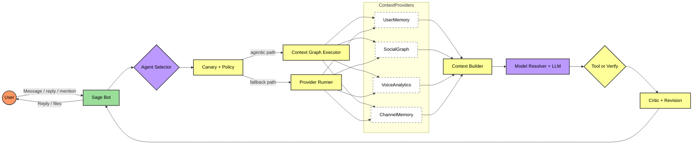

<p align="center">
  
</p>

<h1 align="center">Sage</h1>
<h3 align="center">Governed Agentic Intelligence for Discord Communities</h3>

<p align="center">
  <a href="https://pollinations.ai"></a>
  <a href="LICENSE"></a>
  <a href="https://github.com/BokX1/Sage/actions/workflows/ci.yml"></a>
  
</p>

<p align="center">
  
  
  
  
  
  
</p>

<p align="center">
  <strong>Sage is a memory-rich, policy-governed AI companion that helps Discord communities make better decisions with less noise.</strong>
</p>

> [!IMPORTANT]
> Sage is source-available under PolyForm Strict 1.0.0. You may run/use Sage for noncommercial purposes only. Redistribution, modification, and derivative works are not allowed under the public license. Commercial/business use requires a separate written license (Ahazihak03@gmail.com). See LICENSE and COPYRIGHT.

<p align="center">
  <strong>🎮 <a href="docs/guides/QUICKSTART.md">I just want to run the bot</a></strong> · <strong>💻 <a href="#developer-quick-start">I'm a developer</a></strong>
</p>

<p align="center">
  <sub>Not another slash-command wrapper: Sage combines community memory, verified tooling, and rollout guardrails.</sub>
</p>

---

## 🧭 Quick Navigation

- [🎯 What is Sage?](#what-is-sage)
- [💎 What Makes Sage Different](#what-makes-sage-different)
- [⚡ 30-Second Snapshot](#30-second-snapshot)
- [🎯 Real Community Use Cases](#real-community-use-cases)
- [🏛️ High-Level Architecture](#high-level-architecture)
- [✨ Capabilities That Matter](#capabilities-that-matter)
- [🚀 Getting Started](#getting-started)
- [💻 Developer Quick Start](#developer-quick-start)
- [🛠️ Configuration](#configuration)
- [📚 Documentation](#documentation)
- [💚 Why Teams Choose Sage](#why-teams-choose-sage)

---

<a id="what-is-sage"></a>

## 🎯 What Is Sage?

Sage is a Discord-native AI runtime designed for real communities, not just one-off command responses.

- 🧠 It remembers meaningful context across users, channels, and attachments.
- 🛡️ It applies policy and quality guardrails before shipping answers.
- 🔀 It routes each request by intent (`chat`, `coding`, `search`, `creative`).
- 🔍 It can retrieve live information and reconcile sources before replying.
- ⚙️ It gives operators control over rollout, quality, and risk.

**Best fit:** engineering communities, research teams, creator communities, and high-signal servers that need reliable AI support.

---

<a id="30-second-snapshot"></a>

## ⚡ 30-Second Snapshot

- **For server admins:** canary-governed rollout and replay-gated quality checks reduce bad updates.
- **For operators/mods:** policy-governed tool execution and deterministic fallbacks reduce answer risk.
- **For members:** memory-aware responses keep continuity across discussions, files, and ongoing topics.

---

<a id="what-makes-sage-different"></a>

## 💎 What Makes Sage Different

| Pillar | What Sage does today | Why it matters |
| :--- | :--- | :--- |
| 🛡️ Governed Runtime | Canary-gated agentic path, tenant policy overrides, replay quality gate before promotion | Safer rollouts and fewer silent regressions |
| 🧠 Community Memory Stack | User memory, channel memory, summaries, attachment cache, social graph, voice analytics | Responses reflect server context instead of stateless chat |
| 🔍 Verified Tooling Loop | Route-scoped tools, deterministic risk policy, hard-gate behavior for freshness-sensitive turns, critic-driven revision | Better trust for factual and time-sensitive answers |
| 🧰 Operator Flexibility | BYOP key model, local-first tool stack options, hosted fallback path | Better control over cost, privacy posture, and uptime |

---

<a id="real-community-use-cases"></a>

## 🎯 Real Community Use Cases

1. **Engineering triage in a busy dev server**  
User asks: `compare prisma migrate options for prod with rollback risk`  
Sage behavior: routes to `coding`, pulls tool evidence, applies critic revision, returns an implementation-ready recommendation.  
Outcome: faster issue resolution with fewer risky suggestions.

2. **Research roundup with source hygiene**  
User asks: `what changed in AI model pricing this week`  
Sage behavior: routes to `search`, gathers live findings, runs quality checks, and synthesizes a grounded answer.  
Outcome: fewer stale claims and better decision confidence.

3. **Attachment-aware team memory**  
User asks: `summarize the architecture doc we uploaded yesterday and compare with today’s plan`  
Sage behavior: retrieves cached attachment content on demand and combines it with channel context.  
Outcome: no need to re-upload files or repeat prior context.

4. **Community-aware responses, not generic bot replies**  
User asks: `how should I explain this to the team?`  
Sage behavior: blends user profile + channel memory + social context to tune tone and clarity.  
Outcome: responses feel aligned with the community, not generic AI output.

---

<a id="high-level-architecture"></a>

## 🏛️ High-Level Architecture



> [!NOTE]
> Chat turns always include `UserMemory` and `ChannelMemory`. `SocialGraph` and `VoiceAnalytics` are optional context enhancers.

---

<a id="capabilities-that-matter"></a>

## ✨ Capabilities That Matter

| Capability | Current behavior | Community value |
| :--- | :--- | :--- |
| 🧠 Long-term memory | Builds user and channel memory over time | Less repeated context, better continuity |
| 📄 Attachment intelligence | Ingests and caches non-image file content for lookup | Better doc-aware discussions in-channel |
| 👁️ Vision + image generation | Understands images and can generate/edit images | Better multimodal workflows |
| 🔍 Live search + synthesis | Uses search tools and route-aware search models | More current, decision-ready answers |
| 🤖 Intent routing | Chooses route and model policy per request | Better quality across mixed workloads |
| 🛡️ Tool risk governance | Enforces tool policy and route-scoped tool access | Lower operational risk |
| 🧪 Quality control loop | Critic-driven revisions and replay-based release readiness | Higher answer consistency over time |
| 🎤 Voice awareness | Voice analytics can inform context; voice companion support available | Better continuity between voice and text interactions |

<p align="center">
  <sub>⚡ Powered by <a href="https://pollinations.ai">Pollinations.ai</a> for high-throughput multi-model access.</sub>
</p>

---

<a id="getting-started"></a>

## 🚀 Getting Started

### Option A: Use the public bot

1. **Invite Sage**  
[**Click here to invite Sage to your server**](https://discord.com/oauth2/authorize?client_id=1462117382398017667&scope=bot%20applications.commands&permissions=8)

2. **Activate BYOP (recommended for higher limits)**  
Run `/sage key login` to get your Pollinations key. Then run `/sage key set <your_key>` to activate Sage for the server.

> [!TIP]
> Prefer least-privilege permissions? Generate a custom invite URL in the Discord Developer Portal (see [Getting Started → Invite Bot](docs/guides/GETTING_STARTED.md#step-6-invite-sage-to-your-server)).

### Option B: Self-host from source

Follow **[📖 Getting Started](docs/guides/GETTING_STARTED.md)** for full setup (Node.js, Docker/Postgres, onboarding, and invite flow).

For local-first tooling (SearXNG/Crawl4AI/Ollama) with hosted fallback, see **[🧰 Self-Hosted Tool Stack](docs/operations/TOOL_STACK.md)**.

---

<a id="developer-quick-start"></a>

## 💻 Developer Quick Start

> [!NOTE]
> Fast path below. For full setup (including Discord app creation), use [Getting Started](docs/guides/GETTING_STARTED.md).

```bash
git clone https://github.com/BokX1/Sage.git
cd Sage
npm ci
npm run onboard
docker compose -f config/ci/docker-compose.yml up -d db tika
npm run db:migrate
npm run check
npm run dev
```

Optional local tool stack:

```bash
docker compose -f config/self-host/docker-compose.tools.yml up -d
```

Essential gates:

```bash
npm run check
npm run build
npm start
```

Advanced release gating, eval pipelines, simulation, and tuning live in:

- `docs/reference/RELEASE.md`
- `docs/operations/RUNBOOK.md`
- `docs/architecture/OVERVIEW.md`

---

<a id="configuration"></a>

## 🛠️ Configuration

Sage is optimized for community interaction out of the box.

```env
# behavior
AUTOPILOT_MODE=manual
PROFILE_UPDATE_INTERVAL=5
TRACE_ENABLED=true
```

See [Configuration Reference](docs/reference/CONFIGURATION.md) for complete settings.

---

<a id="documentation"></a>

## 📚 Documentation

| Document | Description |
| :--- | :--- |
| [📚 Documentation Hub](docs/INDEX.md) | Start here for complete navigation |
| [⚡ Quick Start](docs/guides/QUICKSTART.md) | 5-minute setup for new users |
| [📖 Getting Started](docs/guides/GETTING_STARTED.md) | Full beginner walkthrough |
| [🎮 Commands](docs/guides/COMMANDS.md) | Full slash command reference |
| [❓ FAQ](docs/guides/FAQ.md) | Common questions and answers |
| [🔧 Troubleshooting](docs/guides/TROUBLESHOOTING.md) | Error resolution guide |
| [⚙️ Configuration](docs/reference/CONFIGURATION.md) | All env vars and defaults |
| [🤖 Agentic Architecture](docs/architecture/OVERVIEW.md) | Runtime design and governance |
| [🔍 Search Architecture](docs/architecture/SEARCH.md) | Search behavior and tool flow |
| [🧠 Memory Architecture](docs/architecture/MEMORY.md) | Memory model and context assembly |
| [🔒 Security & Privacy](docs/security/SECURITY_PRIVACY.md) | Data handling and privacy controls |
| [🧰 Self-Hosted Tool Stack](docs/operations/TOOL_STACK.md) | Local SearXNG/Crawl4AI/Ollama stack |
| [📋 Operations Runbook](docs/operations/RUNBOOK.md) | Operational and release procedures |

---

<a id="why-teams-choose-sage"></a>

## 💚 Why Teams Choose Sage

| Category | Typical bot experience | Sage experience |
| :--- | :--- | :--- |
| Context | Mostly stateless chat turns | Memory-aware replies grounded in community context |
| Reliability | Best-effort outputs | Critic loop, tool policy, and governed fallbacks |
| Freshness | Often generic or stale summaries | Route-aware search and source-oriented synthesis |
| Operations | Limited rollout controls | Canary policy, tenant policy, replay-based readiness |
| Team fit | One-size-fits-all behavior | Socially and contextually adaptive responses |

[Learn more about Sage’s runtime architecture →](docs/architecture/OVERVIEW.md)
