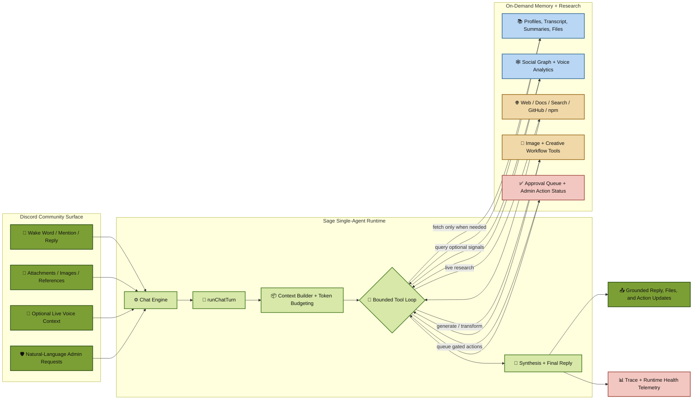
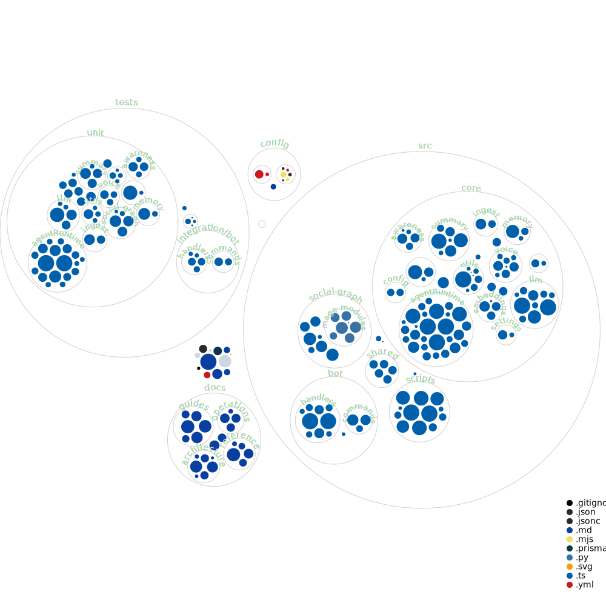
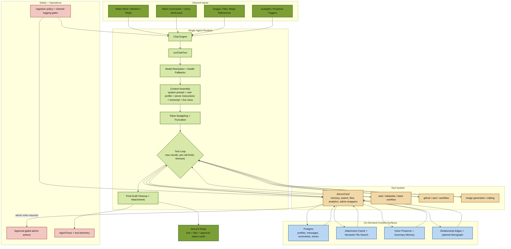

<a name="top"></a>

<p align="center">
  
</p>

<h1 align="center">Sage</h1>
<h3 align="center">The open-source AI agent for Discord communities</h3>

<p align="center">
  <strong>Discord-native AI runtime with long-term memory, live web research, optional voice tooling, and approval-gated admin actions.</strong>
</p>

<p align="center">
  <sub>Sage combines transcript history, summaries, attachment retrieval, web tools, and optional social-graph services in one single-agent runtime.</sub>
</p>

<p align="center">
  <a href="https://pollinations.ai"></a>
  <a href="LICENSE"></a>
  <a href="https://github.com/BokX1/Sage/actions/workflows/ci.yml"></a>
  
</p>

<p align="center">
  <a href="https://github.com/BokX1/Sage/stargazers"></a>
  <a href="https://github.com/BokX1/Sage/network/members"></a>
  <a href="https://github.com/BokX1/Sage/issues"></a>
  
</p>

<p align="center">
  
  <br>
  
</p>

<p align="center">
  <strong>🎮 <a href="docs/guides/QUICKSTART.md">Add Sage to Discord</a></strong> · <strong>💻 <a href="#developer-quick-start">Build & Deploy (Dev Guide)</a></strong>
</p>

---

## 🧭 Quick Navigation

- [🎯 What Is Sage?](#what-is-sage)
- [💡 Why Choose Sage?](#why-choose-sage)
- [💎 What Makes Sage Different](#what-makes-sage-different)
- [🎯 Real Community Use Cases](#real-community-use-cases)
- [🏛️ High-Level Architecture](#high-level-architecture)
- [✨ Capabilities That Matter](#capabilities-that-matter)
- [🚀 Getting Started](#getting-started)
- [💻 Developer Quick Start](#developer-quick-start)
- [🛠️ Configuration](#configuration)
- [📚 Documentation](#documentation)
- [💚 Why Teams Choose Sage](#why-teams-choose-sage)

---

<a id="what-is-sage"></a>

## 🎯 What Is Sage?

Sage is a Discord-native AI runtime built for active communities—where context matters, creativity is celebrated, and traditional "chatbot" commands are obsolete.

It's designed to feel like an intelligent, ever-present teammate that adapts to your server's unique needs:

- 🧠 **Layered Memory:** Combines recent transcript history, background summaries, user profiles, and attachment retrieval, with optional Memgraph analytics when the social-graph stack is enabled.
- 🌐 **Live Internet Research:** Uses built-in web and reference tools to pull in current documentation, search results, and cited pages when the runtime needs fresh information.
- 🎨 **Creative Generation:** Supports vision-aware chat plus built-in image generation and editing through the same runtime loop.
- 🔀 **Tool-Driven Automation:** Executes multi-step workflows through the unified tool loop instead of separate bots or hard-coded command trees.
- 🧰 **Operator Controls:** Configure the chat endpoint with environment variables, keep Pollinations BYOP for the built-in image and key flows, and optionally self-host the search/scrape stack.

**Best fit:** Gaming communities, creative hubs, development teams, and any server scaling beyond simple "vibe-only" chat into genuine AI collaboration.

### How It Works


```mermaid
flowchart LR
    classDef discord fill:#7c9f35,stroke:#2d5016,stroke-width:2px,color:#111
    classDef runtime fill:#d7e8a8,stroke:#4a7c23,stroke-width:2px,color:#111
    classDef memory fill:#b9d7f4,stroke:#356b95,stroke-width:2px,color:#111
    classDef tools fill:#f0d8a8,stroke:#9b6a1d,stroke-width:2px,color:#111
    classDef ops fill:#f3c7c1,stroke:#a24b43,stroke-width:2px,color:#111

    subgraph Discord["Discord Community Surface"]
        U["📩 Wake Word / Mention / Reply"]:::discord
        X["🧾 Attachments / Images / References"]:::discord
        V["🎤 Optional Live Voice Context"]:::discord
        A["🛡️ Natural-Language Admin Requests"]:::discord
    end

    subgraph Runtime["Sage Single-Agent Runtime"]
        CE["⚙️ Chat Engine"]:::runtime
        RT["🧠 runChatTurn"]:::runtime
        CB["📦 Context Builder + Token Budgeting"]:::runtime
        TL{"🔁 Bounded Tool Loop"}:::runtime
        SY["💬 Synthesis + Final Reply"]:::runtime
    end

    subgraph Data["On-Demand Memory + Research"]
        M["📚 Profiles, Transcript, Summaries, Files"]:::memory
        G["🕸️ Social Graph + Voice Analytics"]:::memory
        W["🌐 Web / Docs / Search / GitHub / npm"]:::tools
        C["🎨 Image + Creative Workflow Tools"]:::tools
        P["✅ Approval Queue + Admin Action Status"]:::ops
    end

    U --> CE
    X --> CE
    V --> CE
    A --> CE
    CE --> RT --> CB --> TL
    TL -->|"fetch only when needed"| M
    TL -->|"query optional signals"| G
    TL -->|"live research"| W
    TL -->|"generate / transform"| C
    TL -->|"queue gated actions"| P
    M --> TL
    G --> TL
    W --> TL
    C --> TL
    P --> TL
    TL --> SY
    SY --> R["📤 Grounded Reply, Files, and Action Updates"]:::discord
    SY --> T["📊 Trace + Runtime Health Telemetry"]:::ops
```

<p align="center">
  <a href="https://github.com/BokX1/Sage/stargazers"></a>
  <a href="https://github.com/BokX1/Sage/network/members"></a>
  <a href="https://github.com/BokX1/Sage/issues"></a>
  
</p>

---

<a id="why-choose-sage"></a>

## 💡 Why Choose Sage?

- **For Server Owners:** Scale your community seamlessly. Automate onboarding, technical support, and complex workflows with a single, highly-capable autonomous agent.
- **For Operators & Mods:** Reduce repetitive tasks. Let Sage act as your 24/7 co-pilot, surfacing live internet research and generating weekly ecosystem summaries.
- **For Community Members:** Enjoy frictionless interaction. From deep roleplay and custom image generation to collaborative coding, Sage remembers your historical context so you never have to repeat yourself.

---

<a id="what-makes-sage-different"></a>

## 💎 What Makes Sage Different

- 🛡️ **Single-Agent Runtime:** One execution path (`runChatTurn`) handles prompt assembly, tool calls, and final replies, which keeps behavior inspectable and easier to debug.
- 🧠 **Layered Memory:** Sage keeps recent transcript context in Postgres, updates user/channel summaries in the background, and fetches richer memory only when the tool loop needs it.
- 🔍 **Tool-First Research:** Live web search, page reads, GitHub access, npm lookup, and file retrieval all run through the same tool loop instead of separate specialty bots.
- 🧰 **Operator Choice:** The repo ships with Pollinations defaults, optional local search/scrape services, and an optional Memgraph/Redpanda stack for social-graph analytics.

<p align="right"><a href="#top">⬆️ Back to top</a></p>

---

<a id="real-community-use-cases"></a>

## 🎯 Real Community Use Cases

Stop reading about features—see Sage in action. Here is how leading servers leverage the runtime today:

- 🎭 **Immersive Roleplay**  
  > `Act as the Tavern Keeper from our server's lore. Welcome the new players who just joined and generate a custom image of their starting location.`
- 📈 **Autonomous Community Scaling**  
  > `Summarize the top 5 feature requests discussed in #dev-talk this week, then format them into a Jira-ready ticket list.`
- 🛠️ **Live Technical Support**  
  > `A user is getting a Next.js hydration error in #help. Search the latest React documentation and provide a step-by-step fix including code blocks.`
- 👋 **Hyper-Contextual Onboarding**  
  > `I just joined! What are the main server rules, and based on the recent chatter in #general, what's everyone currently hyped about?`
- 🎨 **Generative Content Workflows**  
  > `Write a sci-fi themed announcement for our upcoming tournament and generate a 16:9 cinematic banner image matching our server aesthetic.`

---

<a id="high-level-architecture"></a>

## 🏛️ High-Level Architecture

How a message flows through Sage's runtime — from user input to verified reply:

<p align="center">
  
</p>


```mermaid
flowchart TD
    classDef discord fill:#7c9f35,stroke:#2d5016,stroke-width:2px,color:#111
    classDef runtime fill:#d7e8a8,stroke:#4a7c23,stroke-width:2px,color:#111
    classDef memory fill:#b9d7f4,stroke:#356b95,stroke-width:2px,color:#111
    classDef tools fill:#f0d8a8,stroke:#9b6a1d,stroke-width:2px,color:#111
    classDef ops fill:#f3c7c1,stroke:#a24b43,stroke-width:2px,color:#111

    subgraph Inputs["Discord Inputs"]
        MSG["Wake Word / Mention / Reply"]:::discord
        CMD["Slash Commands + Voice Join/Leave"]:::discord
        FILES["Images, Files, Reply References"]:::discord
        AUTO["Autopilot / Proactive Triggers"]:::discord
    end

    subgraph Engine["Single-Agent Runtime"]
        direction TB
        CHAT["Chat Engine"]:::runtime
        TURN["runChatTurn"]:::runtime
        MODEL["Model Resolution + Health Fallbacks"]:::runtime
        CTX["Context Assembly
system prompt + user profile + server instructions + transcript + live voice"]:::runtime
        BUDGET["Token Budgeting + Truncation"]:::runtime
        LOOP{"Tool Loop
max rounds, per-call limits, timeouts"}:::runtime
        FINAL["Final Draft Cleanup + Attachments"]:::runtime
    end

    subgraph Retrieval["On-Demand Context Surfaces"]
        direction LR
        DB["Postgres
profiles, messages, summaries, traces"]:::memory
        ATT["Attachment Cache + Semantic File Search"]:::memory
        VOICE["Voice Presence + Summary Memory"]:::memory
        GRAPH["Relationship Edges + optional Memgraph"]:::memory
    end

    subgraph Tools["Tool System"]
        direction LR
        DISC["discord tool
memory, search, files, analytics, admin wrappers"]:::tools
        WEB["web / wikipedia / stack overflow"]:::tools
        DEV["github / npm / workflow"]:::tools
        GEN["image generation / editing"]:::tools
    end

    subgraph Controls["Safety + Operations"]
        direction LR
        APPROVAL["Approval-gated admin actions"]:::ops
        POLICY["Ingestion policy + channel logging gates"]:::ops
        TRACE["AgentTrace + tool telemetry"]:::ops
    end

    MSG --> CHAT
    CMD --> CHAT
    FILES --> CHAT
    AUTO --> CHAT

    CHAT --> TURN --> MODEL --> CTX --> BUDGET --> LOOP

    LOOP --> DISC
    LOOP --> WEB
    LOOP --> DEV
    LOOP --> GEN

    DISC --> DB
    DISC --> ATT
    DISC --> VOICE
    DISC --> GRAPH
    GRAPH --> DISC
    VOICE --> DISC
    ATT --> DISC
    DB --> DISC

    DISC -->|"admin write requests"| APPROVAL
    POLICY --> CHAT
    POLICY --> DISC

    WEB --> LOOP
    DEV --> LOOP
    GEN --> LOOP
    DISC --> LOOP

    LOOP --> FINAL --> OUT["Discord Reply
text + files + approval status cards"]:::discord
    FINAL --> TRACE
```

> [!NOTE]
> `UserMemory`, `ChannelMemory`, and `SocialGraph` data are not blindly injected. The runtime fetches them on demand through tools so the prompt stays smaller and easier to budget.

<p align="right"><a href="#top">⬆️ Back to top</a></p>

---

<a id="capabilities-that-matter"></a>

## ✨ Capabilities That Matter

- **🧠 Deep Community Memory**: Persists transcript history, summaries, and profile data so follow-up conversations can reuse prior context.
- **📄 Attachment Intelligence**: Ingests, caches, and understands non-image file content for seamless doc-aware discussions in-channel.
- **👁️ Multimodal Vision & Generation**: Natively understands images and dynamically generates or edits visuals using Pollinations.ai.
- **🔍 Live Internet Research**: Adds real-time web search and page-reading tools for questions that need current external sources.
- **🤖 Zero-Prompt Tool Automation**: Dynamically selects the exact tools needed (search, memory lookup, analytics) based on raw community intent.
- **🛡️ Runtime Observability**: Includes explicit trace data, model health tracking, and bounded tool execution for easier debugging and operations.
- **🧪 Production-Ready Quality**: Supported by robust build, test, and trust-gate validation for consistent long-term behavior.
- **🎤 Immersive Voice Awareness**: Optionally leverages voice analytics to bridge the gap between text history and live voice sessions.

<p align="center">
  <sub>⚡ Powered by <a href="https://pollinations.ai">Pollinations.ai</a> for high-throughput multi-model access.</sub>
</p>

---

<a id="getting-started"></a>

## 🚀 Getting Started

### 🟢 Option A: Connect to an Existing Sage Deployment

The fastest way to try Sage if your team or community already runs an instance.

**1. Invite the Agent**  
Use the current invite URL from the operator who hosts that deployment.

**2. Activate BYOP (Bring Your Own Pollen)**  
*(Recommended for higher generation limits via Pollinations.ai)*

```bash
/sage key login
/sage key set <your_key>
```

> [!TIP]
> For self-hosted deployments, `npm run onboard` prints a recommended invite URL and the manual Discord Developer Portal flow is documented in [Getting Started](docs/guides/GETTING_STARTED.md#step-6-invite-sage-to-your-server).

### 🛠️ Option B: Self-Host From Source

Full control over your data, models, and tool stack.

**1. Review Prerequisites**  
Node.js >=22.12, Docker, and PostgreSQL. Memgraph/Redpanda are optional and only needed for the social-graph stack.

**2. Follow the Setup Guide**  
👉 **[📖 Getting Started](docs/guides/GETTING_STARTED.md)** (Covers database initialization, onboarding, and Discord invite flow).

**3. Configure Chat + BYOP**  
Pollinations defaults are included in `.env.example`. You can override `LLM_BASE_URL` for chat-compatible endpoints, while Sage's built-in image generation and `/sage key` flow still use Pollinations.

**4. Optional: Local Tool Services**  
For localized web search and scraping (SearXNG/Crawl4AI), check out the **[🧰 Self-Hosted Tool Stack](docs/operations/TOOL_STACK.md)** guide.

<p align="right"><a href="#top">⬆️ Back to top</a></p>

---

<a id="developer-quick-start"></a>

## 💻 Developer Quick Start

> [!NOTE]
> Fast path below. For full setup (including Discord app creation) and detailed local deployment instructions, use the **[📖 Getting Started Guide](docs/guides/GETTING_STARTED.md)**.

**1. Clone & Install**

```bash
git clone https://github.com/BokX1/Sage.git
cd Sage
npm ci
```

**2. Initialize Infrastructure & Database**

```bash
npm run onboard
docker compose -f config/services/core/docker-compose.yml up -d db tika
npm run db:migrate
```

`npm run onboard` also supports automation flags for headless setup: `--start-docker --migrate --doctor`.

**3. Build & Run**

```bash
npm run check:trust
npm run dev
```

**Optional: Stand up Local Tool Services**  
*(SearXNG, Crawl4AI, Tika)*

```bash
docker compose -f config/services/self-host/docker-compose.tools.yml up -d
```

**Essential Release Gates:**

```bash
npm run check:trust
npm run build
npm start
```

Advanced release gating and operational runbooks live in:

- `docs/reference/RELEASE.md`
- `docs/operations/RUNBOOK.md`
- `docs/architecture/OVERVIEW.md`

---

<a id="configuration"></a>

## 🛠️ Configuration

Sage is tuned for highly autonomous community interaction out-of-the-box, but you can tweak its core behavior via your `.env` file:

- ⚙️ **`AUTOPILOT_MODE`**: Set to `manual`, `reserved`, or `talkative` to control how often Sage autonomously replies to community conversations without being directly pinged.
- ⏱️ **`PROFILE_UPDATE_INTERVAL`**: Controls how often (in messages) a user's long-term behavioral profile is re-analyzed.
- 📡 **`TRACE_ENABLED`**: Toggles deep observability logging for debugging tool executions.

See the **[⚙️ Configuration Reference](docs/reference/CONFIGURATION.md)** for a complete index of all adjustable settings.

---

<a id="documentation"></a>

## 📚 Documentation

**🚀 Getting Started & Guides**

- **[📚 Documentation Hub](docs/INDEX.md)**: Start here for complete navigation
- **[⚡ Quick Start](docs/guides/QUICKSTART.md)**: 5-minute setup for new users
- **[📖 Getting Started](docs/guides/GETTING_STARTED.md)**: Full beginner walkthrough
- **[🎮 Commands](docs/guides/COMMANDS.md)**: Full slash command reference
- **[❓ FAQ](docs/guides/FAQ.md)** & **[🔧 Troubleshooting](docs/guides/TROUBLESHOOTING.md)**: Common answers and error resolution

**⚙️ Configuration & Operations**

- **[⚙️ Configuration](docs/reference/CONFIGURATION.md)**: All env vars and defaults
- **[🗂️ Config Layout](config/README.md)**: CI and self-host config file ownership
- **[🧰 Self-Hosted Tool Stack](docs/operations/TOOL_STACK.md)**: Local SearXNG/Crawl4AI/Tika stack
- **[📋 Operations Runbook](docs/operations/RUNBOOK.md)**: Operational and release procedures

**🧠 Architecture & Security**

- **[🤖 Agentic Architecture](docs/architecture/OVERVIEW.md)**: Runtime design and execution flow
- **[🔍 Search Architecture](docs/architecture/SEARCH.md)**: Search behavior and tool flow
- **[🧠 Memory Architecture](docs/architecture/MEMORY.md)**: Memory model and context assembly
- **[🔒 Security & Privacy](docs/security/SECURITY_PRIVACY.md)**: Data handling and privacy controls

<p align="right"><a href="#top">⬆️ Back to top</a></p>

---

<a id="why-teams-choose-sage"></a>

## 🌟 Community & Contributors

A massive thank you to everyone who has helped build Sage.

<a href="https://github.com/BokX1/Sage/graphs/contributors">
  
</a>

<br/>

### Star History

<a href="https://starchart.cc/BokX1/Sage">
  
</a>

<p align="center">
  <strong>Unlock your server's full potential.</strong><br />
  <a href="docs/guides/QUICKSTART.md"><strong>🚀 Quick Start</strong></a> · <a href="docs/guides/GETTING_STARTED.md"><strong>📖 Read the Docs</strong></a> · <a href="docs/architecture/OVERVIEW.md"><strong>🏛️ Explore Architecture</strong></a>
</p>

---

<p align="center">
  <a href="CONTRIBUTING.md"><strong>Contributing</strong></a> · <a href="CODE_OF_CONDUCT.md"><strong>Code of Conduct</strong></a> · <a href="SECURITY.md"><strong>Security</strong></a> · <a href="LICENSE"><strong>License</strong></a>
</p>

<p align="center">
  Built with 💚 using <a href="https://pollinations.ai">Pollinations.ai</a>
</p>

<p align="center">
  <a href="#top">⬆️ Back to top</a>
</p>
