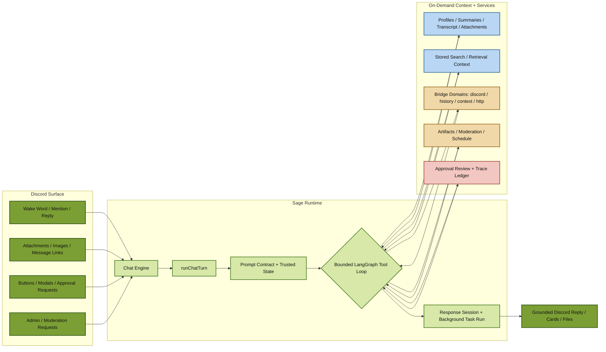
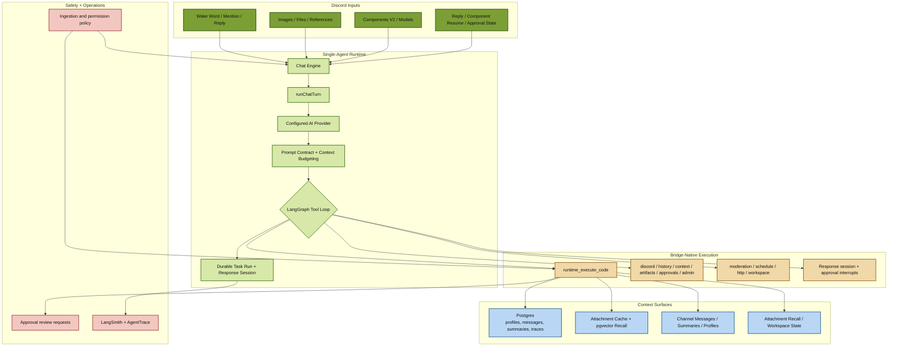

<a name="top"></a>

<p align="center">
  
</p>

<h1 align="center">Sage</h1>
<h3 align="center">The open-source AI runtime for Discord communities</h3>

<p align="center">
  <strong>LangGraph-native Discord AI with layered memory, bridge-native Code Mode, interactive governance, and provider-flexible self-hosting.</strong>
</p>

<p align="center">
  <sub>Sage keeps one durable runtime story from onboarding to admin approvals: chat-first Discord UX, one LangGraph loop, one Code Mode execution surface, and one operator-owned configuration surface.</sub>
</p>

<p align="center">
  
  
  <a href="LICENSE"></a>
  <a href="https://github.com/BokX1/Sage/actions/workflows/ci.yml"></a>
  
</p>

<p align="center">
  <a href="https://github.com/BokX1/Sage/stargazers"></a>
  <a href="https://github.com/BokX1/Sage/network/members"></a>
  <a href="https://github.com/BokX1/Sage/issues"></a>
  
</p>

<p align="center">
  
  <br>
</p>

<p align="center">
  <strong><a href="https://bokx1.github.io/Sage/">Project Website</a></strong> · <strong><a href="docs/guides/QUICKSTART.md">Quick Start</a></strong> · <strong><a href="#developer-quick-start">Developer Quick Start</a></strong>
</p>

---

## 🧭 Quick Navigation

- [🎯 What Is Sage?](#what-is-sage)
- [💎 Why Teams Pick It](#why-teams-pick-it)
- [🏛️ Runtime Architecture](#runtime-architecture)
- [✨ Capabilities](#capabilities)
- [🚀 Getting Started](#getting-started)
- [💻 Developer Quick Start](#developer-quick-start)
- [🛠️ Configuration](#configuration)
- [📚 Documentation](#documentation)
- [🌟 Community](#community)

---

<a id="what-is-sage"></a>

## 🎯 What Is Sage?

Sage is a Discord-native AI runtime built around one durable LangGraph loop.

It is designed for communities that want more than a one-shot chatbot:

- 🧠 **Layered memory** across recent transcript context, user profiles, channel summaries, and attachment recall text.
- 🌐 **Live research** through host-managed retrieval and exact-page reads when freshness matters.
- ⚡ **Bridge-native execution** through one Code Mode path that writes short JS against direct namespaces instead of juggling a sprawling public tool menu.
- 🛡️ **Governed actions** through approval-gated moderation and admin workflows inside Discord.
- ⚙️ **Operator choice** through an OpenAI-compatible chat runtime, host-managed retrieval providers, and a self-hosted deployment you can inspect end to end.

The result is a chat-first assistant that can stay grounded, ask for approval when needed, and keep long-running work alive without turning every Discord workflow into slash-command ceremony.

### How It Works


```mermaid
flowchart LR
    classDef discord fill:#7c9f35,stroke:#2d5016,stroke-width:2px,color:#111
    classDef runtime fill:#d7e8a8,stroke:#4a7c23,stroke-width:2px,color:#111
    classDef memory fill:#b9d7f4,stroke:#356b95,stroke-width:2px,color:#111
    classDef tools fill:#f0d8a8,stroke:#9b6a1d,stroke-width:2px,color:#111
    classDef ops fill:#f3c7c1,stroke:#a24b43,stroke-width:2px,color:#111

    subgraph Discord["Discord Surface"]
        U["Wake Word / Mention / Reply"]:::discord
        X["Attachments / Images / Message Links"]:::discord
        V["Buttons / Modals / Approval Requests"]:::discord
        A["Admin / Moderation Requests"]:::discord
    end

    subgraph Runtime["Sage Runtime"]
        CE["Chat Engine"]:::runtime
        RT["runChatTurn"]:::runtime
        PC["Prompt Contract + Trusted State"]:::runtime
        TL{"Bounded LangGraph Tool Loop"}:::runtime
        RS["Response Session + Background Task Run"]:::runtime
    end

    subgraph Data["On-Demand Context + Services"]
        M["Profiles / Summaries / Transcript / Attachments"]:::memory
        G["Stored Search / Retrieval Context"]:::memory
        W["Bridge Domains: discord / history / context / http"]:::tools
        C["Artifacts / Moderation / Schedule"]:::tools
        P["Approval Review + Trace Ledger"]:::ops
    end

    U --> CE
    X --> CE
    V --> CE
    A --> CE
    CE --> RT --> PC --> TL --> RS
    TL --> M
    TL --> G
    TL --> W
    TL --> C
    TL --> P
    M --> TL
    G --> TL
    W --> TL
    C --> TL
    P --> TL
    RS --> R["Grounded Discord Reply / Cards / Files"]:::discord
```

---

<a id="why-teams-pick-it"></a>

## 💎 Why Teams Pick It

- **Chat-first UX:** Sage is invoked through normal Discord conversation, replies, buttons, and modals instead of a command-heavy menu surface.
- **Provider-flexible runtime:** Self-hosted deployments can point `AI_PROVIDER_BASE_URL` at any OpenAI-compatible endpoint. The hosted server-key and image path remain explicitly documented where they are Pollinations-specific today.
- **One runtime contract:** Prompting, tool execution, approvals, retries, trace capture, and background resumability all live in one runtime rather than a pile of separate bots.
- **Grounded retrieval:** Message history, summaries, file recall, and graph signals are fetched on demand instead of bloating every prompt up front.
- **Operationally honest docs:** Setup, troubleshooting, and validation align with `npm run onboard`, `npm run doctor`, `npm run check:trust`, and the current compose files in this repo.

---

<a id="runtime-architecture"></a>

## 🏛️ Runtime Architecture

<p align="center">
  
</p>


```mermaid
flowchart TD
    classDef discord fill:#7c9f35,stroke:#2d5016,stroke-width:2px,color:#111
    classDef runtime fill:#d7e8a8,stroke:#4a7c23,stroke-width:2px,color:#111
    classDef memory fill:#b9d7f4,stroke:#356b95,stroke-width:2px,color:#111
    classDef tools fill:#f0d8a8,stroke:#9b6a1d,stroke-width:2px,color:#111
    classDef ops fill:#f3c7c1,stroke:#a24b43,stroke-width:2px,color:#111

    subgraph Inputs["Discord Inputs"]
        MSG["Wake Word / Mention / Reply"]:::discord
        FILES["Images / Files / References"]:::discord
        INT["Components V2 / Modals"]:::discord
        VOICE["Reply / Component Resume / Approval State"]:::discord
    end

    subgraph Engine["Single-Agent Runtime"]
        CHAT["Chat Engine"]:::runtime
        TURN["runChatTurn"]:::runtime
        MODEL["Configured AI Provider"]:::runtime
        CTX["Prompt Contract + Context Budgeting"]:::runtime
        LOOP{"LangGraph Tool Loop"}:::runtime
        TASK["Durable Task Run + Response Session"]:::runtime
    end

    subgraph Retrieval["Context Surfaces"]
        DB["Postgres<br/>profiles, messages, summaries, traces"]:::memory
        ATT["Attachment Cache + pgvector Recall"]:::memory
        SG["Channel Messages / Summaries / Profiles"]:::memory
        VA["Attachment Recall / Workspace State"]:::memory
    end

    subgraph Tools["Bridge-Native Execution"]
        DISC["runtime_execute_code"]:::tools
        WEB["discord / history / context / artifacts / approvals / admin"]:::tools
        IMG["moderation / schedule / http / workspace"]:::tools
        SYS["Response session + approval interrupts"]:::tools
    end

    subgraph Ops["Safety + Operations"]
        APPROVAL["Approval review requests"]:::ops
        TRACE["LangSmith + AgentTrace"]:::ops
        POLICY["Ingestion and permission policy"]:::ops
    end

    MSG --> CHAT
    FILES --> CHAT
    INT --> CHAT
    VOICE --> CHAT
    CHAT --> TURN --> MODEL --> CTX --> LOOP --> TASK
    LOOP --> DISC
    LOOP --> WEB
    LOOP --> IMG
    LOOP --> SYS
    DISC --> DB
    DISC --> ATT
    DISC --> SG
    DISC --> VA
    POLICY --> CHAT
    POLICY --> DISC
    DISC --> APPROVAL
    TASK --> TRACE
```

> [!NOTE]
> Sage no longer documents a slash-command-first runtime. The current product surface is wake word, mention, reply, and Sage-authored interactive follow-ups.

---

<a id="capabilities"></a>

## ✨ Capabilities

- **Deep memory:** Recent transcript context, user profiles, channel summaries, and attachment recall.
- **Live research:** Current web results and exact page reads through the host-managed retrieval stack.
- **Interactive governance:** Approval cards, reviewer routing, moderation batching, and restart-safe action state.
- **Durable long-running work:** Background slices, resumable waits for user input or approval, and one evolving Discord response session.
- **Bridge-native execution:** One public runtime surface, `runtime_execute_code`, with direct namespaces for Discord, memory, admin, moderation, scheduling, HTTP, and workspace access.
- **Operational diagnostics:** `npm run doctor`, `npm run ai-provider:probe`, `npm run tools:audit`, `npm run langgraph:discord:smoke`, and `AgentTrace` / LangSmith visibility.

---

<a id="getting-started"></a>

## 🚀 Getting Started

### Option A: Join an Existing Sage Deployment

If your community already has Sage:

1. Get the current invite URL from the deployment operator.
2. Mention Sage once in a guild channel.
3. If the server does not have a usable key path yet, Sage will post the setup card.
4. A server admin can complete the server-key flow from that card.

Hosted guidance remains hybrid:

- Self-hosted runtime chat is provider-neutral.
- The built-in hosted server-key and image flows are Pollinations-specific today.

### Option B: Self-Host from Source

```bash
git clone https://github.com/BokX1/Sage.git
cd Sage
npm ci
npm run onboard
docker compose -f config/services/core/docker-compose.yml up -d db tika
npm run db:migrate
npm run dev
```

`npm run onboard` supports three practical paths:

- set a host-level provider key now
- rely on Sage's in-Discord server activation flow later
- support both

For the full walkthrough, use **[📖 Getting Started](docs/guides/GETTING_STARTED.md)**.

---

<a id="developer-quick-start"></a>

## 💻 Developer Quick Start

```bash
git clone https://github.com/BokX1/Sage.git
cd Sage
npm ci
npm run onboard
docker compose -f config/services/core/docker-compose.yml up -d db tika
npm run db:migrate
npm run check:trust
npm run dev
```

Optional local tool services:

```bash
docker compose -f config/services/self-host/docker-compose.tools.yml up -d
```

Helpful operator commands:

```bash
npm run doctor
npm run doctor -- --llm-ping
npm run ai-provider:probe
npm run tools:audit
npm run langgraph:discord:smoke
```

---

<a id="configuration"></a>

## 🛠️ Configuration

Sage's runtime contract is centered on `.env.example` and `src/platform/config/envSchema.ts`.

High-signal knobs:

- `AI_PROVIDER_BASE_URL` and `AI_PROVIDER_*_MODEL` select the runtime, profile, and summary models.
- `AUTOPILOT_MODE` controls how proactively Sage joins ambient conversation.
- `MESSAGE_DB_STORAGE_ENABLED`, `PROFILE_UPDATE_INTERVAL`, and `SUMMARY_*` tune memory behavior.
- `LANGSMITH_TRACING` and `SAGE_TRACE_DB_ENABLED` control observability.
- `TOOL_WEB_*`, `SEARXNG_*`, `CRAWL4AI_*`, and provider keys shape the retrieval stack.

See **[⚙️ Configuration Reference](docs/reference/CONFIGURATION.md)** for the complete environment surface.

---

<a id="documentation"></a>

## 📚 Documentation

**Start here**

- **[📚 Documentation Hub](docs/INDEX.md)** — complete navigation
- **[⚡ Quick Start](docs/guides/QUICKSTART.md)** — fastest path into Discord
- **[📖 Getting Started](docs/guides/GETTING_STARTED.md)** — full source setup
- **[💬 Conversation & Controls](docs/guides/COMMANDS.md)** — chat-first UX, approvals, and admin patterns

**Reference**

- **[⚙️ Configuration](docs/reference/CONFIGURATION.md)** — env vars and defaults
- **[🧩 Models](docs/reference/MODELS.md)** — model-budget and provider contract
- **[🐝 Pollinations Integration](docs/reference/POLLINATIONS.md)** — hosted/server-key and image-specific details
- **[🔌 API Examples](docs/reference/API_EXAMPLES.md)** — upstream request shapes and service examples

**Architecture and operations**

- **[🤖 Architecture Overview](docs/architecture/OVERVIEW.md)** — single-agent runtime design
- **[🔀 Runtime Pipeline](docs/architecture/PIPELINE.md)** — turn lifecycle and task-run behavior
- **[🧠 Memory Architecture](docs/architecture/MEMORY.md)** — memory surfaces and retention
- **[📋 Operations Runbook](docs/operations/RUNBOOK.md)** — validation and incident flow
- **[🧰 Tool Stack](docs/operations/TOOL_STACK.md)** — self-hosted search/scrape services
- **[🔒 Security & Privacy](docs/security/SECURITY_PRIVACY.md)** — data handling and trust boundaries

<p align="right"><a href="#top">⬆️ Back to top</a></p>

---

<a id="community"></a>

## 🌟 Community

A massive thank you to everyone who has helped build Sage.

<a href="https://github.com/BokX1/Sage/graphs/contributors">
  
</a>

<br/>

### Star History

<a href="https://starchart.cc/BokX1/Sage">
  
</a>

<p align="center">
  <strong>Build a Discord assistant that can actually stay grounded.</strong><br />
  <a href="https://bokx1.github.io/Sage/"><strong>Project Website</strong></a> · <a href="docs/guides/QUICKSTART.md"><strong>Quick Start</strong></a> · <a href="docs/guides/GETTING_STARTED.md"><strong>Read the Docs</strong></a> · <a href="docs/architecture/OVERVIEW.md"><strong>Explore Architecture</strong></a>
</p>

---

<p align="center">
  <a href="CONTRIBUTING.md"><strong>Contributing</strong></a> · <a href="CODE_OF_CONDUCT.md"><strong>Code of Conduct</strong></a> · <a href="SECURITY.md"><strong>Security</strong></a> · <a href="LICENSE"><strong>License</strong></a>
</p>

<p align="center">
  <a href="#top">⬆️ Back to top</a>
</p>
