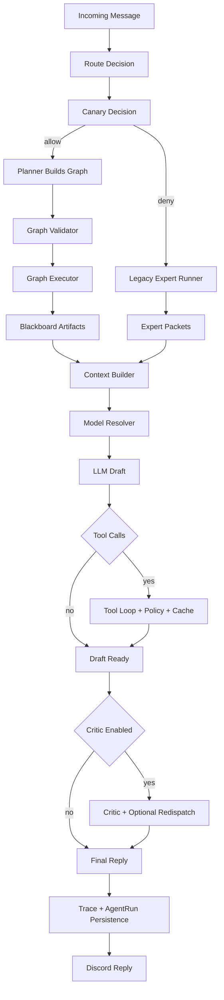
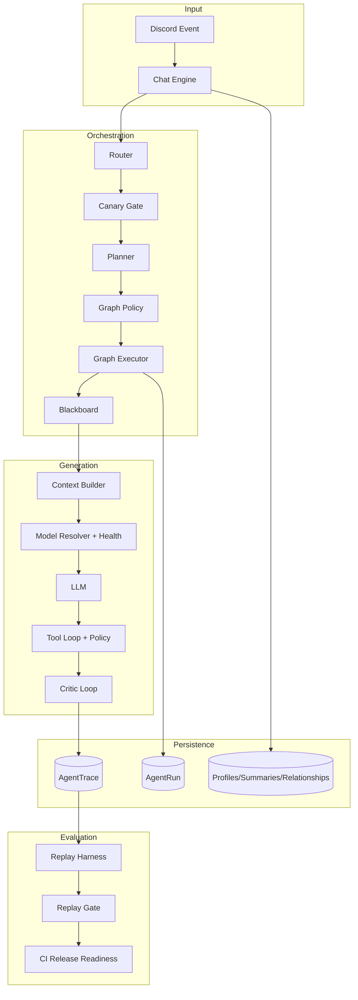

# Agentic Architecture

Sage is a planner-led, safety-governed, multi-agent Discord runtime.

This page explains the current architecture and what makes the runtime agentic in production, not only in demos.

---

## Quick Navigation

- [What "Agentic" Means in Sage](#what-agentic-means-in-sage)
- [Core Runtime Pillars](#core-runtime-pillars)
- [Execution Lifecycle](#execution-lifecycle)
- [Governance and Safety](#governance-and-safety)
- [Observability and Evaluation](#observability-and-evaluation)
- [Architecture Map](#architecture-map)

---

## What "Agentic" Means in Sage

In Sage, "agentic" means the runtime can:

1. Plan work as a graph of specialist tasks.
2. Execute with retries/timeouts and controlled parallelism.
3. Share typed artifacts through a blackboard.
4. Self-critique and revise when quality is below threshold.
5. Enforce deterministic policy for tools and rollout risk.
6. Measure outcomes and gate releases with replay signals.

---

## Core Runtime Pillars

### 1) Planner + Graph Executor

- Router decides route + experts.
- Planner constructs dependency-aware DAG/fanout/linear plans.
- Graph validator blocks invalid graphs before execution.
- Executor runs nodes with budgeted retries and timeouts.

### 2) Blackboard Artifacts

- Each node writes artifacts with provenance and confidence.
- Synthesis uses blackboard output, not implicit hidden state.

### 3) Tool Governance

- Tool loop supports bounded rounds and recovery prompts.
- Policy classes: `read_only`, `external_write`, `high_risk`.
- Blocklist/permission gates are applied before execution.
- Per-turn cache deduplicates repeated tool calls.

### 4) Quality Loop

- Critic scoring evaluates draft quality.
- If below threshold, runtime requests revision.
- Critic can trigger targeted expert redispatch before rewrite.

### 5) Model Policy

- Route-aware model candidate chains.
- Capability filters (vision/audio/search/reasoning/tool use).
- Tenant allowlists can constrain selected models.
- Model health outcomes influence fallback ordering over time.

### 6) Rollout Governance

- Canary sampling controls agentic rollout percent.
- Route allowlist limits where agentic path is active.
- Error-budget window trips cooldown when failure rate rises.
- Runtime falls back to legacy expert runner when canary blocks/opens circuit.

---

## Execution Lifecycle

---

## Governance and Safety

### Tenant Policy Layer

`AGENTIC_TENANT_POLICY_JSON` supports `default` and per-guild overrides for:

- graph parallelism,
- critic settings,
- tool risk permissions/blocklists,
- model allowlists.

### Canary and Rollback Layer

Canary controls include:

- rollout percentage,
- route allowlist,
- failure-rate threshold,
- rolling sample window,
- cooldown period.

When thresholds are breached, runtime automatically cools down to safer behavior.

### Release Gate Layer

`npm run agentic:replay-gate` evaluates recent traces and enforces quality thresholds before promotion.

CI release-readiness runs this gate after migrations.

---

## Observability and Evaluation

Trace persistence includes:

- route decision payloads,
- graph and event streams,
- quality and budget metadata,
- tool execution metadata,
- per-node runtime rows (`AgentRun`).

Replay harness and outcome scoring provide:

- average quality score,
- success-likely ratio,
- route-level quality slices,
- repeatable release gate inputs.

---

## Architecture Map

---

## Related Docs

- [Runtime Pipeline](architecture/pipeline.md)
- [Configuration Reference](CONFIGURATION.md)
- [Operations Runbook](operations/runbook.md)
- [Release Process](RELEASE.md)
- [Database Architecture](architecture/database.md)
