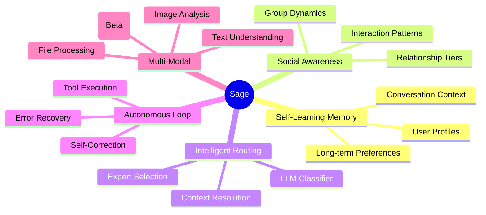
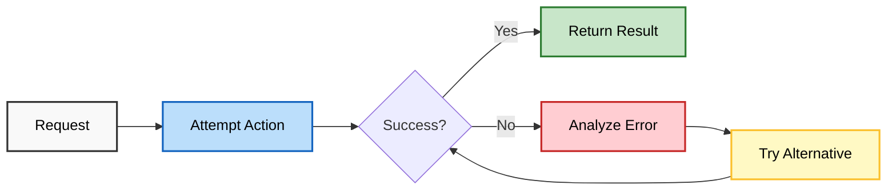
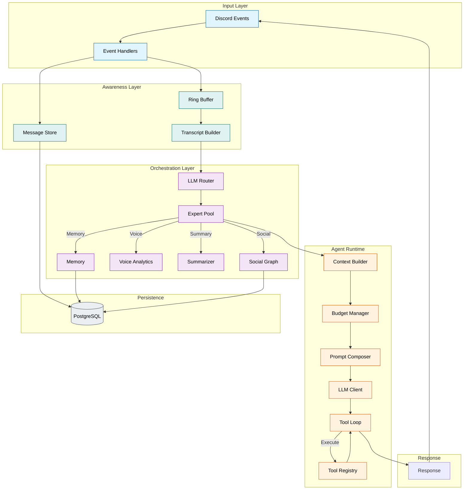

# 🤖 Agentic Architecture

<p align="center">
  
  
</p>

**Sage is not just a chatbot — it's a fully agentic Discord companion that thinks, learns, and adapts.**

This document explains what makes Sage different from traditional bots and how its agentic architecture works.

---

## 🎯 What is "Agentic AI"?

An **agentic AI** is an AI system that can:

| Capability | Traditional Bot | Agentic Bot (Sage) |
|:-----------|:----------------|:-------------------|
| **Memory** | Forgets after each message | Remembers and learns over time |
| **Autonomy** | Only responds to commands | Can observe, think, and act proactively |
| **Context** | Limited to current message | Understands conversation history and relationships |
| **Adaptation** | Static responses | Evolves understanding of each user |
| **Error Recovery** | Crashes or fails silently | Self-corrects and tries alternative approaches |

---

## 🧠 The Five Pillars of Sage's Intelligence



---

## 🆚 Sage vs Traditional Bots

### Scenario: A user frequently talks about TypeScript

| Aspect | Traditional Bot | Sage |
|:-------|:----------------|:-----|
| **Day 1** | "What is TypeScript?" → Generic explanation | Same → Generic explanation |
| **Day 7** | Same question → Same generic answer | Notices pattern, asks: "Working on your TypeScript project again?" |
| **Day 30** | No memory of past help | Remembers preferences, code style, common issues |
| **Relationship** | All users treated identically | "Best Friend" status = more personalized help |

### Scenario: User asks "Can you help with that thing?"

| Traditional Bot | Sage |
|:----------------|:-----|
| ❌ "I don't understand what 'that thing' means" | ✅ Checks recent context: "You mean the API rate limiting issue we discussed earlier?" |
| ❌ "I cannot see images" | ✅ Analyzes shared images: "I see a React component in that screenshot—want me to debug it?" |

---

## 🔄 How Sage Learns

```mermaid
sequenceDiagram
    autonumber
    participant User
    participant Sage
    participant Memory
    participant Profile
    
    User->>Sage: Message
    Sage->>Memory: Fetch recent context
    Memory-->>Sage: Last 15 messages + user profile
    
    Sage->>Sage: Generate response with full context
    Sage->>User: Personalized reply
    
    rect rgb(45, 45, 45)
        Note over Sage,Profile: Asynchronous Learning Loop (Every 5 messages)
        Sage->>Profile: Update user profile
        Profile->>Profile: Consolidate facts
        Profile->>Profile: Detect intent patterns
        Profile-->>Memory: Save updated profile
    end
```



### What Sage Remembers

| Category | Examples |
|:---------|:---------|
| **Preferences** | Favorite programming languages, preferred explanations style |
| **Context** | Current projects, recent discussions, ongoing problems |
| **Relationships** | Who talks to whom, interaction frequency, closeness |
| **Patterns** | Common questions, active hours, communication style |

### What Sage Forgets

| Category | Reason |
|:---------|:-------|
| **Raw messages** | Summarized into profiles (privacy by design) |
| **Sensitive data** | Never stored in profiles |
| **Old context** | Replaced with consolidated summaries |

---

## 🎭 Social Intelligence

Sage understands **who you are** to each other.

### Relationship Tiers

```text
👑 Best Friend (0.9+)
   └─ Very personalized, remembers everything
   
💚 Close Friend (0.7-0.9)
   └─ Warm and familiar, good context
   
🤝 Friend (0.5-0.7)
   └─ Friendly, growing understanding
   
👋 Acquaintance (0.3-0.5)
   └─ Polite, learning about you
   
👤 Stranger (<0.3)
   └─ New friend, neutral and helpful
```

### How Relationships Form

Sage builds relationships naturally through:

- **Message interactions** — Replies, mentions, conversations
- **Voice presence** — Time spent together in voice channels
- **Shared activities** — Group discussions, collaborative problem-solving

> [!TIP]
> Use `/sage whoiswho` to see your relationship status!

---

## 🎤 Voice Companion (Beta)

Sage introduces a novel **"Text-in, Voice-out"** architecture to provide a seamless voice experience.

### Decoupled Intelligence

Unlike traditional voice bots that struggle with speech-to-text accuracy, Sage decouples the "Brain" from the "Mouth".

1. **The Brain (Chat Agent):** You type to Sage in text. This leverages the full power of Sage's memory, tools, and social context without degradation.
2. **The Mouth (TTS Agent):** Sage replies in text *and* simultaneously speaks the response in your voice channel.

### Dynamic Persona

Sage analyzes your conversation style and intent to dynamically select a voice persona (e.g., "Deep Narrator", "Energetic Friend") and instructs the TTS model to act it out.

```mermaid
sequenceDiagram
    autonumber
    actor User
    participant ChatBrain as 🧠 Chat Brain
    participant TTS as 🗣️ TTS Agent
    participant VoiceChannel as 🔊 Voice Channel
    
    User->>ChatBrain: "Tell me a scary story" (Text)
    ChatBrain->>ChatBrain: Selects 'Onyx' Voice (Narrator)
    ChatBrain->>ChatBrain: Generates Story Script
    ChatBrain->>TTS: "Read this with a scary tone"
    
    par Sync Response
        ChatBrain->>User: Sends Text Reply
        TTS->>VoiceChannel: Plays Audio
    end
```



---

## 🧭 Intelligent Routing

Sage uses an **LLM-powered router** to understand questions.

```mermaid
flowchart TD
    %% Styling
    classDef user fill:#f96,stroke:#333,stroke-width:2px,color:black
    classDef router fill:#b9f,stroke:#333,stroke-width:2px,color:black
    classDef expert fill:#fff,stroke:#333,stroke-width:1px,stroke-dasharray: 5 5,color:black
    classDef context fill:#ff9,stroke:#333,stroke-width:2px,color:black
    classDef llm fill:#9d9,stroke:#333,stroke-width:2px,color:black

    M[User Message]:::user --> R{LLM Router}:::router
    
    R -->|Summarize request| S[📊 Summarizer Expert]:::expert
    R -->|Social/relationship query| G[👥 Social Graph Expert]:::expert
    R -->|Voice activity question| V[🎤 Voice Analytics Expert]:::expert
    R -->|Memory/profile query| P[🧠 Memory Expert]:::expert
    R -->|General conversation| C[💬 Chat Engine]:::expert
    
    S --> CTX[Context Builder]:::context
    G --> CTX
    V --> CTX
    P --> CTX
    C --> CTX
    
    CTX --> LLM[🤖 LLM Brain]:::llm
    LLM --> Response[Reply to User]:::user
```



### Why This Matters

| Query | Traditional Bot | Sage |
|:------|:----------------|:-----|
| "Who was in voice last night?" | ❌ "I can't access voice data" | ✅ Routes to Voice Expert → "Alice, Bob, and Charlie were in General for 2 hours" |
| "Summarize what we talked about" | ❌ "What conversation?" | ✅ Routes to Summarizer → Provides channel summary |
| "What did Sarah say about TypeScript?" | ❌ "I don't know Sarah" | ✅ Routes to Memory → Recalls Sarah's recent TypeScript discussions |

---

## 🔁 Self-Correcting Agent Loop

Sage doesn't just fail — it **adapts**.



### Error Recovery Example

```text
User: "Summarize the #dev channel"

Attempt 1: Query channel summary
  → Error: No recent summary exists
  
Attempt 2: Trigger on-demand summarization
  → Error: Rate limited

Attempt 3: Use channel transcript directly
  → Success: Generates summary from raw messages
  
Reply: "Here's what happened in #dev today..."
```

---

## 📊 Observability

Admins can see exactly how Sage thinks.

### Trace Viewing

```text
/sage admin trace
```

Shows:

- 🧭 **Router Decision** — Which experts were selected and why
- 📦 **Context Used** — What information Sage considered
- 🔧 **Tool Calls** — What actions were attempted
- 💭 **Reasoning** — How the final response was generated

---

## 🏗️ Technical Architecture



---

## 🎓 Learn More

- [Memory System Deep-Dive](architecture/memory_system.md)
- [Pipeline Architecture](architecture/pipeline.md)
- [Configuration Reference](CONFIGURATION.md)
- [Database Schema](architecture/database.md)

---

<p align="center">
  <em>Sage: The Discord companion that actually <strong>gets it</strong>.</em>
</p>
