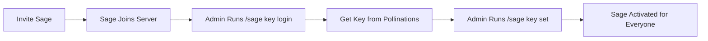

# 🌸 Bring Your Own Pollen (BYOP)

Sage runs on a unique, community-friendly model: **The bot is free to host, and communities provide the "brain power."**

This ensures Sage remains free, unlimited, and sustainable for everyone.

---

## 🔑 How It Works

Sage needs an API Key (Pollen) to generate smart responses. We use a **Server-Wide Key** system so your community can chat freely without each person needing their own key.

### The Activation Lifecycle



---

## 🚀 Setup Guide (For Admins)

**Prerequisite:** You must be a Server Admin or have the "Manage Guild" permission.

### Step 1: Get Your Key

Type this command in your server:

```
/sage key login
```

Click the link to log in to Pollinations.ai. You'll see your API key in the browser URL bar (it starts with `sk_`).

### Step 2: Activate Sage

Copy your key and run:

```
/sage key set <your_key>
```

**That's it!** Sage is now active for your entire server. 🎉 Members can start chatting by **tagging @Sage**, starting a message with "**Sage**", or **replying** to its posts.

---

## ❓ FAQ

**Q: Do my members need to pay?**
**A:** No! The key you provide covers everyone. Pollinations.ai offers generous free tiers, so it's usually free for your community.

**Q: Is this safe?**
**A:** Yes. Your key is stored securely in Sage's database and is **only** used for requests from your specific server.

**Q: How do I remove a key?**
**A:** If you want to stop using Sage in your server, just run `/sage key clear`.

---

<p align="center">
  <sub>Powered by <a href="https://pollinations.ai">Pollinations.ai</a> 🐝</sub>
</p>
