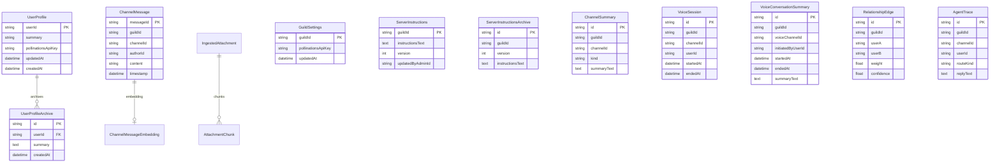

# 💾 Database Schema

Sage uses PostgreSQL with Prisma ORM. The current Prisma schema defines 18 models; this document covers the active tables, relationships, and common query patterns.

> [!IMPORTANT]
> Sage now ships one current-schema Prisma baseline migration for fresh database rebuilds. Historical migration layering was intentionally removed as part of the flagship runtime reset, and the baseline bootstraps `CREATE EXTENSION IF NOT EXISTS vector` before any pgvector-backed tables are created.

<p align="center">
  
  
  
</p>

---

## 🧭 Quick Navigation

- [Entity Relationship Diagram](#entity-relationship-diagram)
- [Core Tables](#core-tables)
- [Memory & Context Tables](#memory--context-tables)
- [Embeddings & Search Tables](#embeddings--search-tables)
- [Telemetry Tables](#telemetry-tables)
- [Admin & Operations Tables](#admin--operations-tables)
- [Common Operations](#common-operations)
- [Related Documentation](#related-documentation)

---

<a id="entity-relationship-diagram"></a>

## 📊 Entity Relationship Diagram

> [!NOTE]
> The ERD below is abbreviated to the core entities most readers need first. The later sections cover the full 18-model schema.


```mermaid
erDiagram
    UserProfile ||--o{ UserProfileArchive : "archives"
    ChannelMessage ||--o| ChannelMessageEmbedding : "embedding"
    IngestedAttachment ||--o{ AttachmentChunk : "chunks"

    UserProfile {
        string userId PK
        string summary
        string pollinationsApiKey
        datetime updatedAt
        datetime createdAt
    }

    UserProfileArchive {
        string id PK
        string userId FK
        text summary
        datetime createdAt
    }

    GuildSettings {
        string guildId PK
        string pollinationsApiKey
        datetime updatedAt
    }

    ServerInstructions {
        string guildId PK
        text instructionsText
        int version
        string updatedByAdminId
    }

    ServerInstructionsArchive {
        string id PK
        string guildId
        int version
        text instructionsText
    }

    ChannelMessage {
        string messageId PK
        string guildId
        string channelId
        string authorId
        string content
        datetime timestamp
    }

    ChannelSummary {
        string id PK
        string guildId
        string channelId
        string kind
        text summaryText
    }

    VoiceSession {
        string id PK
        string guildId
        string channelId
        string userId
        datetime startedAt
        datetime endedAt
    }

    VoiceConversationSummary {
        string id PK
        string guildId
        string voiceChannelId
        string initiatedByUserId
        datetime startedAt
        datetime endedAt
        text summaryText
    }

    RelationshipEdge {
        string id PK
        string guildId
        string userA
        string userB
        float weight
        float confidence
    }

    AgentTrace {
        string id PK
        string guildId
        string channelId
        string userId
        string routeKind
        text replyText
    }
```

---

<a id="core-tables"></a>

## 🗂️ Core Tables

### `UserProfile`

Long-term personalization summary per user.

| Column | Type | Notes |
|:---|:---|:---|
| `userId` | `String` (PK) | Discord user ID |
| `summary` | `String` | LLM-generated profile narrative |
| `pollinationsApiKey` | `String?` | User-level BYOP key (optional) |
| `updatedAt` / `createdAt` | `DateTime` | Auto-managed timestamps |

### `UserProfileArchive`

Versioned snapshots of user profiles before compaction overwrites.

| Column | Type | Notes |
|:---|:---|:---|
| `id` | `String` (PK) | CUID |
| `userId` | `String` (FK → `UserProfile`) | Cascade delete |
| `summary` | `Text` | Archived profile text |
| `createdAt` | `DateTime` | Snapshot timestamp |

### `GuildSettings`

Per-guild configuration including server-wide BYOP key.

| Column | Type | Notes |
|:---|:---|:---|
| `guildId` | `String` (PK) | Discord guild ID |
| `pollinationsApiKey` | `String?` | Guild BYOP key (set through Sage's setup card flow) |
| `approvalReviewChannelId` | `String?` | Optional dedicated channel for detailed governance review cards; requester status still stays in the source channel |

### `ServerInstructions`

Admin-authored guild Sage Persona text available to the bot. The persisted model name remains `ServerInstructions`.

| Column | Type | Notes |
|:---|:---|:---|
| `guildId` | `String` (PK) | One memory per guild |
| `instructionsText` | `Text` | Operator-defined Sage Persona, tone, and rules |
| `version` | `Int` | Monotonically increasing |
| `updatedByAdminId` | `String?` | Discord ID of last admin editor |

### `ServerInstructionsArchive`

Historical snapshots of Sage Persona text before updates. The archive model name remains `ServerInstructionsArchive`.

| Column | Type | Notes |
|:---|:---|:---|
| `id` | `String` (PK) | CUID |
| `guildId` / `version` | `String` / `Int` | Indexed by `[guildId, createdAt]` |
| `instructionsText` | `Text` | Archived Sage Persona text |

---

<a id="memory--context-tables"></a>

## 🧠 Memory & Context Tables

### `ChannelMessage`

Raw Discord message storage for transcript context.

| Column | Type | Notes |
|:---|:---|:---|
| `messageId` | `String` (PK) | Discord message ID |
| `guildId` / `channelId` | `String` | Channel location |
| `authorId` / `authorDisplayName` | `String` | Message author |
| `authorIsBot` | `Boolean` | Bot message flag |
| `content` | `Text` | Message body |
| `timestamp` | `DateTime` | Message timestamp |
| `replyToMessageId` | `String?` | Thread/reply reference |
| `mentionsUserIds` | `Json` | Array of mentioned user IDs |
| `mentionsBot` | `Boolean` | Whether bot was mentioned |

Indexed: `[guildId, channelId, timestamp]`, `[guildId, channelId, authorIsBot, timestamp]`

### `IngestedAttachment`

Cached text extraction from non-image Discord file attachments.

| Column | Type | Notes |
|:---|:---|:---|
| `id` | `String` (PK) | CUID |
| `messageId` / `attachmentIndex` | Unique constraint | One entry per attachment |
| `filename` / `sourceUrl` | `String` | Original file metadata |
| `extractor` | `String?` | `tika`, `native`, etc. |
| `status` | `String` | `ok`, `error`, `skipped` |
| `extractedText` | `Text?` | Cached content |
| `extractedTextChars` | `Int` | Character count |

### `ChannelSummary`

Rolling and profile channel summaries with structured metadata.

| Column | Type | Notes |
|:---|:---|:---|
| `id` | `String` (PK) | CUID |
| `guildId` / `channelId` | `String` | Channel scope |
| `kind` | `String` | `rolling` or `profile` |
| `windowStart` / `windowEnd` | `DateTime` | Summary time range |
| `summaryText` | `String` | LLM-generated summary |
| `topicsJson` / `threadsJson` / `unresolvedJson` | `Json?` | Structured metadata |
| `decisionsJson` / `actionItemsJson` | `Json?` | Extracted decisions/actions |
| `sentiment` / `glossaryJson` | `String?` / `Json?` | Sentiment + glossary |

Unique constraint: `[guildId, channelId, kind]`

### `VoiceSession`

Discord voice channel presence tracking.

| Column | Type | Notes |
|:---|:---|:---|
| `id` | `String` (PK) | CUID |
| `guildId` / `channelId` / `userId` | `String` | Session scope |
| `displayName` | `String?` | User display name at session time |
| `startedAt` / `endedAt` | `DateTime` | Session duration |

### `VoiceConversationSummary`

Summary-only memory for a transcribed voice session (optional feature).

| Column | Type | Notes |
|:---|:---|:---|
| `id` | `String` (PK) | CUID |
| `guildId` / `voiceChannelId` | `String` | Guild + voice channel scope |
| `voiceChannelName` | `String?` | Channel display name at session time |
| `initiatedByUserId` | `String` | User who triggered Sage's live voice join flow |
| `startedAt` / `endedAt` | `DateTime` | Session window |
| `speakerStatsJson` | `Json` | Per-speaker utterance counts (summary metadata) |
| `summaryText` | `String` | LLM-generated narrative summary |
| `topicsJson` / `threadsJson` / `unresolvedJson` | `Json?` | Structured metadata |
| `decisionsJson` / `actionItemsJson` | `Json?` | Extracted decisions/actions |
| `sentiment` / `glossaryJson` | `String?` / `Json?` | Sentiment + glossary |

### `RelationshipEdge`

Probabilistic user relationships from interaction signals.

| Column | Type | Notes |
|:---|:---|:---|
| `id` | `String` (PK) | CUID |
| `guildId` | `String` | Guild scope |
| `userA` / `userB` | `String` | Lexicographically ordered pair |
| `weight` | `Float` | 0.0–1.0 relationship strength |
| `confidence` | `Float` | 0.0–1.0 evidence strength |
| `featuresJson` | `Json` | `{ mentions, replies, voice, meta }` |
| `manualOverride` | `Float?` | Admin-set override (0.0–1.0) |

Unique constraint: `[guildId, userA, userB]`

---

<a id="embeddings--search-tables"></a>

## 🔍 Embeddings & Search Tables

### `AttachmentChunk`

Vector-embedded chunks of ingested attachment text for semantic search.

| Column | Type | Notes |
|:---|:---|:---|
| `id` | `String` (PK) | CUID |
| `attachmentId` | `String` | Reference to `IngestedAttachment` |
| `chunkIndex` | `Int` | Ordered chunk position |
| `content` | `Text` | Chunk text |
| `tokenCount` | `Int` | Token count for budgeting |
| `embedding` | `vector(256)` | pgvector embedding |

### `ChannelMessageEmbedding`

Vector embeddings of channel messages for hybrid semantic/lexical search.

| Column | Type | Notes |
|:---|:---|:---|
| `messageId` | `String` (PK, FK → `ChannelMessage`) | Cascade delete |
| `guildId` / `channelId` | `String` | Indexed for scoped queries |
| `embedding` | `vector(256)` | pgvector embedding |

> [!NOTE]
> Embeddings use the `nomic-ai/nomic-embed-text-v1.5` model (configurable via `EMBEDDING_MODEL`) with 256 dimensions (fixed in schema).

---

<a id="telemetry-tables"></a>

## 📡 Telemetry Tables

### `AgentTrace`

Compact per-turn operator ledger for debugging and observability. High-fidelity node, task, and interrupt traces now live in LangSmith.

| Column | Type | Notes |
|:---|:---|:---|
| `id` | `String` (PK) | Trace ID |
| `routeKind` | `String` | Canonical value: `single` |
| `terminationReason` | `String?` | Deprecated compact alias for the graph `stopReason`; current semantic closeout fields live in `budgetJson.graphRuntime` / `toolJson.graph` (`completionKind`, `stopReason`, `deliveryDisposition`) |
| `langSmithRunId` | `String?` | LangSmith run id for the graph execution |
| `langSmithTraceId` | `String?` | LangSmith trace id for cross-run lookup |
| `budgetJson` | `Json?` | Token budget allocation per block |
| `toolJson` | `Json?` | Tool names, args, results |
| `tokenJson` | `Json?` | Provider token usage |
| `replyText` | `Text` | Final reply |

<a id="admin--operations-tables"></a>

## 🛡️ Admin & Operations Tables

### `ApprovalReviewRequest`

Checkpoint-backed approval review requests used to pause and resume the LangGraph runtime around Discord-governed writes.

| Column | Type | Notes |
|:---|:---|:---|
| `id` | `String` (PK) | CUID |
| `threadId` | `String` | LangGraph thread id (the originating trace id) |
| `originTraceId` | `String` | Trace that opened the approval interrupt |
| `resumeTraceId` | `String?` | Trace written when the paused graph resumes |
| `guildId` | `String` | Guild scope |
| `sourceChannelId` | `String` | Source/request channel used for compact requester-facing governance status cards |
| `reviewChannelId` | `String` | Detailed reviewer card channel; defaults to the source channel when no dedicated review surface is configured |
| `reviewerMessageId` | `String?` | Discord message id for the reviewer governance card (auto-deleted after resolution; persisted for restart-safe cleanup) |
| `requesterStatusMessageId` | `String?` | Discord message id for Sage's requester-facing status card (edited on resolution) |
| `kind` | `String` | Action type (for example `server_instructions_update`, `discord_queue_moderation_action`, `discord_rest_write`) |
| `dedupeKey` | `String` | Canonical coalescing key for equivalent unresolved approvals |
| `executionPayloadJson` | `Json` | Canonical execution payload used after approval resume |
| `reviewSnapshotJson` | `Json` | Reviewer-friendly snapshot of the request |
| `interruptMetadataJson` | `Json?` | Extra interrupt metadata surfaced in traces/cards |
| `status` | `String` | `pending` / `approved` / `rejected` / `executed` / `failed` / `expired` |
| `expiresAt` | `DateTime` | Auto-expiry deadline |
| `decidedBy` / `decidedAt` | `String?` / `DateTime?` | Admin decision metadata |
| `executedAt` | `DateTime?` | Timestamp for executed or failed post-approval side effects |
| `decisionReasonText` | `String?` | Short rejection reason collected from the governance modal when present |

### `AgentTaskRun`

Durable task-run records used when Sage keeps a long-running LangGraph thread moving across background worker slices, approval waits, and user-input waits.

| Column | Type | Notes |
|:---|:---|:---|
| `id` | `String` (PK) | CUID |
| `threadId` | `String` | Unique LangGraph thread id for the durable task run |
| `originTraceId` | `String` | Trace that opened the original graph thread |
| `latestTraceId` | `String` | Most recent trace id associated with the task run |
| `guildId` | `String?` | Guild scope when present |
| `channelId` | `String` | Primary channel or thread for the run |
| `requestedByUserId` | `String` | Original requester for the durable task |
| `sourceMessageId` | `String?` | Original user message that opened the run |
| `responseMessageId` | `String?` | Primary Discord message Sage keeps editing across yields and resumes |
| `status` | `String` | `running` / `waiting_user_input` / `waiting_approval` / `completed` / `failed` / `cancelled` |
| `waitingKind` | `String?` | Human wait type when paused (`user_input` or `approval_review`) |
| `latestDraftText` | `Text` | Latest visible response-session text Sage has published |
| `draftRevision` | `Int` | Monotonic response-session revision counter |
| `completionKind` | `String?` | Latest semantic graph outcome when known |
| `stopReason` | `String?` | Latest operational graph stop reason when known |
| `nextRunnableAt` | `DateTime?` | Next worker wake-up time for automatic background progress |
| `leaseOwner` / `leaseExpiresAt` / `heartbeatAt` | `String?` / `DateTime?` / `DateTime?` | Worker lease state for crash-safe background execution; active workers refresh the lease heartbeat throughout a running slice |
| `resumeCount` | `Int` | Number of durable slice resumes consumed so far |
| `taskWallClockMs` | `Int` | Accumulated active slice runtime used for task-level SLA enforcement |
| `maxTotalDurationMs` / `maxIdleWaitMs` | `Int` / `Int` | Total task SLA and human-wait SLA budgets |
| `lastErrorText` | `Text?` | Most recent runtime failure summary, when present |
| `responseSessionJson` | `Json?` | Persisted response-session metadata |
| `activeUserInterruptJson` | `Json?` | Latest requester-only steering reply queued while the run is still `running` |
| `activeUserInterruptRevision` / `activeUserInterruptConsumedRevision` | `Int` / `Int` | Monotonic steering revision and the latest revision the graph has already consumed |
| `activeUserInterruptQueuedAt` / `activeUserInterruptConsumedAt` | `DateTime?` / `DateTime?` | Audit timestamps for the latest queued steering input and when Sage actually consumed it |
| `activeUserInterruptSupersededAt` / `activeUserInterruptSupersededRevision` | `DateTime?` / `Int?` | Latest-wins steering metadata when a newer requester reply supersedes an unconsumed interrupt |
| `waitingStateJson` | `Json?` | Persisted approval or user-input wait state |
| `compactionStateJson` | `Json?` | Persisted prompt-facing compaction state |
| `checkpointMetadataJson` | `Json?` | Latest runnable-context metadata such as yield reason and resume counters |
| `startedAt` / `completedAt` | `DateTime` / `DateTime?` | Task-run lifecycle timestamps |

### `AdminAudit`

Records admin action usage with hashed parameters.

| Column | Type | Notes |
|:---|:---|:---|
| `guildId` / `adminId` | `String` | Audit scope |
| `command` | `String` | Action name |
| `paramsHash` | `String` | SHA256 of normalized params JSON |

---

<a id="common-operations"></a>

## 🔧 Common Operations

```bash
# Apply tracked migrations
npx prisma migrate deploy

# Open visual database browser
npm run db:studio

# Create a new migration (development only)
npx prisma migrate dev --name <migration_name>

# Reset database (⚠️ deletes all data)
npx prisma migrate reset --force --skip-generate
```

> [!WARNING]
> Always back up your database before running migrations in production. Use `npx prisma migrate deploy` (not `dev`) for production environments.

---

<a id="related-documentation"></a>

## 🔗 Related Documentation

- [🧠 Memory System](MEMORY.md) — How Sage stores, summarizes, and injects memory
- [🕸️ Social Graph](SOCIAL_GRAPH.md) — GNN pipeline and Memgraph integration
- [🔒 Security & Privacy](../security/SECURITY_PRIVACY.md) — Data handling and retention
- [⚙️ Configuration](../reference/CONFIGURATION.md) — All database-related env vars
- [🚀 Deployment Guide](../operations/DEPLOYMENT.md) — Database setup for production

<p align="right"><a href="#top">⬆️ Back to top</a></p>
