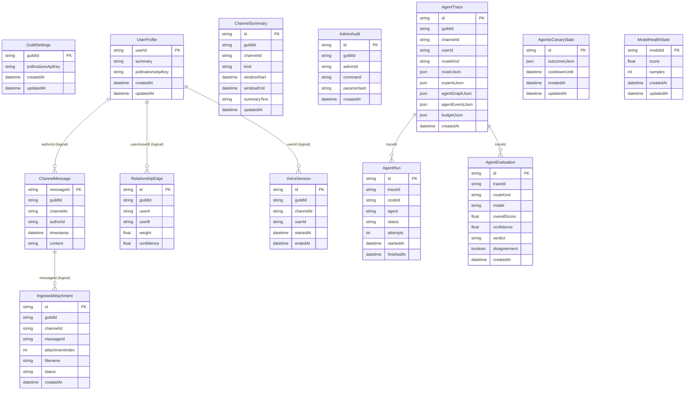

# 💾 Sage Database Architecture

Sage uses **PostgreSQL** (via Prisma) to persist memory, social state, voice activity, and runtime traces.

> [!NOTE]
> The ERD below is a simplified orientation map. `prisma/schema.prisma` is the authoritative schema.

---

## 🧭 Quick navigation

- [Entity Relationship Diagram (ERD)](#entity-relationship-diagram-erd)
- [Core tables](#core-tables)

---

## Entity Relationship Diagram (ERD)

---

## Core tables

| Table | Purpose |
| :--- | :--- |
| `GuildSettings` | Per-guild configuration and encrypted BYOP key references. |
| `UserProfile` | Long-term user summary memory and optional user-scoped key. |
| `ChannelMessage` | Stored message transcript rows (when DB storage is enabled). |
| `IngestedAttachment` | Cached non-image attachment extraction text/metadata for on-demand retrieval. |
| `ChannelSummary` | Rolling and profile summary snapshots per channel. |
| `RelationshipEdge` | Weighted social links derived from interactions. |
| `VoiceSession` | Voice join/leave duration history. |
| `AdminAudit` | Audit trail for privileged command usage. |
| `AgentTrace` | Per-turn runtime trace payload (route, context metadata, events, quality, budget). |
| `AgentRun` | Per-node execution telemetry tied to an `AgentTrace`. |
| `AgentEvaluation` | Model-judge evaluation rows linked to an `AgentTrace`. |
| `AgenticCanaryState` | Persisted canary rollout/error-budget state across restarts. |
| `ModelHealthState` | Per-model health scores used for fallback ranking. |

Notes:

- `AgentTrace.expertsJson` is a legacy field name retained for compatibility; it stores context packet/action metadata in the current architecture.
- Most "relationships" in the ERD are logical (by matching ids), not strict Prisma FK constraints.
