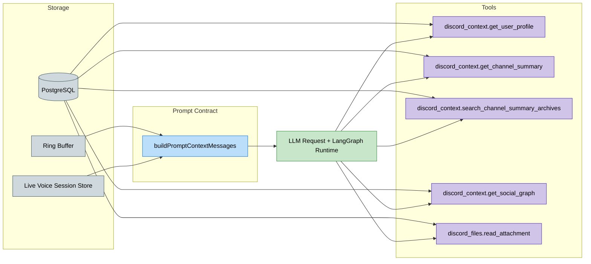

# 🧠 Sage Memory System Architecture

  

This document describes how Sage stores memory and makes it available to the runtime. It reflects the current behavior under `src/features` and `src/platform`.

---

## 🧭 Quick navigation

- [1) Memory sources and storage](#1-memory-sources-and-storage)
- [2) Data retention (transcripts)](#2-data-retention-transcripts)
- [3) Context assembly flow](#3-context-assembly-flow)
- [4) Working memory and prompt contract](#4-working-memory-and-prompt-contract)
- [5) Short-term memory: rolling channel summary](#5-short-term-memory-rolling-channel-summary)
- [6) Long-term memory: channel summary](#6-long-term-memory-channel-summary)
- [7) Throttled user profile updates](#7-throttled-user-profile-updates)
- [8) Relationship graph and social layers](#8-relationship-graph-and-social-layers)
- [9) Voice awareness in memory](#9-voice-awareness-in-memory)
- [🔗 Related documentation](#related-documentation)

---

## 1) Memory sources and storage

| Memory type | Purpose | Storage | Key files |
| :--- | :--- | :--- | :--- |
| **User profile** | Long-term personalization profile per user, stored as soft preferences, active focus, and durable background context. | `UserProfile`, `UserProfileArchive` | `src/features/memory/profileUpdater.ts`, `src/features/memory/userProfileRepo.ts` |
| **Sage Persona** | Admin-authored guild-scoped Sage Persona configuration and archive history. Stored internally in `ServerInstructions` tables and treated as adjacent config, not long-term memory about users or channels. | `ServerInstructions`, `ServerInstructionsArchive` | `src/features/admin/*`, `src/features/agent-runtime/discordDomainTools.ts`, `src/features/agent-runtime/discord/core.ts` |
| **Channel summaries** | Rolling and profile summaries for channels; continuity context rather than quote-level evidence. | `ChannelSummary` | `src/features/summary/*` |
| **Raw transcript** | Recent message history for prompt context and retrieval. | Ring buffer plus optional `ChannelMessage` persistence | `src/features/awareness/*`, `src/features/ingest/ingestEvent.ts` |
| **Attachment cache** | Persisted attachment recall text for on-demand retrieval and resend. Uploaded images store Florence-generated recall/OCR text; other files store extracted text. | `IngestedAttachment`, `AttachmentChunk` | `src/features/attachments/*`, `src/app/discord/handlers/messageCreate.ts` |
| **Relationship graph** | Relationship weights derived from mentions, replies, reactions, and voice overlap. | `RelationshipEdge`, optional Memgraph export | `src/features/relationships/*`, `src/features/social-graph/*` |
| **Voice sessions** | Voice join/leave history and optional summary-only session memory. | `VoiceSession`, `VoiceConversationSummary` | `src/features/voice/*` |

---

## 2) Data retention (transcripts)

- **In-memory transcript ring buffer**
  - `RAW_MESSAGE_TTL_DAYS` starter value: `3`
  - `RING_BUFFER_MAX_MESSAGES_PER_CHANNEL` starter value: `200`
- **Database transcript retention**
  - `MESSAGE_DB_STORAGE_ENABLED=true` persists messages into `ChannelMessage`
  - `MESSAGE_DB_MAX_MESSAGES_PER_CHANNEL` starter value: `500` caps retained rows per channel
- **Prompt transcript window**
  - `CONTEXT_TRANSCRIPT_MAX_MESSAGES` starter value: `15`

Transcript storage and prompt assembly are separate controls. A channel can retain more history in the database than any single prompt includes, and Sage now passes the selected transcript window through without an extra character clamp.

Attachment behavior:

- Transcript rows store cache references and message metadata, not full historical attachment bodies.
- Stored attachment text is loaded on demand through `discord_files` actions such as `list_channel`, `list_server`, and `read_attachment`.
- Sage can resend a cached original file or image through `discord_files` action `send_attachment`; the tool result also returns the stored recall/extracted text so the follow-up reply stays grounded.

Voice transcript behavior:

- Live STT utterances are kept **in-memory only** during a voice session.
- When voice session summaries are enabled, Sage stores only the structured summary row in `VoiceConversationSummary`, not the raw utterance transcript.

---

## 3) Context assembly flow

Runtime notes:

- Memory is not pre-fetched through a separate graph executor.
- User profile summary is the only long-term profile block always embedded up front, and it now lives inside the universal XML prompt contract built by `buildPromptContextMessages`.
- Sage now uses one canonical prompt contract in `src/features/agent-runtime/promptContract.ts`, with fixed sections for system rules, tool protocol, closeout protocol, trusted runtime state, trusted working memory, and explicitly tagged untrusted context.
- The profile is best-effort personalization, not an authoritative rule surface: it is rendered inside `<user_profile>` as soft personalization context that may lag behind the latest turn because profile updates happen asynchronously.
- Channel summaries, archives, social-graph data, file cache data, and wider message history are fetched only if the model chooses the corresponding tool action.
- `discord_context.get_channel_summary` returns rolling channel summary context for continuity and situational awareness. It is not a substitute for message-history evidence.
- Exact historical verification should use `discord_messages.search_history`, `discord_messages.search_with_context`, or `discord_messages.get_context`.

---

## 4) Working memory and prompt contract

**File:** `src/features/agent-runtime/promptContract.ts`

`buildPromptContextMessages` now owns the full turn prompt surface. It builds one universal XML-tagged system message plus one lower-priority tagged context message.

Canonical system-message sections:

- `<system_contract>`
- `<instruction_hierarchy>`
- `<assistant_mission>`
- `<tool_protocol>`
- `<closeout_protocol>`
- `<safety_and_injection_policy>`
- `<few_shot_examples>`
- `<trusted_runtime_state>`
- `<trusted_working_memory>`

Trusted runtime state carries the current turn facts, guild Sage Persona, voice mode, autopilot mode, and profile summary. Trusted working memory carries the loop-level frame:

- `objective`
- `verified_facts`
- `completed_actions`
- `open_questions`
- `pending_approvals`
- `delivery_state`
- `next_required_action`

The lower-priority context envelope carries the explicitly tagged untrusted blocks:

- `<untrusted_reply_target>`
- `<untrusted_recent_transcript>`
- `<untrusted_tool_observations>`
- `<untrusted_user_input>`

Untrusted context is tagged and kept out of the system role instead of being duplicated into high-authority instruction space.

What is **not** preloaded:

- channel summaries
- archived summaries
- social-graph results
- attachment cache text
- historical message search results

These are returned only when the runtime requests them through tools.

Runtime prompt assembly no longer truncates or drops blocks before provider submission, and the graph loop no longer applies a fixed post-budget message-count slice before the next model call. The prompt contract also emits a stable `promptFingerprint` plus a version string so trace/debug surfaces can correlate behavior to an exact reusable prompt revision. The remaining operator knobs are:

| Budget | Env var |
| :--- | :--- |
| Max input tokens | `CONTEXT_MAX_INPUT_TOKENS` |
| Reserved output tokens | `CONTEXT_RESERVED_OUTPUT_TOKENS` |

---

## 5) Short-term memory: rolling channel summary

**Files:**

- `src/features/summary/channelSummaryScheduler.ts`
- `src/features/summary/summarizeChannelWindow.ts`

Scheduler behavior:

- Tick interval: `SUMMARY_SCHED_TICK_SEC` starter value `60`
- Minimum messages before update: `SUMMARY_ROLLING_MIN_MESSAGES` starter value `20`
- Minimum interval between updates: `SUMMARY_ROLLING_MIN_INTERVAL_SEC` starter value `300`
- Rolling window size: `SUMMARY_ROLLING_WINDOW_MIN` starter value `60`

Output is stored in `ChannelSummary` with `kind = 'rolling'`.

---

## 6) Long-term memory: channel summary

**File:** `src/features/summary/summarizeChannelWindow.ts`

Long-term channel summary updates are scheduler-driven:

- `SUMMARY_PROFILE_MIN_INTERVAL_SEC` starter value `21600` gates profile updates
- output is stored in `ChannelSummary` with `kind = 'profile'`
- the runtime reads these summaries through `discord_context` actions when needed

There is no dedicated summarize command surface in the current product; summarization is requested through normal chat.

---

## 7) Throttled user profile updates

**Files:** `src/features/chat/chat-engine.ts`, `src/features/memory/profileUpdater.ts`

Sage updates user profiles asynchronously with throttling:

- Update interval: `PROFILE_UPDATE_INTERVAL` starter value `5`
- Analysis model: `AI_PROVIDER_PROFILE_AGENT_MODEL` (required; optional `AI_PROVIDER_MODEL_PROFILES_JSON` entries can refine limits)
- Formatter/repair step: `jsonrepair` is used to recover strict JSON output
- Concurrency guard: per-user sequential protection prevents overlapping profile updates
- Stored profile contract: exactly `<preferences>`, `<active_focus>`, and `<background>`; legacy `<directives>` rows are normalized on read/write for compatibility
- Input sources: current user text, assistant reply, recent transcript window, and reply/reference text when present; image/file-only content is not interpreted into profile updates in this pass

The latest profile is stored in `UserProfile.summary`, and prior versions can be archived in `UserProfileArchive`.

---

## 8) Relationship graph and social layers

**Files:** `src/features/relationships/*`, `src/features/social-graph/socialGraphQuery.ts`

Relationship edges are updated from mentions, replies, reactions, and voice overlap. At query time, Sage maps ranked relationships into Dunbar-style labels:

- `intimate`
- `close`
- `active`
- `acquaintance`
- `distant`

These signals are returned through `discord_context` actions such as `get_social_graph` and `get_top_relationships`.

If the optional Memgraph/Redpanda stack is enabled, Sage can also export interaction events and query richer graph analytics from Memgraph.

---

## 9) Voice awareness in memory

Voice presence events are stored in `VoiceSession` as join/leave windows and durations.

`discord_context` action `get_voice_analytics` summarizes:

- who is currently in voice
- how long a user has been active today
- lightweight voice-activity signals for response context

Optional voice session summary memory:

- If `VOICE_STT_ENABLED=true`, Sage can transcribe in-channel audio while connected.
- Utterance transcripts stay **in-memory only** in the live session store.
- On leave/disconnect, Sage can persist a **summary-only** record to `VoiceConversationSummary`.
- These summaries are retrievable via `discord_context` action `get_voice_summaries`.

---

## 🔗 Related documentation

- [🔀 Runtime pipeline](PIPELINE.md)
- [💾 Database architecture](DATABASE.md)
- [🔒 Security and privacy](../security/SECURITY_PRIVACY.md)
