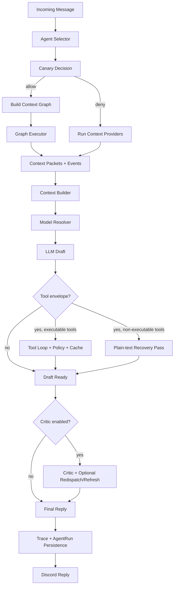
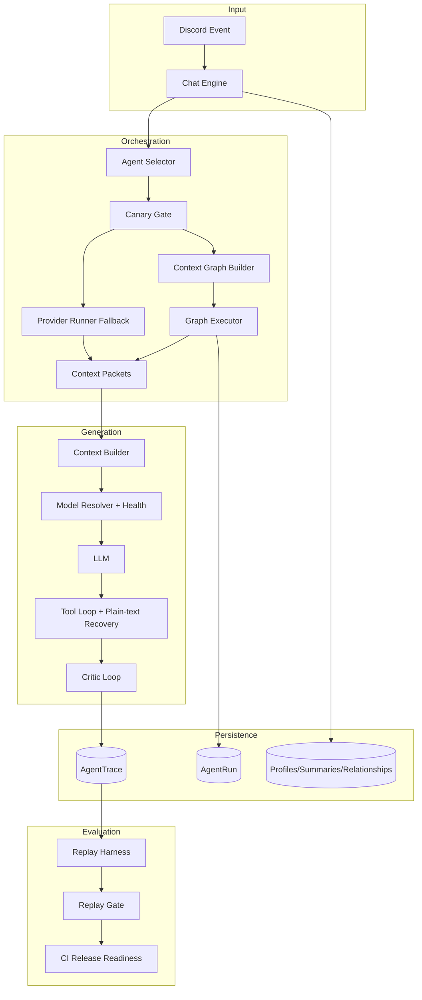

# Agentic Architecture

Sage is an agent-selector-driven, safety-governed Discord runtime.

This page documents the current production architecture as implemented in `src/core/agentRuntime`, `src/core/orchestration`, and related modules.

---

## Quick Navigation

- [What "Agentic" Means in Sage](#what-agentic-means-in-sage)
- [Core Runtime Pillars](#core-runtime-pillars)
- [Execution Lifecycle](#execution-lifecycle)
- [Governance and Safety](#governance-and-safety)
- [Observability and Evaluation](#observability-and-evaluation)
- [Architecture Map](#architecture-map)

---

## What "Agentic" Means in Sage

In Sage, "agentic" means the runtime can:

1. Select an execution route (`chat`, `coding`, `search`, `creative`) per turn, including route temperature and search execution mode when applicable.
2. Build and execute a context-provider graph (or safe provider fallback).
3. Share provider artifacts through blackboard-style packet composition.
4. Run bounded tool loops with policy controls and cache, while advertising only policy-allowed capabilities in the runtime prompt.
5. Use critic-driven revisions (and targeted refresh) when quality is low, plus plain-text recovery when a non-executable tool envelope is emitted.
6. Persist trace metadata and enforce replay gates before promotion.

---

## Core Runtime Pillars

### 1) Agent Selector + Context Graph

- `decideAgent` selects route kind, temperature, and (for search) `search_mode` (`simple` or `complex`).
- `buildContextGraph` builds fanout or linear provider graphs.
- `executeAgentGraph` runs provider tasks with retries/timeouts and captures events.
- When canary blocks agentic execution (or graph execution fails), Sage falls back to `runContextProviders`.

### 2) Context Packets + Builder

- Providers emit typed packets (`UserMemory`, `ChannelMemory`, `SocialGraph`, `VoiceAnalytics`).
- Chat route enforces `UserMemory` + `ChannelMemory` as required baseline providers.
- `SocialGraph` and `VoiceAnalytics` are optional providers added per-turn when selected.
- Packets are merged into `buildContextMessages` with transcript and summary blocks under token budgets.
- Prompt assembly keeps one ordered system block (`base_system`, then runtime capability instruction, then summaries/providers/transcript).
- Creative route can add image-generation packets/files through `runImageGenAction`.

### 3) Tool Governance

- Tool execution is bounded by `runToolCallLoop`.
- Deterministic policy gates apply blocklists and risk permissions (`external_write`, `high_risk`).
- Per-turn cache avoids duplicate tool executions.
- Hard gate (`AGENTIC_TOOL_HARD_GATE_*`) can require successful tool evidence on freshness/source-sensitive turns before finalizing.
- Verification and factual revision are handled by the critic loop rather than virtual verification tools.
- Runtime injects a capability manifest into the system prompt so the model only claims tools/context providers actually available in that turn.
- Runtime includes `## Agentic State (JSON)` only for `chat` and `coding` routes.

### 4) Quality Loop

- Critic scoring is controlled by `AGENTIC_CRITIC_*`.
- If quality is below threshold, Sage revises with critic instructions.
- For `chat` and `coding`, revisions are new LLM rewrite passes; the revised draft replaces the previous draft (no merging).
- For `chat` and `coding`, critic-requested revisions can execute a tool-backed revision loop when verification is required.
- Search route can run an additional search refresh when issues indicate staleness/factual risk and uses guardrails to require source grounding for key claims.
- When search mode is `complex`, runtime runs a second chat synthesis pass (`search -> chat summary`) before returning the final answer (this is where multiple search findings can be reconciled).
- Non-search routes can redispatch targeted context providers before rewrite.

### 5) Model Policy

- Route-aware candidate chains are resolved by `resolveModelForRequestDetailed`.
- Capability filters cover tools/search/reasoning/vision/audio constraints.
- Tenant allowlists (`AGENTIC_TENANT_POLICY_JSON`) can constrain model selection.
- Health telemetry adjusts fallback ordering over time.
- Search runtime guardrails keep normal search on `gemini-search`, `perplexity-fast`, and `perplexity-reasoning`; `nomnom` is only enabled when the user prompt contains a URL and is prioritized for that turn.

### 6) Rollout Governance

- Canary sampling controls how often graph execution is used.
- Route allowlist limits which routes can use agentic graph path.
- Error-budget windows trigger cooldown when failure rates spike.
- Runtime records canary decisions/outcomes per turn.

---

## Execution Lifecycle

---

## Governance and Safety

### Tenant Policy Layer

`AGENTIC_TENANT_POLICY_JSON` supports `default` and per-guild overrides for:

- graph parallelism,
- critic settings,
- tool permissions/blocklists,
- allowed model sets.

### Canary and Rollback Layer

Canary controls include:

- rollout percentage,
- route allowlist,
- failure-rate threshold,
- rolling sample window,
- cooldown period.

When thresholds are breached, runtime automatically cools down to safer provider-only behavior.

### Release Gate Layer

`npm run agentic:replay-gate` evaluates recent traces and enforces score/success thresholds before promotion.

CI release-readiness runs this gate after migrations are applied (for example: `npx prisma migrate deploy`).

---

## Observability and Evaluation

Trace persistence includes:

- agent selector decisions (`routeKind`, `routerJson`, `reasoningText`, search mode),
- context packet payloads (`expertsJson` field name retained for schema compatibility),
- graph/events and budget metadata (including resolved `searchExecutionMode` when search route is used),
- tool + critic metadata,
- per-node runtime rows (`AgentRun`).

Replay harness and outcome scoring provide:

- average quality score,
- success-likely ratio,
- route-level quality slices,
- repeatable release gate inputs.

---

## Architecture Map

---

## Related Docs

- [Runtime Pipeline](PIPELINE.md)
- [Configuration Reference](../reference/CONFIGURATION.md)
- [Operations Runbook](../operations/RUNBOOK.md)
- [Release Process](../reference/RELEASE.md)
- [Database Architecture](DATABASE.md)
