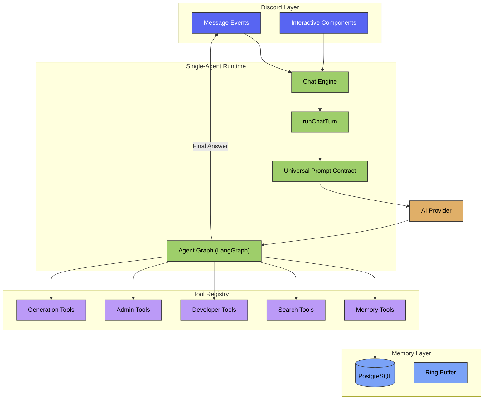
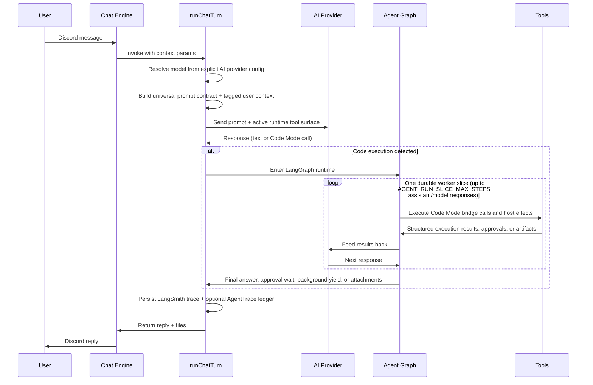

# 🤖 Agentic Architecture Overview

How Sage processes every message — from raw Discord event to verified, tool-augmented reply.

<p align="center">
  
</p>

---

## 🧭 Quick Navigation

- [Design Philosophy](#design-philosophy)
- [Core Components](#core-components)
- [Runtime Overview](#runtime-overview)
- [Tool-Oriented Architecture](#tool-oriented-architecture)
- [Registered Tools](#registered-tools)
- [Reliability Model](#reliability-model)
- [Key Source Files](#key-source-files)
- [Related Documentation](#related-documentation)

---

<a id="design-philosophy"></a>

## 💡 Design Philosophy

Sage is a **single-agent runtime** built around one custom LangGraph execution path. Every message flows through `runChatTurn`, which assembles context and then hands control to the agent graph for model calls, Code Mode execution, approval interrupts, durable background yields, and finalization.

**Why single-agent?**

- **Predictability:** One canonical execution path means deterministic behavior and simpler debugging.
- **Clean context:** Memory, summaries, message history, and file content are fetched **on demand** through tools — not blindly pre-injected into every prompt.
- **Composability:** The model now sees one primary execution surface, `runtime_execute_code`, and uses Sage's host bridge for composed work instead of juggling a huge public tool menu.

---

<a id="core-components"></a>

## 🏗️ Core Components


```mermaid
flowchart TD
    classDef discord fill:#5865f2,stroke:#333,color:white
    classDef runtime fill:#9ECE6A,stroke:#333,color:black
    classDef memory fill:#7AA2F7,stroke:#333,color:black
    classDef tools fill:#BB9AF7,stroke:#333,color:black
    classDef llm fill:#E0AF68,stroke:#333,color:black

    subgraph Discord["Discord Layer"]
        ME[Message Events]:::discord
        IC[Interactive Components]:::discord
    end

    subgraph Runtime["Single-Agent Runtime"]
        CE[Chat Engine]:::runtime
        RT[runChatTurn]:::runtime
        PC["Universal Prompt Contract"]:::runtime
        AG["Agent Graph (LangGraph)"]:::runtime
    end

    subgraph Memory["Memory Layer"]
        PG[(PostgreSQL)]:::memory
        RB[Ring Buffer]:::memory
    end

    subgraph Tools["Tool Registry"]
        MT[Memory Tools]:::tools
        ST[Search Tools]:::tools
        DT[Developer Tools]:::tools
        AT[Admin Tools]:::tools
        GT[Generation Tools]:::tools
    end

    ME --> CE --> RT
    IC --> CE
    RT --> PC --> LLM[AI Provider]:::llm
    LLM --> AG
    AG --> MT & ST & DT & AT & GT
    MT --> PG
    AG -->|"Final Answer"| ME
```

| Component | File | Purpose |
|:---|:---|:---|
| **Chat Engine** | `src/features/chat/chat-engine.ts` | Entry point — receives Discord events, orchestrates `runChatTurn` |
| **Agent Runtime** | `src/features/agent-runtime/agentRuntime.ts` | The single `runChatTurn` function: model resolution, prompt assembly, graph invocation, trace persistence, and prompt metadata propagation |
| **Universal Prompt Contract** | `src/features/agent-runtime/promptContract.ts` | Builds Sage's one canonical XML-tagged system contract plus tagged user content, working-memory frame, prompt version, and prompt fingerprint |
| **Agent Graph Runtime** | `src/features/agent-runtime/langgraph/runtime.ts` | Custom LangGraph runtime for plain-text-first assistant turns, bounded worker slices, tool execution, approval + user-input interrupts, response-session state, and checkpointed resumes |
| **Tool Registry** | `src/features/agent-runtime/toolRegistry.ts` | Zod-validated tool definitions with runtime execution metadata |
| **Default Tools** | `src/features/agent-runtime/defaultTools.ts` | Registers the primary Code Mode tool plus the internal host-backed capability inventory |

---

<a id="runtime-overview"></a>

## ⚡ Runtime Overview


```mermaid
sequenceDiagram
    participant U as User
    participant CE as Chat Engine
    participant RT as runChatTurn
    participant LLM as AI Provider
    participant AG as Agent Graph
    participant T as Tools

    U->>CE: Discord message
    CE->>RT: Invoke with context params
    RT->>RT: Resolve model from explicit AI provider config
    RT->>RT: Build universal prompt contract + tagged user context
    RT->>LLM: Send prompt + active runtime tool surface
    LLM->>RT: Response (text or Code Mode call)

    alt Code execution detected
        RT->>AG: Enter LangGraph runtime
        loop One durable worker slice (up to AGENT_RUN_SLICE_MAX_STEPS assistant/model responses)
            AG->>T: Execute Code Mode bridge calls and host effects
            T->>AG: Structured execution results, approvals, or artifacts
            AG->>LLM: Feed results back
            LLM->>AG: Next response
        end
        AG->>RT: Final answer, approval wait, background yield, or attachments
    end

    RT->>RT: Persist LangSmith trace + optional AgentTrace ledger
    RT->>CE: Return reply + files
    CE->>U: Discord reply
```

**Key runtime rules:**

1. **Single-agent, provider-routed text runtime** — Sage stays on one runtime path while resolving either the built-in Codex route or the configured fallback text provider.
2. **Code Mode first** — `runtime_execute_code` is the primary model-facing execution surface, and host capabilities are reached through the Sage bridge instead of a giant top-level tool menu.
3. **Bounded graph execution** — configurable max tool-capable assistant/model responses per durable worker slice (`AGENT_RUN_SLICE_MAX_STEPS`); Sage no longer slices tool-call batches or truncates model-facing tool payloads inside the runtime.
4. **Parallel read-only optimization** — read-only tools can execute concurrently within a step through `ToolNode`.
5. **Clean background yield** — when a slice closes cleanly after tool work, Sage can spend one extra no-tools wrap-up response to summarize progress before yielding back to the background worker; timeout handling still falls back to the deterministic runtime summary.
6. **Prompt-first observability** — every turn carries `promptVersion` and `promptFingerprint` metadata alongside LangGraph tracing so changes to the canonical system contract or lower-priority context-envelope layout are attributable in traces and smoke runs.

---

<a id="tool-oriented-architecture"></a>

## 🔧 Tool-Oriented Architecture

Code Mode is now the primary model-facing execution mechanism. Sage still uses one canonical internal tool contract, but it is primarily consumed behind the host bridge rather than exposed wholesale to the model.

Each tool carries:

- A stable **tool name** plus optional display title
- A provider-safe **`inputSchema`**
- An optional **`outputSchema`**
- MCP-style **annotations** such as `readOnlyHint`, `destructiveHint`, `idempotentHint`, and `openWorldHint`
- Runtime policy metadata for approval, observation budget, access tier, and capability tags where a tool family needs them for access policy
- An **`execute` function** that returns structured content, optional model-facing summary text, optional artifacts, and telemetry

The runtime now enforces that contract instead of treating it as descriptive metadata only:

- `outputSchema` is validated at execution time when a tool declares it.
- Observation summaries are generated per tool policy (`tiny`, `default`, `large`, `streaming`, `artifact-only`) instead of one global fallback path.
- Only tools marked `parallelSafe` are batched into the parallel read lane; other reads stay sequential.
- Every turn still registers the full internal host capability inventory, but the default model-facing surface now collapses to Code Mode so the model programs against the bridge instead of hand-routing dozens of capabilities.

```typescript
interface ToolSpecV2<TArgs, TStructured = unknown> {
  name: string;
  title?: string;
  description: string;
  inputSchema: Record<string, unknown>;
  outputSchema?: Record<string, unknown>;
  annotations?: {
    readOnlyHint?: boolean;
    destructiveHint?: boolean;
    idempotentHint?: boolean;
    openWorldHint?: boolean;
    parallelSafe?: boolean;
  };
  runtime: {
    class: 'query' | 'mutation' | 'artifact' | 'runtime';
    access?: 'public' | 'admin';
    observationPolicy?: 'tiny' | 'default' | 'large' | 'streaming' | 'artifact-only';
    capabilityTags?: string[];
  };
  execute: (
    args: TArgs,
    ctx: ToolExecutionContext,
  ) => Promise<{
    structuredContent?: TStructured;
    modelSummary?: string;
    artifacts?: ToolArtifact[];
  }>;
}
```

The runtime teaches silent native tool usage through the universal prompt contract, exposes all eligible tools for the current turn, and keeps normal user-facing answers in assistant text rather than tool payloads.

Operators can audit that surface directly with `npm run tools:audit` or `npm run doctor -- --only tools.audit`, which checks the live registry for description quality, prompt routing metadata, read-only annotation coverage, artifact observation policy, and other compiler-readiness rules before a tool set is shipped.

---

<a id="registered-tools"></a>

## 🧰 Registered Tools

> [!NOTE]
> The runtime now exposes exactly one model-facing baseline tool. Host capabilities are reached through bridge-native Code Mode namespaces instead of a public registry of named Discord, web, system, and admin tools.

### 🧩 Baseline Runtime Surface

| Tool | Description | Access |
|:---|:---|:---|
| `runtime_execute_code` | Execute short JavaScript programs against the bridge-native namespaces `discord`, `history`, `context`, `artifacts`, `approvals`, `admin`, `moderation`, `schedule`, `http`, and `workspace`. | Public |

---

<a id="reliability-model"></a>

## 🛡️ Reliability Model

| Layer | Mechanism |
|:---|:---|
| **Tool validation** | Zod input validation + size limits before execution, plus runtime `outputSchema` validation when declared |
| **Bounded execution** | Max rounds, calls per round, and per-tool timeout |
| **Error classification** | Execution-stage kind (`validation`/`execution`/`timeout`) plus actionable categories (HTTP status, rate limit, network error, etc.) surfaced to the LLM |
| **Observability** | LangSmith captures graph execution and Sage can persist a compact `AgentTrace` ledger with route, budget, tool, token, final-reply, and tool-exposure metadata |
| **Tool audit** | `npm run tools:audit` and `tools.audit` in `doctor` validate registry quality, provider compiler readiness, and policy coverage before deployment |
| **Build/test gates** | `check:trust` runs lint + typecheck + test audit + shuffled test validation, and now includes the tool-audit gate |

---

<a id="key-source-files"></a>

## 📂 Key Source Files

```text
src/
├── app/                        # Bootstrap, Discord event wiring, lifecycle hooks
├── features/
│   ├── agent-runtime/          # runChatTurn, LangGraph turn runtime, prompt/context assembly
│   ├── chat/                   # Chat orchestration and rate limiting
│   ├── memory/                 # Profiles and memory update flows
│   ├── summary/                # Channel summarization and compaction
│   └── ...                     # Awareness, settings, ingest, embeddings, admin
├── platform/                   # Discord, DB, LLM, config, logging, security adapters
├── shared/                     # Pure cross-cutting helpers and error utilities
└── cli/                        # Operational entrypoints and diagnostics
```

---

<a id="related-documentation"></a>

## 🔗 Related Documentation

- [🔀 Runtime Pipeline](PIPELINE.md) — Detailed message flow through the agent loop
- [🔍 Search Architecture](SEARCH.md) — SAG flow, search modes, tool providers
- [🧠 Memory System](MEMORY.md) — How Sage stores, summarizes, and injects memory
- [💾 Database Schema](DATABASE.md) — All PostgreSQL tables and relationships
- [⚙️ Configuration](../reference/CONFIGURATION.md) — All environment variables

<p align="right"><a href="#top">⬆️ Back to top</a></p>
