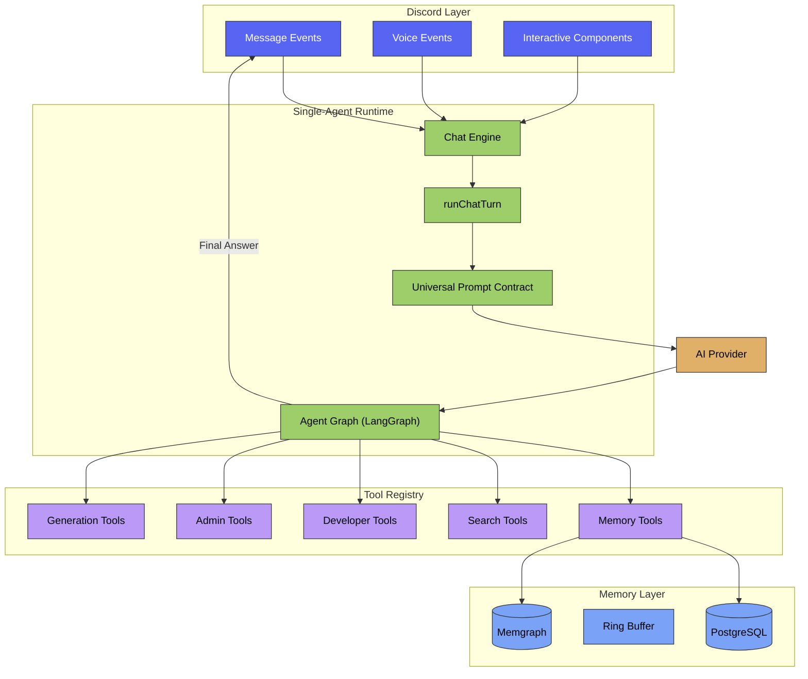
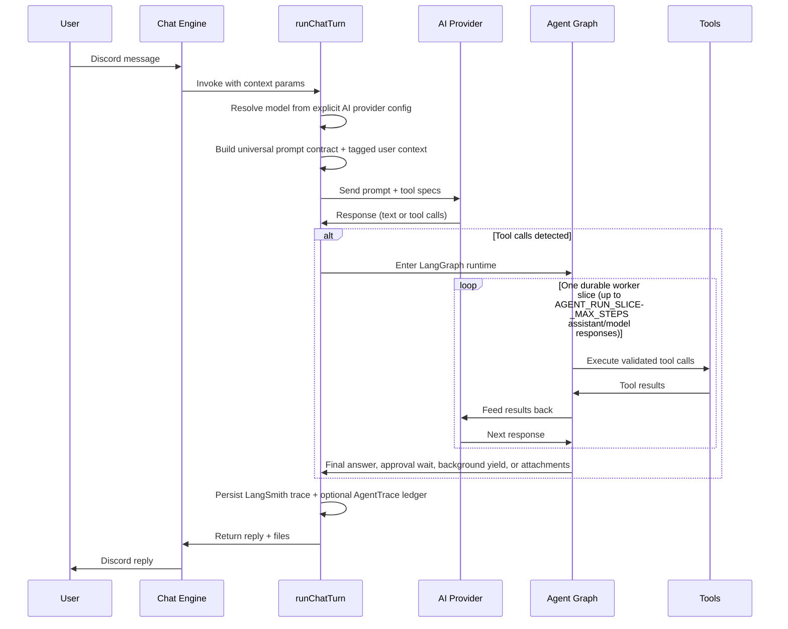

# 🤖 Agentic Architecture Overview

How Sage processes every message — from raw Discord event to verified, tool-augmented reply.

<p align="center">
  
</p>

---

## 🧭 Quick Navigation

- [Design Philosophy](#design-philosophy)
- [Core Components](#core-components)
- [Runtime Overview](#runtime-overview)
- [Tool-Oriented Architecture](#tool-oriented-architecture)
- [Registered Tools](#registered-tools)
- [Reliability Model](#reliability-model)
- [Key Source Files](#key-source-files)
- [Related Documentation](#related-documentation)

---

<a id="design-philosophy"></a>

## 💡 Design Philosophy

Sage is a **single-agent runtime** built around one custom LangGraph execution path. Every message flows through `runChatTurn`, which assembles context and then hands control to the agent graph for model calls, tool execution, approval interrupts, durable background yields, and finalization.

**Why single-agent?**

- **Predictability:** One canonical execution path means deterministic behavior and simpler debugging.
- **Clean context:** Memory, social graph, voice analytics, and file content are fetched **on demand** through tools — not blindly pre-injected into every prompt.
- **Composability:** New capabilities are added as tools, not as new agents or router branches.

---

<a id="core-components"></a>

## 🏗️ Core Components


```mermaid
flowchart TD
    classDef discord fill:#5865f2,stroke:#333,color:white
    classDef runtime fill:#9ECE6A,stroke:#333,color:black
    classDef memory fill:#7AA2F7,stroke:#333,color:black
    classDef tools fill:#BB9AF7,stroke:#333,color:black
    classDef llm fill:#E0AF68,stroke:#333,color:black

    subgraph Discord["Discord Layer"]
        ME[Message Events]:::discord
        VE[Voice Events]:::discord
        IC[Interactive Components]:::discord
    end

    subgraph Runtime["Single-Agent Runtime"]
        CE[Chat Engine]:::runtime
        RT[runChatTurn]:::runtime
        PC["Universal Prompt Contract"]:::runtime
        AG["Agent Graph (LangGraph)"]:::runtime
    end

    subgraph Memory["Memory Layer"]
        PG[(PostgreSQL)]:::memory
        RB[Ring Buffer]:::memory
        MG[(Memgraph)]:::memory
    end

    subgraph Tools["Tool Registry"]
        MT[Memory Tools]:::tools
        ST[Search Tools]:::tools
        DT[Developer Tools]:::tools
        AT[Admin Tools]:::tools
        GT[Generation Tools]:::tools
    end

    ME --> CE --> RT
    VE --> CE
    IC --> CE
    RT --> PC --> LLM[AI Provider]:::llm
    LLM --> AG
    AG --> MT & ST & DT & AT & GT
    MT --> PG & MG
    AG -->|"Final Answer"| ME
```

| Component | File | Purpose |
|:---|:---|:---|
| **Chat Engine** | `src/features/chat/chat-engine.ts` | Entry point — receives Discord events, orchestrates `runChatTurn` |
| **Agent Runtime** | `src/features/agent-runtime/agentRuntime.ts` | The single `runChatTurn` function: model resolution, prompt assembly, graph invocation, trace persistence, and prompt metadata propagation |
| **Universal Prompt Contract** | `src/features/agent-runtime/promptContract.ts` | Builds Sage's one canonical XML-tagged system contract plus tagged user content, working-memory frame, prompt version, and prompt fingerprint |
| **Agent Graph Runtime** | `src/features/agent-runtime/langgraph/runtime.ts` | Custom LangGraph runtime for plain-text-first assistant turns, bounded worker slices, tool execution, approval + user-input interrupts, response-session state, and checkpointed resumes |
| **Tool Registry** | `src/features/agent-runtime/toolRegistry.ts` | Zod-validated tool definitions with runtime execution metadata |
| **Default Tools** | `src/features/agent-runtime/defaultTools.ts` | All granular built-in tool definitions registered for the runtime |

---

<a id="runtime-overview"></a>

## ⚡ Runtime Overview


```mermaid
sequenceDiagram
    participant U as User
    participant CE as Chat Engine
    participant RT as runChatTurn
    participant LLM as AI Provider
    participant AG as Agent Graph
    participant T as Tools

    U->>CE: Discord message
    CE->>RT: Invoke with context params
    RT->>RT: Resolve model from explicit AI provider config
    RT->>RT: Build universal prompt contract + tagged user context
    RT->>LLM: Send prompt + tool specs
    LLM->>RT: Response (text or tool calls)

    alt Tool calls detected
        RT->>AG: Enter LangGraph runtime
        loop One durable worker slice (up to AGENT_RUN_SLICE_MAX_STEPS assistant/model responses)
            AG->>T: Execute validated tool calls
            T->>AG: Tool results
            AG->>LLM: Feed results back
            LLM->>AG: Next response
        end
        AG->>RT: Final answer, approval wait, background yield, or attachments
    end

    RT->>RT: Persist LangSmith trace + optional AgentTrace ledger
    RT->>CE: Return reply + files
    CE->>U: Discord reply
```

**Key runtime rules:**

1. **Single-agent, single-model** — no route-mapped model selection.
2. **Tool-driven context** — memory, social graph, voice data are fetched through tools, not pre-injected.
3. **Bounded graph execution** — configurable max tool-capable assistant/model responses per durable worker slice (`AGENT_RUN_SLICE_MAX_STEPS`); Sage no longer slices tool-call batches or truncates model-facing tool payloads inside the runtime.
4. **Parallel read-only optimization** — read-only tools can execute concurrently within a step through `ToolNode`.
5. **Clean background yield** — when a slice closes cleanly after tool work, Sage can spend one extra no-tools wrap-up response to summarize progress before yielding back to the background worker; timeout handling still falls back to the deterministic runtime summary.
6. **Prompt-first observability** — every turn carries `promptVersion` and `promptFingerprint` metadata alongside LangGraph tracing so changes to the canonical system contract or lower-priority context-envelope layout are attributable in traces and smoke runs.

---

<a id="tool-oriented-architecture"></a>

## 🔧 Tool-Oriented Architecture

Tools are the primary extension mechanism. Sage now uses one canonical MCP-like internal tool contract and compiles that into provider-edge Chat Completions tools on demand.

Each tool carries:

- A stable **tool name** plus optional display title
- A provider-safe **`inputSchema`**
- An optional **`outputSchema`**
- MCP-style **annotations** such as `readOnlyHint`, `destructiveHint`, `idempotentHint`, and `openWorldHint`
- Runtime policy metadata for approval, observation budget, access tier, and capability tags where a tool family needs them for access policy
- An **`execute` function** that returns structured content, optional model-facing summary text, optional artifacts, and telemetry

The runtime now enforces that contract instead of treating it as descriptive metadata only:

- `outputSchema` is validated at execution time when a tool declares it.
- Observation summaries are generated per tool policy (`tiny`, `default`, `large`, `streaming`, `artifact-only`) instead of one global fallback path.
- Only tools marked `parallelSafe` are batched into the parallel read lane; other reads stay sequential.
- Every turn now exposes the full eligible tool surface for the current actor and runtime context; Sage relies on tool definitions plus runtime policy enforcement instead of heuristic subset routing.

```typescript
interface ToolSpecV2<TArgs, TStructured = unknown> {
  name: string;
  title?: string;
  description: string;
  inputSchema: Record<string, unknown>;
  outputSchema?: Record<string, unknown>;
  annotations?: {
    readOnlyHint?: boolean;
    destructiveHint?: boolean;
    idempotentHint?: boolean;
    openWorldHint?: boolean;
    parallelSafe?: boolean;
  };
  runtime: {
    class: 'query' | 'mutation' | 'artifact' | 'runtime';
    access?: 'public' | 'admin';
    observationPolicy?: 'tiny' | 'default' | 'large' | 'streaming' | 'artifact-only';
    capabilityTags?: string[];
  };
  execute: (
    args: TArgs,
    ctx: ToolExecutionContext,
  ) => Promise<{
    structuredContent?: TStructured;
    modelSummary?: string;
    artifacts?: ToolArtifact[];
  }>;
}
```

The runtime teaches silent native tool usage through the universal prompt contract, exposes all eligible tools for the current turn, and keeps normal user-facing answers in assistant text rather than tool payloads.

Operators can audit that surface directly with `npm run tools:audit` or `npm run doctor -- --only tools.audit`, which checks the live registry for description quality, prompt routing metadata, read-only annotation coverage, artifact observation policy, and other compiler-readiness rules before a tool set is shipped.

---

<a id="registered-tools"></a>

## 🧰 Registered Tools

> [!NOTE]
> The runtime no longer exposes routed mega-tools with model-facing `action` fields.
> Every row below is a real registered baseline runtime tool name. This table mirrors the built-in registry sources in `src/features/agent-runtime/defaultTools.ts`, `src/features/agent-runtime/discordDomainTools.ts`, and `src/features/agent-runtime/webTool.ts`. Optional MCP-backed tools are discovered at runtime and are intentionally documented separately from this default inventory.

### 🧠 Discord Context

| Tool | Description | Access |
|:---|:---|:---|
| `discord_context_get_channel_summary` | Fetch rolling and archived summary context for the current channel. | Public |
| `discord_context_get_server_instructions` | Read the current guild Sage Persona instructions. | Public |
| `discord_context_get_social_graph` | Retrieve social graph relationships for a user. | Public |
| `discord_context_get_top_relationships` | Show the strongest recent relationship edges in the guild. | Public |
| `discord_context_get_user_profile` | Fetch the best-effort profile for a user. | Public |
| `discord_context_get_voice_analytics` | Retrieve voice participation analytics. | Public |
| `discord_context_get_voice_summaries` | Retrieve recent voice session summaries. | Public |
| `discord_context_search_channel_summary_archives` | Search archived summary context for the current channel. | Public |

### 💬 Discord Messages

| Tool | Description | Access |
|:---|:---|:---|
| `discord_messages_add_reaction` | Add a reaction to a Discord message. | Public |
| `discord_messages_create_poll` | Create a poll in Discord. | Public |
| `discord_messages_get_context` | Retrieve messages before and after a message ID. | Public |
| `discord_messages_get_user_timeline` | Show recent messages from a user across the guild. | Public |
| `discord_messages_remove_self_reaction` | Remove Sage's own reaction from a message. | Public |
| `discord_messages_search_guild` | Search raw message history across the guild. | Public |
| `discord_messages_search_history` | Search channel message history. | Public |
| `discord_messages_search_with_context` | Search channel history and expand context around the best match. | Public |

### 📎 Discord Files

| Tool | Description | Access |
|:---|:---|:---|
| `discord_files_find_channel` | Search attachment text in the current channel. | Public |
| `discord_files_find_server` | Search attachment text across the guild. | Public |
| `discord_files_list_channel` | List cached attachments in the current channel. | Public |
| `discord_files_list_server` | List cached attachments across the guild. | Public |
| `discord_files_read_attachment` | Read cached attachment text in pages. | Public |
| `discord_files_send_attachment` | Resend a cached attachment as a distinct artifact. | Public |

### 🏛️ Discord Server

| Tool | Description | Access |
|:---|:---|:---|
| `discord_server_add_thread_member` | Add a member to a thread. | Public |
| `discord_server_create_thread` | Create a thread in Discord. | Public |
| `discord_server_get_channel` | Inspect a guild channel or category. | Public |
| `discord_server_get_member` | Inspect a guild member. | Admin |
| `discord_server_get_moderation_policy` | Inspect one Sage moderation policy or imported external AutoMod rule. | Admin |
| `discord_server_get_permission_snapshot` | Inspect guild permission state for a member or role. | Admin |
| `discord_server_get_scheduled_event` | Inspect a scheduled event. | Public |
| `discord_server_get_scheduled_task` | Inspect one durable scheduled reminder or scheduled Sage job. | Admin |
| `discord_server_get_thread` | Inspect a thread. | Public |
| `discord_server_join_thread` | Join a thread as Sage. | Public |
| `discord_server_leave_thread` | Leave a thread as Sage. | Public |
| `discord_server_list_automod_rules` | List guild AutoMod rules. | Admin |
| `discord_server_list_channels` | List guild channels and categories. | Public |
| `discord_server_list_members` | List guild members. | Admin |
| `discord_server_list_moderation_cases` | List recent Sage moderation cases for the guild. | Admin |
| `discord_server_list_moderation_policies` | List Sage moderation policies and imported external AutoMod inventory. | Admin |
| `discord_server_list_roles` | List guild roles. | Public |
| `discord_server_list_scheduled_events` | List guild scheduled events. | Public |
| `discord_server_list_scheduled_tasks` | List durable scheduled reminders and scheduled Sage jobs. | Admin |
| `discord_server_list_threads` | List guild threads. | Public |
| `discord_server_remove_thread_member` | Remove a member from a thread. | Public |
| `discord_server_update_thread` | Rename or update archive and lock settings for a thread. | Public |

### 🛡️ Discord Admin

| Tool | Description | Access |
|:---|:---|:---|
| `discord_admin_add_member_role` | Add a role to a member with admin approval. | Admin |
| `discord_admin_api` | Use the guild-scoped raw Discord API fallback. | Admin |
| `discord_admin_cancel_scheduled_task` | Cancel a durable scheduled reminder or scheduled Sage job. | Admin |
| `discord_admin_clear_governance_review_channel` | Clear the dedicated governance review channel. | Admin |
| `discord_admin_clear_server_api_key` | Clear the current server-wide API key. | Admin |
| `discord_admin_create_channel` | Create a new channel or category. | Admin |
| `discord_admin_create_forum_post` | Create a new forum post in a guild forum channel. | Admin |
| `discord_admin_create_invite` | Create a new invite for a guild channel. | Admin |
| `discord_admin_create_role` | Create a new role. | Admin |
| `discord_admin_create_scheduled_event` | Create a scheduled event for the guild. | Admin |
| `discord_admin_delete_scheduled_event` | Delete a scheduled event from the guild. | Admin |
| `discord_admin_delete_message` | Delete a message with admin approval. | Admin |
| `discord_admin_delete_role` | Delete a role with admin approval. | Admin |
| `discord_admin_disable_moderation_policy` | Disable a deterministic moderation policy without removing its history. | Admin |
| `discord_admin_edit_channel` | Edit an existing channel. | Admin |
| `discord_admin_edit_message` | Edit a message with admin approval. | Admin |
| `discord_admin_edit_role` | Edit an existing role. | Admin |
| `discord_admin_get_governance_review_status` | Inspect governance review routing. | Admin |
| `discord_admin_get_invite_url` | Generate an OAuth2 invite URL for the bot. | Admin |
| `discord_admin_get_server_key_status` | Check whether the guild has a server API key configured. | Admin |
| `discord_admin_list_invites` | List active invites for the guild. | Admin |
| `discord_admin_archive_thread` | Archive a managed thread. | Admin |
| `discord_admin_pin_message` | Pin a message with admin approval. | Admin |
| `discord_admin_remove_member_role` | Remove a role from a member with admin approval. | Admin |
| `discord_admin_reopen_thread` | Reopen an archived managed thread. | Admin |
| `discord_admin_revoke_invite` | Revoke an existing guild invite. | Admin |
| `discord_admin_send_key_setup_card` | Send an interactive server-key setup card. | Admin |
| `discord_admin_set_governance_review_channel` | Route governance review cards to a specific channel. | Admin |
| `discord_admin_submit_moderation` | Submit a moderation or enforcement request. | Admin |
| `discord_admin_unpin_message` | Unpin a message with admin approval. | Admin |
| `discord_admin_upsert_moderation_policy` | Create or update an autonomous moderation policy. | Admin |
| `discord_admin_upsert_scheduled_task` | Create or update a durable scheduled reminder or scheduled Sage job. | Admin |
| `discord_admin_update_forum_tags` | Update the available forum tags for a forum channel. | Admin |
| `discord_admin_update_scheduled_event` | Update an existing scheduled event. | Admin |
| `discord_admin_update_server_instructions` | Submit an admin request to update the guild Sage Persona. | Admin |

### 🔊 Discord Voice

| Tool | Description | Access |
|:---|:---|:---|
| `discord_voice_get_status` | Show the bot voice connection status for this guild. | Public |
| `discord_voice_join_current_channel` | Join the invoker's current voice channel. | Public |
| `discord_voice_leave` | Leave the active guild voice channel. | Public |

### 🌐 Web And Research

| Tool | Description | Access |
|:---|:---|:---|
| `web_read` | Read a web page and return a compact summary. | Public |
| `web_read_page` | Read a specific paginated or follow-up page. | Public |
| `web_search` | Search the web. | Public |

### 💻 Developer

| Tool | Description | Access |
|:---|:---|:---|
| `npm_info` | Lookup npm package metadata. | Public |

> [!TIP]
> GitHub capability now comes from curated MCP presets, but the model sees stable Sage capabilities such as `repo_search_code` and `repo_read_file` instead of raw server-native tool names.

### 🎨 Generation

| Tool | Description | Access |
|:---|:---|:---|
| `image_generate` | Generate an image artifact. | Public |

### ⚙️ System

| Tool | Description | Access |
|:---|:---|:---|
| `system_time` | Calculate current time and timezone offsets. | Public |
| `system_tool_stats` | Inspect in-process tool telemetry. | Public |

---

<a id="reliability-model"></a>

## 🛡️ Reliability Model

| Layer | Mechanism |
|:---|:---|
| **Tool validation** | Zod input validation + size limits before execution, plus runtime `outputSchema` validation when declared |
| **Bounded execution** | Max rounds, calls per round, and per-tool timeout |
| **Error classification** | Execution-stage kind (`validation`/`execution`/`timeout`) plus actionable categories (HTTP status, rate limit, network error, etc.) surfaced to the LLM |
| **Observability** | LangSmith captures graph execution and Sage can persist a compact `AgentTrace` ledger with route, budget, tool, token, final-reply, and tool-exposure metadata |
| **Tool audit** | `npm run tools:audit` and `tools.audit` in `doctor` validate registry quality, provider compiler readiness, and policy coverage before deployment |
| **Build/test gates** | `check:trust` runs lint + typecheck + test audit + shuffled test validation, and now includes the tool-audit gate |

---

<a id="key-source-files"></a>

## 📂 Key Source Files

```text
src/
├── app/                        # Bootstrap, Discord event wiring, lifecycle hooks
├── features/
│   ├── agent-runtime/          # runChatTurn, LangGraph turn runtime, prompt/context assembly
│   ├── chat/                   # Chat orchestration and rate limiting
│   ├── memory/                 # Profiles and memory update flows
│   ├── summary/                # Channel summarization and compaction
│   ├── social-graph/           # Query/migration/setup logic and analytics
│   ├── voice/                  # Voice presence, sessions, analytics
│   └── ...                     # Awareness, settings, ingest, embeddings, admin
├── platform/                   # Discord, DB, LLM, config, logging, security adapters
├── shared/                     # Pure cross-cutting helpers and error utilities
└── cli/                        # Operational entrypoints and diagnostics
```

---

<a id="related-documentation"></a>

## 🔗 Related Documentation

- [🔀 Runtime Pipeline](PIPELINE.md) — Detailed message flow through the agent loop
- [🔍 Search Architecture](SEARCH.md) — SAG flow, search modes, tool providers
- [🧠 Memory System](MEMORY.md) — How Sage stores, summarizes, and injects memory
- [💾 Database Schema](DATABASE.md) — All PostgreSQL tables and relationships
- [🕸️ Social Graph](SOCIAL_GRAPH.md) — GNN pipeline and Memgraph integration
- [🎤 Voice System](VOICE.md) — Voice awareness and companion
- [⚙️ Configuration](../reference/CONFIGURATION.md) — All environment variables

<p align="right"><a href="#top">⬆️ Back to top</a></p>
