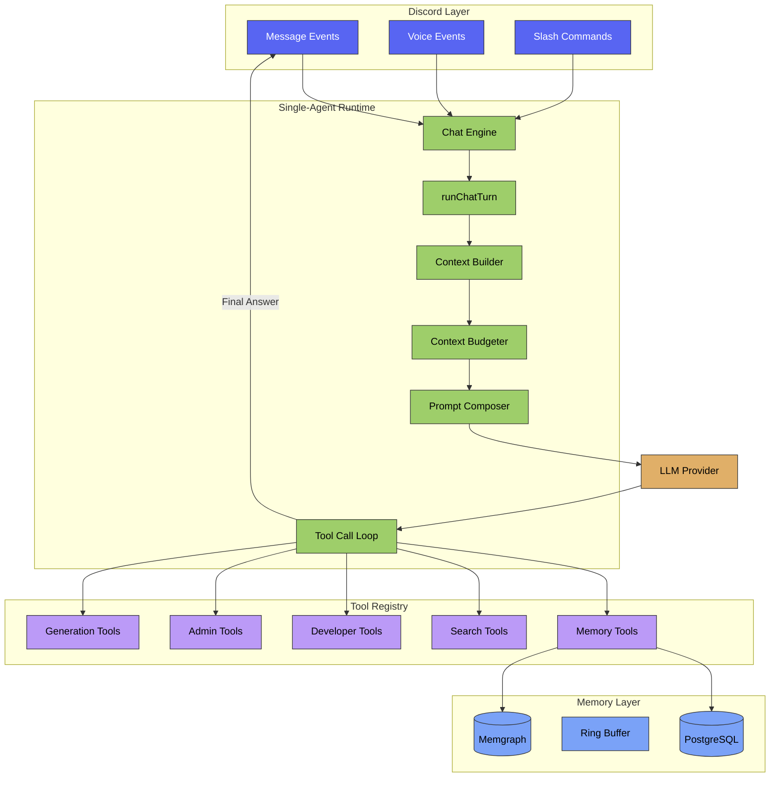
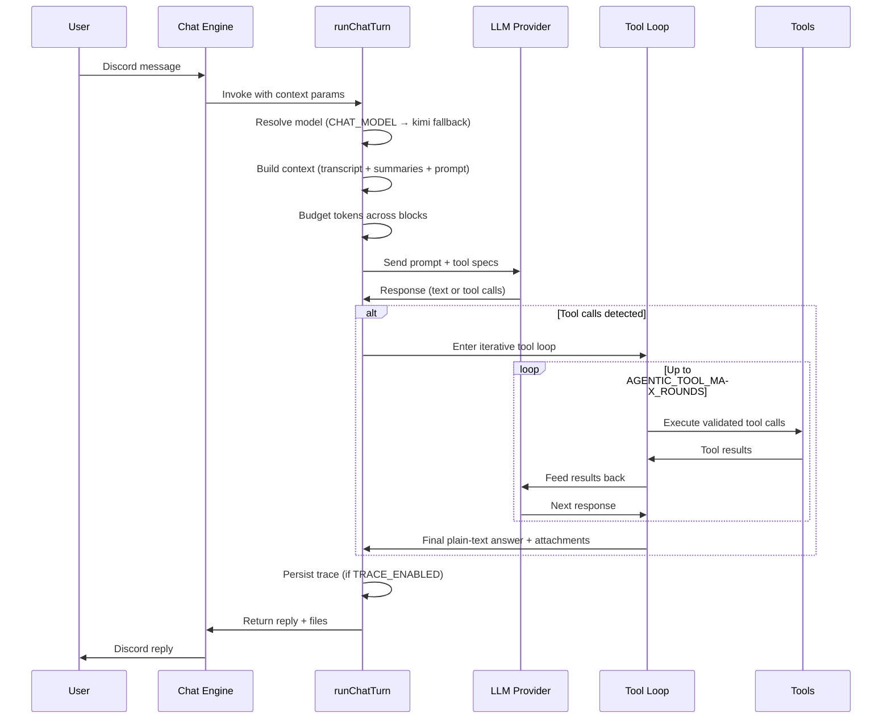

# 🤖 Agentic Architecture Overview

How Sage processes every message — from raw Discord event to verified, tool-augmented reply.

<p align="center">
  
  
</p>

---

## 🧭 Quick Navigation

- [Design Philosophy](#design-philosophy)
- [Core Components](#core-components)
- [Runtime Overview](#runtime-overview)
- [Tool-Oriented Architecture](#tool-oriented-architecture)
- [Registered Tools](#registered-tools)
- [Reliability Model](#reliability-model)
- [Key Source Files](#key-source-files)
- [Related Documentation](#related-documentation)

---

<a id="design-philosophy"></a>

## 💡 Design Philosophy

Sage is a **single-agent runtime** — not a multi-agent graph. Every message flows through one unified execution path (`runChatTurn`) with an iterative tool loop that fetches context, executes actions, and synthesizes a final reply.

**Why single-agent?**

- **Predictability:** One canonical execution path means deterministic behavior and simpler debugging.
- **Clean context:** Memory, social graph, voice analytics, and file content are fetched **on demand** through tools — not blindly pre-injected into every prompt.
- **Composability:** New capabilities are added as tools, not as new agents or router branches.

---

<a id="core-components"></a>

## 🏗️ Core Components


```mermaid
flowchart TD
    classDef discord fill:#5865f2,stroke:#333,color:white
    classDef runtime fill:#9ECE6A,stroke:#333,color:black
    classDef memory fill:#7AA2F7,stroke:#333,color:black
    classDef tools fill:#BB9AF7,stroke:#333,color:black
    classDef llm fill:#E0AF68,stroke:#333,color:black

    subgraph Discord["Discord Layer"]
        ME[Message Events]:::discord
        VE[Voice Events]:::discord
        SC[Slash Commands]:::discord
    end

    subgraph Runtime["Single-Agent Runtime"]
        CE[Chat Engine]:::runtime
        RT[runChatTurn]:::runtime
        CB[Context Builder]:::runtime
        BG[Context Budgeter]:::runtime
        PC[Prompt Composer]:::runtime
        TL[Tool Call Loop]:::runtime
    end

    subgraph Memory["Memory Layer"]
        PG[(PostgreSQL)]:::memory
        RB[Ring Buffer]:::memory
        MG[(Memgraph)]:::memory
    end

    subgraph Tools["Tool Registry"]
        MT[Memory Tools]:::tools
        ST[Search Tools]:::tools
        DT[Developer Tools]:::tools
        AT[Admin Tools]:::tools
        GT[Generation Tools]:::tools
    end

    ME --> CE --> RT
    VE --> CE
    SC --> CE
    RT --> CB --> BG
    BG --> PC --> LLM[LLM Provider]:::llm
    LLM --> TL
    TL --> MT & ST & DT & AT & GT
    MT --> PG & MG
    TL -->|"Final Answer"| ME
```

| Component | File | Purpose |
|:---|:---|:---|
| **Chat Engine** | `src/core/chat-engine.ts` | Entry point — receives Discord events, orchestrates `runChatTurn` |
| **Agent Runtime** | `src/core/agentRuntime/agentRuntime.ts` | The single `runChatTurn` function: model resolution, prompt assembly, tool loop, trace persistence |
| **Context Builder** | `src/core/agentRuntime/contextBuilder.ts` | Composes prioritized message blocks (system prompt, transcript, summaries, reply context) |
| **Context Budgeter** | `src/core/agentRuntime/contextBudgeter.ts` | Token-aware block sizing with configurable per-block budgets |
| **Prompt Composer** | `src/core/agentRuntime/promptComposer.ts` | Assembles the final system prompt with personality, capabilities, and tool protocol |
| **Tool Call Loop** | `src/core/agentRuntime/toolCallLoop.ts` | Iterative tool execution with bounded rounds, parallel read-only optimization, and timeout enforcement |
| **Tool Registry** | `src/core/agentRuntime/toolRegistry.ts` | Zod-validated tool definitions with OpenAI-compatible spec generation |
| **Default Tools** | `src/core/agentRuntime/defaultTools.ts` | All 26 built-in tool definitions |
| **Style Classifier** | `src/core/agentRuntime/styleClassifier.ts` | Analyzes user communication style for adaptive response tone |

---

<a id="runtime-overview"></a>

## ⚡ Runtime Overview


```mermaid
sequenceDiagram
    participant U as User
    participant CE as Chat Engine
    participant RT as runChatTurn
    participant LLM as LLM Provider
    participant TL as Tool Loop
    participant T as Tools

    U->>CE: Discord message
    CE->>RT: Invoke with context params
    RT->>RT: Resolve model (CHAT_MODEL → kimi fallback)
    RT->>RT: Build context (transcript + summaries + prompt)
    RT->>RT: Budget tokens across blocks
    RT->>LLM: Send prompt + tool specs
    LLM->>RT: Response (text or tool calls)

    alt Tool calls detected
        RT->>TL: Enter iterative tool loop
        loop Up to AGENTIC_TOOL_MAX_ROUNDS
            TL->>T: Execute validated tool calls
            T->>TL: Tool results
            TL->>LLM: Feed results back
            LLM->>TL: Next response
        end
        TL->>RT: Final plain-text answer + attachments
    end

    RT->>RT: Persist trace (if TRACE_ENABLED)
    RT->>CE: Return reply + files
    CE->>U: Discord reply
```

**Key runtime rules:**

1. **Single-agent, single-model** — no route-mapped model selection.
2. **Tool-driven context** — memory, social graph, voice data are fetched through tools, not pre-injected.
3. **Bounded tool loop** — configurable max rounds (`AGENTIC_TOOL_MAX_ROUNDS`) and calls per round (`AGENTIC_TOOL_MAX_CALLS_PER_ROUND`).
4. **Parallel read-only optimization** — read-only tools can execute concurrently within a round.
5. **Trace persistence** — every turn optionally persists route, budget, tool, and quality metadata.

---

<a id="tool-oriented-architecture"></a>

## 🔧 Tool-Oriented Architecture

Tools are the primary extension mechanism. Each tool is defined with:

- A **Zod schema** for input validation
- An **`execute` function** for async execution
- **Metadata** (`readOnly`, `readOnlyPredicate`, `access`) for parallelization and permission control

```typescript
interface ToolDefinition<TArgs> {
  name: string;
  description: string;
  schema: z.ZodType<TArgs>;
  metadata?: {
    readOnly?: boolean;
    readOnlyPredicate?: (args: unknown, ctx: ToolExecutionContext) => boolean;
    access?: 'public' | 'admin';
  };
  execute: (args: TArgs, ctx: ToolExecutionContext) => Promise<unknown>;
}
```

The tool protocol is communicated to the LLM via a structured instruction block, and tool calls are parsed from the model's JSON output.

---

<a id="registered-tools"></a>

## 🧰 Registered Tools (13 Total)

### 🧠 Memory & Context (1 tool)

| Tool | Description | Access |
|:---|:---|:---|
| `discord` | Unified Discord tool: memory, retrieval, analytics, safe interactions, and admin approval flows (action-based) | Public (some actions Admin) |

### 🌐 Search & Research (5 tools)

| Tool | Description | Access |
|:---|:---|:---|
| `web_search` | Provider-backed web search (Tavily/Exa/SearXNG/Pollinations) | Public |
| `web_get_page_text` | Extract page text (Crawl4AI/Firecrawl/Jina/raw) | Public |
| `web_extract` | Agentic web scraper with specific instructions | Public |
| `wikipedia_search` | Wikipedia article lookup | Public |
| `stack_overflow_search` | Stack Overflow Q&A search | Public |

### 💻 Developer (4 tools)

| Tool | Description | Access |
|:---|:---|:---|
| `github_get_repository` | GitHub repo metadata + optional README | Public |
| `github_get_file` | Fetch file contents from GitHub | Public |
| `github_search_code` | Search code across a GitHub repository | Public |
| `npm_get_package` | npm package metadata lookup | Public |

### 🎨 Generation (1 tool)

| Tool | Description | Access |
|:---|:---|:---|
| `image_generate` | Generate/edit images via Pollinations | Public |

### 🛡️ Admin & Discord (via `discord` actions)

Admin-only capabilities are exposed as actions on the `discord` tool:
- `memory.queue_server_update` (approval-gated)
- `moderation.queue` (approval-gated)
- `rest` (admin-only; GET executes immediately, non-GET requires approval)
- Typed REST write wrappers (approval-gated): `messages.edit/delete/pin/unpin`, `channels.create/edit`, `roles.create/edit/delete`, `members.add_role/remove_role`

Read-only helpers are also exposed via `discord` actions:
- `oauth2.get_bot_invite_url` (builds a bot invite URL using `DISCORD_APP_ID`)

### ⚙️ System (2 tools)

| Tool | Description | Access |
|:---|:---|:---|
| `system_get_current_datetime` | Get current date/time with timezone offset | Public |
| `system_internal_reflection` | Internal reasoning scratchpad | Public |

---

<a id="reliability-model"></a>

## 🛡️ Reliability Model

| Layer | Mechanism |
|:---|:---|
| **Tool validation** | Zod schema validation + size limits before execution |
| **Bounded execution** | Max rounds, calls per round, and per-tool timeout |
| **Error classification** | `validation` vs `execution` error types with structured feedback to LLM |
| **Model health tracking** | Rolling success/failure scores per model with degraded-mode signaling |
| **Trace persistence** | Route, budget, tool, and quality metadata stored per turn |
| **Build/test gates** | `check:trust` runs lint + typecheck + test audit + shuffled test validation |
| **Eval pipeline** | Model-judge evaluations with dual-judge + adjudicator pattern |

---

<a id="key-source-files"></a>

## 📂 Key Source Files

```text
src/core/
├── chat-engine.ts              # Entry point: Discord → runtime
├── agentRuntime/
│   ├── agentRuntime.ts         # runChatTurn — the single execution path
│   ├── contextBuilder.ts       # Prioritized context message composition
│   ├── contextBudgeter.ts      # Token-budget enforcement per block
│   ├── promptComposer.ts       # System prompt assembly
│   ├── toolCallLoop.ts         # Iterative tool execution loop
│   ├── toolRegistry.ts         # Zod-based tool definition registry
│   ├── defaultTools.ts         # All 26 built-in tools
│   ├── toolIntegrations.ts     # Tool backend implementations
│   ├── toolCallParser.ts       # Parse tool calls from LLM output
│   ├── toolCallExecution.ts    # Execute + validate tool calls
│   ├── toolGrounding.ts        # GitHub grounded search mode
│   ├── styleClassifier.ts      # User style analysis
│   └── agent-trace-repo.ts     # Trace persistence
├── llm/                        # Model resolver, catalog, health
├── memory/                     # Profile updater, user profile repo
├── summary/                    # Channel summary scheduler + summarizer
├── relationships/              # Social graph edge tracking
├── voice/                      # Voice presence, sessions, analytics
├── awareness/                  # Ring buffer, transcript builder
├── attachments/                # Non-image file extraction cache
└── embeddings/                 # Local vector embeddings (RAG)
```

---

<a id="related-documentation"></a>

## 🔗 Related Documentation

- [🔀 Runtime Pipeline](PIPELINE.md) — Detailed message flow through the agent loop
- [🔍 Search Architecture](SEARCH.md) — SAG flow, search modes, tool providers
- [🧠 Memory System](MEMORY.md) — How Sage stores, summarizes, and injects memory
- [💾 Database Schema](DATABASE.md) — All PostgreSQL tables and relationships
- [🕸️ Social Graph](SOCIAL_GRAPH.md) — GNN pipeline and Memgraph integration
- [🎤 Voice System](VOICE.md) — Voice awareness and companion
- [⚙️ Configuration](../reference/CONFIGURATION.md) — All environment variables

<p align="right"><a href="#top">⬆️ Back to top</a></p>
