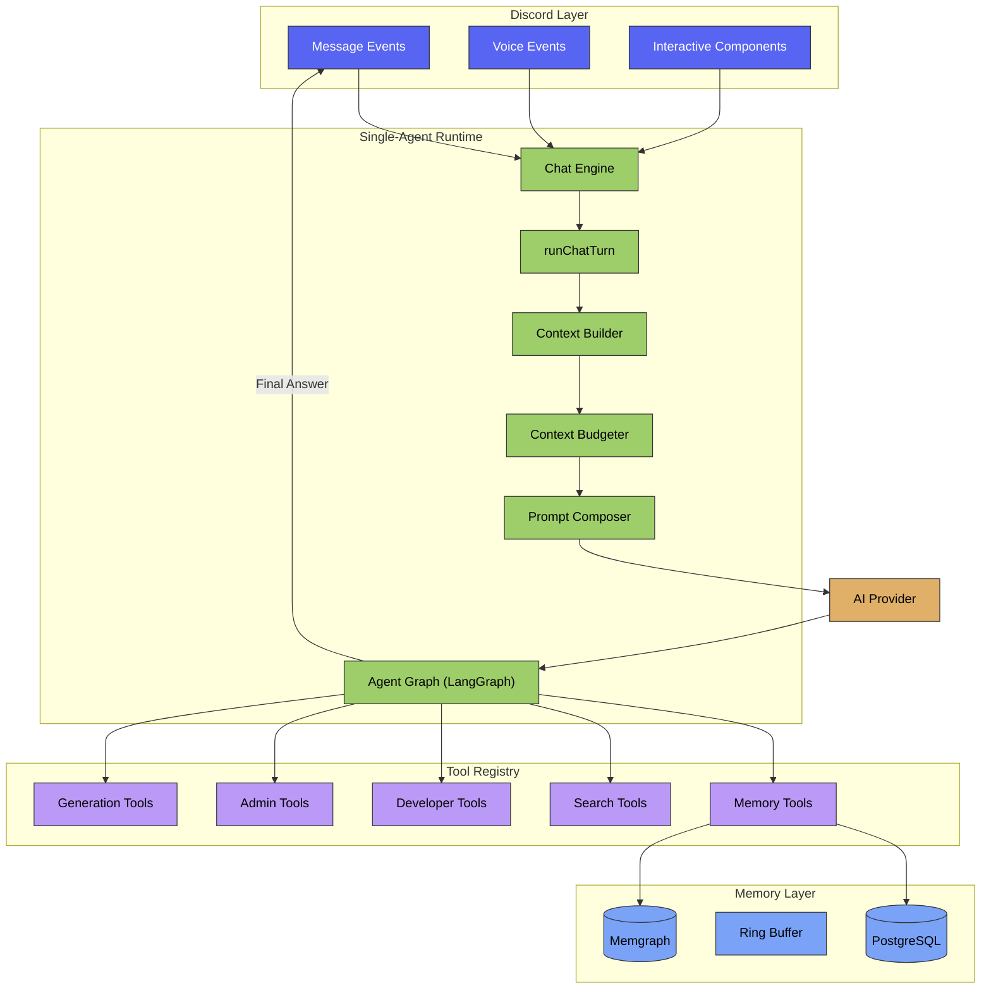
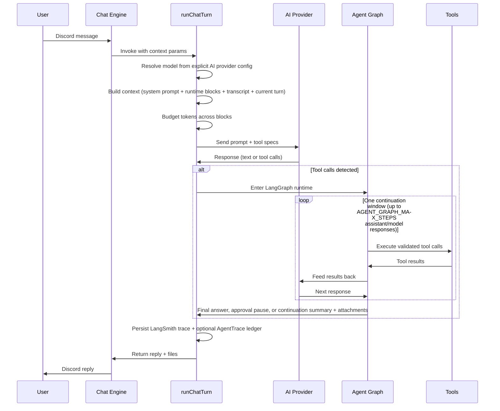

# 🤖 Agentic Architecture Overview

How Sage processes every message — from raw Discord event to verified, tool-augmented reply.

<p align="center">
  
</p>

---

## 🧭 Quick Navigation

- [Design Philosophy](#design-philosophy)
- [Core Components](#core-components)
- [Runtime Overview](#runtime-overview)
- [Tool-Oriented Architecture](#tool-oriented-architecture)
- [Registered Tools](#registered-tools)
- [Reliability Model](#reliability-model)
- [Key Source Files](#key-source-files)
- [Related Documentation](#related-documentation)

---

<a id="design-philosophy"></a>

## 💡 Design Philosophy

Sage is a **single-agent runtime** built around one custom LangGraph execution path. Every message flows through `runChatTurn`, which assembles context and then hands control to the agent graph for model calls, tool execution, approval interrupts, resumable continuation pauses, and finalization.

**Why single-agent?**

- **Predictability:** One canonical execution path means deterministic behavior and simpler debugging.
- **Clean context:** Memory, social graph, voice analytics, and file content are fetched **on demand** through tools — not blindly pre-injected into every prompt.
- **Composability:** New capabilities are added as tools, not as new agents or router branches.

---

<a id="core-components"></a>

## 🏗️ Core Components


```mermaid
flowchart TD
    classDef discord fill:#5865f2,stroke:#333,color:white
    classDef runtime fill:#9ECE6A,stroke:#333,color:black
    classDef memory fill:#7AA2F7,stroke:#333,color:black
    classDef tools fill:#BB9AF7,stroke:#333,color:black
    classDef llm fill:#E0AF68,stroke:#333,color:black

    subgraph Discord["Discord Layer"]
        ME[Message Events]:::discord
        VE[Voice Events]:::discord
        IC[Interactive Components]:::discord
    end

    subgraph Runtime["Single-Agent Runtime"]
        CE[Chat Engine]:::runtime
        RT[runChatTurn]:::runtime
        CB[Context Builder]:::runtime
        BG[Context Budgeter]:::runtime
        PC[Prompt Composer]:::runtime
        AG["Agent Graph (LangGraph)"]:::runtime
    end

    subgraph Memory["Memory Layer"]
        PG[(PostgreSQL)]:::memory
        RB[Ring Buffer]:::memory
        MG[(Memgraph)]:::memory
    end

    subgraph Tools["Tool Registry"]
        MT[Memory Tools]:::tools
        ST[Search Tools]:::tools
        DT[Developer Tools]:::tools
        AT[Admin Tools]:::tools
        GT[Generation Tools]:::tools
    end

    ME --> CE --> RT
    VE --> CE
    IC --> CE
    RT --> CB --> BG
    BG --> PC --> LLM[AI Provider]:::llm
    LLM --> AG
    AG --> MT & ST & DT & AT & GT
    MT --> PG & MG
    AG -->|"Final Answer"| ME
```

| Component | File | Purpose |
|:---|:---|:---|
| **Chat Engine** | `src/features/chat/chat-engine.ts` | Entry point — receives Discord events, orchestrates `runChatTurn` |
| **Agent Runtime** | `src/features/agent-runtime/agentRuntime.ts` | The single `runChatTurn` function: model resolution, prompt assembly, graph invocation, and compact trace-ledger persistence |
| **Context Builder** | `src/features/agent-runtime/contextBuilder.ts` | Composes prioritized message blocks (system prompt, runtime instructions, optional guild Sage Persona/voice context, transcript, reply context) |
| **Context Budgeter** | `src/features/agent-runtime/contextBudgeter.ts` | Token-aware block sizing with configurable per-block budgets |
| **Prompt Composer** | `src/features/agent-runtime/promptComposer.ts` | Assembles the durable base system prompt with identity, response discipline, continuity precedence, and hard rules |
| **Agent Graph Runtime** | `src/features/agent-runtime/langgraph/runtime.ts` | Custom LangGraph runtime for schema-first state, model calls, bounded continuation windows, tool execution, approval + continuation interrupts, subgraph routing, and checkpointed resumes |
| **Tool Registry** | `src/features/agent-runtime/toolRegistry.ts` | Zod-validated tool definitions with runtime execution metadata |
| **Default Tools** | `src/features/agent-runtime/defaultTools.ts` | All 15 built-in top-level tool definitions |

---

<a id="runtime-overview"></a>

## ⚡ Runtime Overview


```mermaid
sequenceDiagram
    participant U as User
    participant CE as Chat Engine
    participant RT as runChatTurn
    participant LLM as AI Provider
    participant AG as Agent Graph
    participant T as Tools

    U->>CE: Discord message
    CE->>RT: Invoke with context params
    RT->>RT: Resolve model from explicit AI provider config
    RT->>RT: Build context (system prompt + runtime blocks + transcript + current turn)
    RT->>RT: Budget tokens across blocks
    RT->>LLM: Send prompt + tool specs
    LLM->>RT: Response (text or tool calls)

    alt Tool calls detected
        RT->>AG: Enter LangGraph runtime
        loop One continuation window (up to AGENT_GRAPH_MAX_STEPS assistant/model responses)
            AG->>T: Execute validated tool calls
            T->>AG: Tool results
            AG->>LLM: Feed results back
            LLM->>AG: Next response
        end
        AG->>RT: Final answer, approval pause, or continuation summary + attachments
    end

    RT->>RT: Persist LangSmith trace + optional AgentTrace ledger
    RT->>CE: Return reply + files
    CE->>U: Discord reply
```

**Key runtime rules:**

1. **Single-agent, single-model** — no route-mapped model selection.
2. **Tool-driven context** — memory, social graph, voice data are fetched through tools, not pre-injected.
3. **Bounded graph execution** — configurable max tool-capable assistant/model responses per continuation window (`AGENT_GRAPH_MAX_STEPS`) and a hard per-response tool-call width cap (`AGENT_GRAPH_MAX_TOOL_CALLS_PER_STEP`); overflowed calls are surfaced back to the model as explicit skipped tool results instead of disappearing silently.
4. **Parallel read-only optimization** — read-only tools can execute concurrently within a step through `ToolNode`.
5. **Clean pause handoff** — when a step window closes cleanly after tool work, Sage can spend one extra no-tools wrap-up response to summarize progress before the Continue handoff; timeout pauses still fall back to the deterministic runtime summary.
6. **LangSmith-first observability** — every turn records LangGraph execution into LangSmith and can additionally persist a compact `AgentTrace` ledger row.

---

<a id="tool-oriented-architecture"></a>

## 🔧 Tool-Oriented Architecture

Tools are the primary extension mechanism. Each tool is defined with:

- A **Zod schema** for input validation
- An **`execute` function** for async execution
- **Metadata** (`readOnly`, `readOnlyPredicate`, `access`) for parallelization and permission control

```typescript
interface ToolDefinition<TArgs> {
  name: string;
  description: string;
  schema: z.ZodType<TArgs>;
  metadata?: {
    readOnly?: boolean;
    readOnlyPredicate?: (args: unknown, ctx: ToolExecutionContext) => boolean;
    access?: 'public' | 'admin';
  };
  execute: (args: TArgs, ctx: ToolExecutionContext) => Promise<unknown>;
}
```

The runtime teaches silent native tool usage through the capability prompt execution rules, and tool calls flow through the provider's native structured tool-call contract. Sage does not expose tool payloads, approval commands, or internal recovery protocol in normal channel replies.

---

<a id="registered-tools"></a>

## 🧰 Registered Tools (15 Total)

> [!NOTE]
> The runtime currently registers 15 top-level tools. The website/demo may show a larger capability count because it also lists routed Discord actions individually.
> Sage’s agent-facing source of truth lives in the runtime tool schemas plus the shared top-level and routed tool metadata in `src/features/agent-runtime/toolDocs.ts`.
> The hierarchy is intentional: prompt guidance teaches fast first-pass routing, routed-tool `help` teaches verbose action discovery, and validation hints plus repair guidance teach recovery after malformed or uncertain tool calls.

### 🧠 Discord Domain Tools (6 tools)

| Tool | Description | Access |
|:---|:---|:---|
| `discord_context` | Profiles, channel summaries, Sage Persona reads, and social/voice analytics | Public |
| `discord_messages` | Exact message history, Discord-native delivery, polls, and reactions | Public |
| `discord_files` | Attachment discovery, paged attachment reads, and attachment resend flows | Public |
| `discord_server` | Guild resources, scheduled events, AutoMod reads, and thread lifecycle actions | Public (some reads Admin) |
| `discord_voice` | Live voice connection status plus join or leave control | Public |
| `discord_admin` | Admin instruction writes, moderation, channel/role/member admin actions, invite URLs, and raw Discord API fallback | Admin |

### 🌐 Search & Research (3 tools)

| Tool | Description | Access |
|:---|:---|:---|
| `web` | Unified web tool (actions): `search`, `read`, `read.page`, `extract`, `research` | Public |
| `wikipedia_search` | Wikipedia article lookup | Public |
| `stack_overflow_search` | Stack Overflow Q&A search | Public |

### 💻 Developer (3 tools)

| Tool | Description | Access |
|:---|:---|:---|
| `github` | Unified GitHub tool (actions): repo metadata, code search, file reads (paged/bulk), issues/PRs, commits | Public |
| `npm_info` | npm package metadata lookup | Public |
| `workflow` | Composable workflow tool that chains common multi-hop operations into one call | Public |

### 🎨 Generation (1 tool)

| Tool | Description | Access |
|:---|:---|:---|
| `image_generate` | Generate images via Pollinations (optional reference image guidance) | Public |

### 🛡️ Admin & Discord (via routed Discord actions)

Admin-only capabilities are exposed on `discord_admin`:

- `get_governance_review_status` (admin-only read)
- `set_governance_review_channel` / `clear_governance_review_channel` (admin-only governance routing controls)
- `update_server_instructions` (approval-gated)
- `submit_moderation` (approval-gated)
- `api` (admin-only; guild-scoped; `GET` executes immediately, non-`GET` requires approval)
- Typed REST write wrappers (approval-gated): `edit_message`, `delete_message`, `pin_message`, `unpin_message`, `create_channel`, `edit_channel`, `create_role`, `edit_role`, `delete_role`, `add_member_role`, `remove_member_role`

Approval UX:

- Sage posts one compact requester-facing status card per queued admin action in the source channel.
- Detailed reviewer cards route to the configured governance review channel when `approvalReviewChannelId` is set, or use the source channel by default when it is not.
- Equivalent unresolved approval-gated requests are coalesced onto the same approval review request and reviewer card instead of opening duplicate cards.
- Rejecting an action collects a short modal reason and propagates that reason back to the requester-facing resolution card.
- When an action resolves (approve/reject/execute/fail/expire), Sage edits the requester-facing status card with the outcome and updates the reviewer card state.
- Resolved reviewer cards auto-delete after ~60 seconds to avoid channel clutter (including after restarts via DB-backed cleanup).
- After an approval interrupt is materialized, the graph keeps the paused turn stable instead of retrying the same approval-gated write again.

Read-only helpers are also exposed across the routed Discord tools:

- `discord_admin.get_invite_url` (builds a bot invite URL using `DISCORD_APP_ID`)
- `discord_messages.search_with_context` (one-shot match + surrounding messages)
- `discord_messages.search_guild` (guild-wide search; not available in Autopilot)
- `discord_messages.get_user_timeline` (recent activity for a user; not available in Autopilot)
- `discord_files.read_attachment` (paged read of ingested attachment text)
- `discord_server.list_channels` / `discord_server.get_channel` (guild channel and category inspection)
- `discord_server.list_threads` / `discord_server.get_thread` (thread discovery and state lookup)
- `discord_server.list_scheduled_events` / `discord_server.get_scheduled_event` (guild event inspection)
- `discord_server.list_members` / `discord_server.get_member` / `discord_server.get_permission_snapshot` / `discord_server.list_automod_rules` (admin-only guild inspection reads)
- `discord_context.get_top_relationships` (top social-graph edges for a time window)

### ⚙️ System (2 tools)

| Tool | Description | Access |
|:---|:---|:---|
| `system_time` | Get current date/time with timezone offset | Public |
| `system_tool_stats` | Inspect in-process tool telemetry (latency/caching/failures; in-memory only) | Public |

---

<a id="reliability-model"></a>

## 🛡️ Reliability Model

| Layer | Mechanism |
|:---|:---|
| **Tool validation** | Zod schema validation + size limits before execution |
| **Bounded execution** | Max rounds, calls per round, and per-tool timeout |
| **Error classification** | Execution-stage kind (`validation`/`execution`/`timeout`) plus actionable categories (HTTP status, rate limit, network error, etc.) surfaced to the LLM |
| **Observability** | LangSmith captures graph execution and Sage can persist a compact `AgentTrace` ledger with route, budget, tool, token, and final-reply metadata |
| **Build/test gates** | `check:trust` runs lint + typecheck + test audit + shuffled test validation |

---

<a id="key-source-files"></a>

## 📂 Key Source Files

```text
src/
├── app/                        # Bootstrap, Discord event wiring, lifecycle hooks
├── features/
│   ├── agent-runtime/          # runChatTurn, LangGraph turn runtime, prompt/context assembly
│   ├── chat/                   # Chat orchestration and rate limiting
│   ├── memory/                 # Profiles and memory update flows
│   ├── summary/                # Channel summarization and compaction
│   ├── social-graph/           # Query/migration/setup logic and analytics
│   ├── voice/                  # Voice presence, sessions, analytics
│   └── ...                     # Awareness, settings, ingest, embeddings, admin
├── platform/                   # Discord, DB, LLM, config, logging, security adapters
├── shared/                     # Pure cross-cutting helpers and error utilities
└── cli/                        # Operational entrypoints and diagnostics
```

---

<a id="related-documentation"></a>

## 🔗 Related Documentation

- [🔀 Runtime Pipeline](PIPELINE.md) — Detailed message flow through the agent loop
- [🔍 Search Architecture](SEARCH.md) — SAG flow, search modes, tool providers
- [🧠 Memory System](MEMORY.md) — How Sage stores, summarizes, and injects memory
- [💾 Database Schema](DATABASE.md) — All PostgreSQL tables and relationships
- [🕸️ Social Graph](SOCIAL_GRAPH.md) — GNN pipeline and Memgraph integration
- [🎤 Voice System](VOICE.md) — Voice awareness and companion
- [⚙️ Configuration](../reference/CONFIGURATION.md) — All environment variables

<p align="right"><a href="#top">⬆️ Back to top</a></p>
