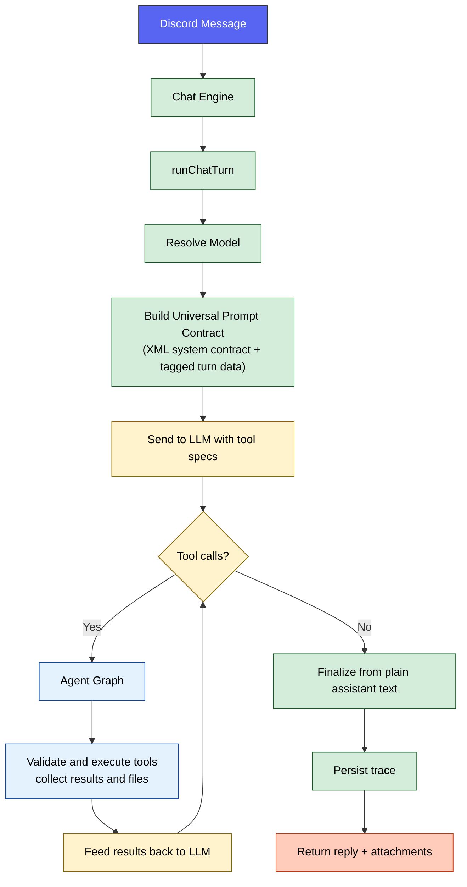
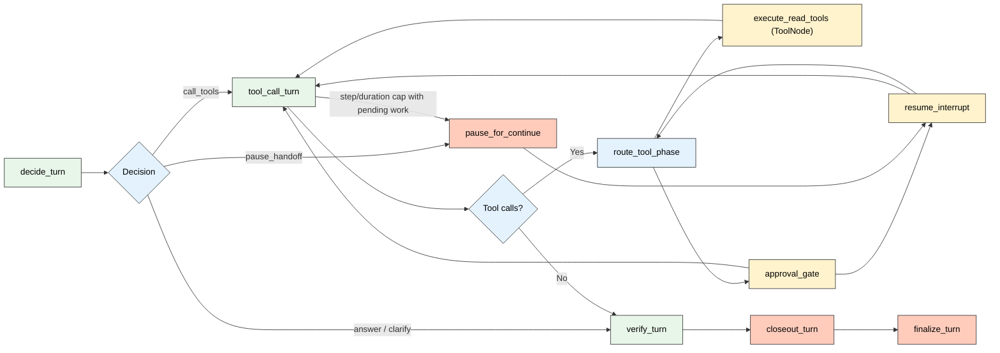

# 🔀 Runtime Pipeline

How a single message flows through Sage's single-agent runtime from Discord event to final reply.

  

---

## 🧭 Quick Navigation

- [Turn Flow](#turn-flow)
- [Context Assembly](#context-assembly)
- [Agent Graph](#agent-graph)
- [Trace Outputs](#trace-outputs)
- [Tool-Oriented Data Access](#tool-oriented-data-access)
- [Configuration](#configuration)
- [Related Documentation](#related-documentation)

---

## ⚡ Turn Flow

Every text turn follows this sequence:

**Step-by-step**

1. **Model resolution**: `runChatTurn` reads `AI_PROVIDER_MAIN_AGENT_MODEL`. Sage no longer ships a built-in agent-model fallback; runtime boot requires explicit AI-provider model configuration.
2. **Context composition**: `buildPromptContextMessages` assembles one canonical XML-tagged system contract plus one lower-priority tagged context message. The system contract now carries only durable operator invariants, tool and closeout protocol, trusted runtime state, and trusted working memory; reply targets, transcript windows, tool observations, and current user content stay in the tagged user-context envelope instead of being duplicated into the system role.
3. **LLM request**: Sage sends the assembled messages plus the active tool schemas for this turn.
4. **Agent graph**: Sage enters the LangGraph-native runtime built on reducer-backed message state, durable tasks, `ToolNode` read batches, explicit read/write partitioning, and in-graph approval or continuation interrupts/resumes until the objective is satisfied, clarification is required, or the run pauses cleanly.
5. **Final reply**: plain text is cleaned, tool-produced files are attached, and the final payload is returned to Discord.
6. **Trace persistence**: LangGraph node and task execution is recorded in LangSmith, and Sage can additionally persist a compact `AgentTrace` ledger row with LangSmith references.

---

## 📦 Context Assembly

`buildPromptContextMessages` composes the turn context in this order:

| Priority | Block | Source |
| :---: | :--- | :--- |
| 1 | System contract | `<system_contract>`, `<instruction_hierarchy>`, `<assistant_mission>`, `<tool_protocol>`, `<closeout_protocol>`, `<safety_and_injection_policy>`, `<few_shot_examples>` |
| 2 | Trusted runtime state | `<trusted_runtime_state>` with `<current_turn>`, guild Sage Persona, voice context, autopilot mode, user profile summary, and runtime turn metadata |
| 3 | Trusted working memory | `<trusted_working_memory>` with objective, verified facts, completed actions, open questions, pending approvals, delivery state, and next required action |
| 4 | Lower-priority context envelope | `<untrusted_reply_target>` when present |
| 5 | Transcript context | `<focused_continuity>` and `<recent_transcript>` nested inside `<untrusted_recent_transcript>` when available |
| 6 | Tool observations | `<untrusted_tool_observations>` summary from the active graph loop |
| 7 | Current user message | Triggering text and multimodal content wrapped as `<untrusted_user_input>` |

> [!NOTE]
> Channel summaries, archived summaries, social-graph data, attachment cache results, and wider message history are not preloaded into every turn. The model fetches them on demand through the split Discord tools when it decides they are needed.
> `discord_context.get_channel_summary` is a continuity surface, not historical evidence. For exact verification Sage should use `discord_messages.search_history`, `discord_messages.search_with_context`, or `discord_messages.get_context`.

The runtime records a stable `promptVersion` plus `promptFingerprint` for the full reusable prompt surface, including both the system contract template and the lower-priority context-envelope layout, so prompt changes are attributable in debugging and smoke runs without hashing live per-turn content.

---

## 🔄 Agent Graph

**Key behaviors**

- **Bounded windows**: `AGENT_GRAPH_MAX_STEPS` limits how many tool-capable assistant/model responses can occur in one continuation window before Sage pauses.
- **Window closeout summary**: when Sage pauses cleanly because the step window is exhausted, it can spend one extra no-tools model response to summarize concrete progress before posting the Continue handoff. If that closeout pass fails or the pause was caused by graph timeout, Sage falls back to the deterministic runtime summary.
- **Message-native state**: the graph persists LangGraph/LangChain messages plus turn facts, approval state, trace metadata, and final delivery state instead of the old custom pending-tool-loop buffers.
- **Read/write partitioning**: read-only batches execute through `ToolNode`, and mutating calls execute one at a time.
- **In-round read dedupe**: identical read-only calls in the same model response are executed once, then fanned back out to the model as per-call tool messages so repeated reads do not waste a full execution slot.
- **Loop guard**: Sage rejects over-wide tool batches before side effects, gives the model one structured repair chance, and finalizes with `loop_guard` if the next batch repeats the same unsafe plan or LangGraph hits the recursion safety ceiling.
- **Plain-text-first closeout**: assistant turns may include both visible text and tool calls; when a turn ends with no tool calls, Sage finalizes directly from the assistant text as either a final answer or a clarification question.
- **Tool-owned action policy**: routed Discord tools now declare explicit read/write and approval metadata, so admin-only reads stay on the read lane while approval-gated writes enter the approval path through per-tool policy instead of graph-side action-name branching.
- **Native tool contract**: the runtime consumes structured provider tool calls directly and feeds tool results back as LangChain tool messages.
- **Provider-neutral model node**: the graph now invokes Sage's `AiProviderChatModel`, which targets an operator-defined AI provider over the OpenAI-compatible chat-completions contract exposed at `AI_PROVIDER_BASE_URL`.
- **Native provider transcript**: follow-up model calls now preserve assistant `tool_calls` and real `tool` messages end to end instead of flattening tool results into synthetic user text.
- **No fixed message-count clipping**: after rebudgeting, Sage now forwards the full surviving assistant/tool transcript instead of hard-cutting the loop to the last eight messages.
- **Response-session delivery**: the runtime tracks one primary editable response session, so draft assistant text can be updated in place while tools run and finalized cleanly when the turn ends.
- **Split outcome semantics**: `completionKind` captures what the turn semantically achieved, `stopReason` captures why the graph stopped or paused, and `deliveryDisposition` tells the outer runtime whether to keep editing the response session, pause it with a Continue affordance, or hand off to approval state.
- **Per-tool timeout**: each tool call is bounded by `AGENT_GRAPH_TOOL_TIMEOUT_MS`.
- **Durable execution**: every real tool invocation and post-approval execution runs inside a LangGraph `task(...)` boundary so replay and thread resume reuse checkpointed task outputs instead of repeating side effects.
- **Repair-aware validation feedback**: routed-tool validation failures now carry compact repair guidance into the next model round, including missing/unknown action recovery and the best matching action contract from the routed-tool docs.
- **Graph wall-clock cap**: the whole orchestration phase is bounded by `AGENT_GRAPH_MAX_DURATION_MS`.
- **No Sage-side truncation**: Sage no longer compacts model-facing tool results or silently trims provider-bound prompt payloads; oversized requests now fail at the provider/runtime boundary instead of being rewritten locally.
- **Approval + continuation interrupts**: approval-gated writes pause before side effects, and long-running turns pause at the window boundary with a persisted continuation record and deterministic progress summary built from the latest draft and tool results.
- **Checkpointed continuation**: resume keeps the same LangGraph thread and prior tool results, resets only the window-local counters, and can continue through another bounded window instead of rebuilding the turn from scratch.
- **File collection**: tools such as `image_generate` can return files that are merged into the final Discord response.

---

## 📊 Trace Outputs

Each turn can persist the following compact operator ledger fields to `AgentTrace`:

| Field | Description |
| :--- | :--- |
| `routeKind` | Canonical value: `single` |
| `promptVersion` | Prompt-contract version string recorded in `tokenJson` / `budgetJson` for the turn |
| `promptFingerprint` | Stable prompt hash recorded alongside the turn so prompt changes are observable |
| `terminationReason` | Deprecated legacy alias on `AgentTrace`; normal graph success paths now persist semantic outcome data in `budgetJson.graphRuntime` / `toolJson.graph` instead |
| `budgetJson.graphRuntime.completionKind` | Semantic turn outcome (`final_answer`, `clarification_question`, `approval_pending`, `pause_handoff`, `loop_guard`, `runtime_failure`) |
| `budgetJson.graphRuntime.stopReason` | Operational stop cause (`assistant_turn_completed`, `approval_interrupt`, `step_window_exhausted`, `graph_timeout`, `max_windows_reached`, `continuation_expired`, `loop_guard`, `runtime_failure`) |
| `budgetJson.graphRuntime.deliveryDisposition` | Runtime delivery path (`response_session`, `approval_handoff`, `response_session_with_continue`) |
| `langSmithRunId` | LangSmith run id for the turn |
| `langSmithTraceId` | LangSmith trace id for the turn |
| `budgetJson` | Token-budget allocation per block |
| `toolJson` | Tool names, args, statuses, and compacted results |
| `tokenJson` | Provider token usage |
| `replyText` | Final reply text sent back to Discord |

> [!TIP]
> Use LangSmith for node, task, and interrupt drill-down, `npm run db:studio` for Sage's compact ledger rows, or send a real chat ping in Discord for an end-to-end runtime health check.
> For a deterministic live Discord graph validation pass without relying on LLM tool selection, run `npm run langgraph:discord:smoke` against a disposable guild/channel.
> Tool-result reinjection is intentionally compact and machine-facing: successful results are bounded, failed results surface retryability plus compact repair metadata for routed-tool validation issues, approval-gated writes resume from an interrupt instead of replaying the write inline, and graph trace metadata records both the semantic closeout classification and the operational stop cause.

---

## 🧰 Tool-Oriented Data Access

Most richer context is loaded on demand through the split Discord tools:

| Data | Tool action | Storage |
| :--- | :--- | :--- |
| User profile | `discord_context.get_user_profile` | PostgreSQL (`UserProfile`) |
| Channel summaries | `discord_context.get_channel_summary` | PostgreSQL (`ChannelSummary`) |
| Archived channel summaries | `discord_context.search_channel_summary_archives` | PostgreSQL plus pgvector-backed archive search |
| Sage Persona | `discord_context.get_server_instructions` | PostgreSQL (`ServerInstructions`, stored internally as guild Sage Persona config) |
| Social graph | `discord_context.get_social_graph`, `discord_context.get_top_relationships` | PostgreSQL (`RelationshipEdge`) plus optional Memgraph |
| Voice analytics | `discord_context.get_voice_analytics`, `discord_context.get_voice_summaries` | PostgreSQL (`VoiceSession`, `VoiceConversationSummary`) |
| Cached file text | `discord_files.list_channel`, `discord_files.list_server`, `discord_files.read_attachment` | PostgreSQL (`IngestedAttachment`) |
| Semantic file search | `discord_files.find_channel`, `discord_files.find_server` | pgvector (`AttachmentChunk`) |
| Message history | `discord_messages.search_history`, `discord_messages.search_with_context`, `discord_messages.get_context`, `discord_messages.search_guild`, `discord_messages.get_user_timeline` | PostgreSQL (`ChannelMessage`) plus pgvector (`ChannelMessageEmbedding`) |
| Invite generation | `discord_admin.get_invite_url` | Computed from `DISCORD_APP_ID` |

Some read actions are blocked in Autopilot mode, and all write/admin actions remain permission-gated.

---

## ⚙️ Configuration

These values reflect the starter values in `.env.example`:

| Variable | Description | Starter value |
| :--- | :--- | :--- |
| `AI_PROVIDER_MAIN_AGENT_MODEL` | Runtime main agent model for `runChatTurn` | *(required in `.env`)* |
| `AGENT_GRAPH_MAX_STEPS` | Max tool-capable assistant/model responses per continuation window before Sage pauses or runs a wrap-up summary | `6` |
| `AGENT_GRAPH_TOOL_TIMEOUT_MS` | Per-tool execution timeout | `45000` |
| `AGENT_GRAPH_MAX_DURATION_MS` | Max wall-clock duration for one graph turn | `120000` |
| `AGENT_GRAPH_MAX_OUTPUT_TOKENS` | Max output tokens for graph model calls | `1800` |
| `AGENT_GRAPH_GITHUB_GROUNDED_MODE` | Enable grounded GitHub search mode | `true` |
| `AGENT_GRAPH_RECURSION_LIMIT` | LangGraph recursion fail-safe above the legal hop count | `16` |
| `AGENT_GRAPH_MAX_TOOL_CALLS_PER_ROUND` | Max executable tool calls Sage will allow from one model response before it forces a repair pass | `8` |
| `AGENT_GRAPH_MAX_IDENTICAL_TOOL_BATCHES` | Consecutive identical tool batches allowed before Sage trips the loop guard | `2` |
| `AGENT_GRAPH_MAX_LOOP_GUARD_RECOVERIES` | How many structured repair attempts Sage gives the model before finalizing with `loop_guard` | `1` |
| `LANGSMITH_TRACING` | Enable optional LangSmith graph tracing | `false` |
| `LANGSMITH_PROJECT` | LangSmith project name | `sage` |
| `SAGE_TRACE_DB_ENABLED` | Persist compact `AgentTrace` ledger rows | `true` |

---

## 🔗 Related Documentation

- [🤖 Agentic Architecture](OVERVIEW.md) — High-level design and tool registry
- [🧠 Memory System](MEMORY.md) — How Sage stores memory and fetches richer context
- [🔍 Search Architecture](SEARCH.md) — SAG flow and search providers
- [🧩 Model Reference](../reference/MODELS.md) — Model resolution and health tracking
- [⚙️ Configuration](../reference/CONFIGURATION.md) — Full environment variable reference

<a href="#top">⬆️ Back to top</a>

