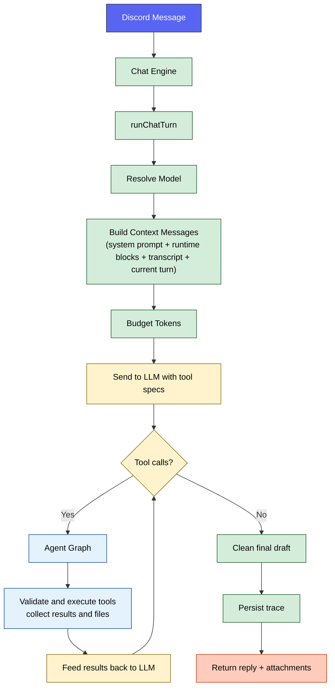
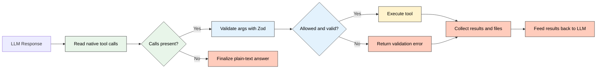

# 🔀 Runtime Pipeline

How a single message flows through Sage's single-agent runtime from Discord event to final reply.

  

---

## 🧭 Quick Navigation

- [Turn Flow](#turn-flow)
- [Context Assembly](#context-assembly)
- [Agent Graph](#agent-graph)
- [Trace Outputs](#trace-outputs)
- [Tool-Oriented Data Access](#tool-oriented-data-access)
- [Configuration](#configuration)
- [Related Documentation](#related-documentation)

---

## ⚡ Turn Flow

Every text turn follows this sequence:

**Step-by-step**

1. **Model resolution**: `runChatTurn` reads `CHAT_MODEL` and falls back to `kimi` when it is empty.
2. **Context composition**: `buildContextMessages` assembles the system prompt, `<current_turn>`, runtime instruction block, optional server instructions, optional live voice context, optional `<focused_continuity>`, optional `<recent_transcript>`, and the current user turn wrapped in `<user_input>` (with any `<reply_target>` folded in as context-only preface content).
3. **Token budgeting**: `contextBudgeter` trims blocks against the configured budgets before the provider call.
4. **LLM request**: Sage sends the budgeted messages plus the OpenAI-compatible tool definitions.
5. **Agent graph**: if the model returns tool calls, Sage routes through the custom LangGraph runtime to validate calls, execute tools, handle approval interrupts, and continue the turn until it can finalize.
6. **Final reply**: plain text is cleaned, tool-produced files are attached, and the final payload is returned to Discord.
7. **Trace persistence**: route, tool, token, and quality metadata are stored when tracing is enabled.

---

## 📦 Context Assembly

`buildContextMessages` composes the turn context in this order:

| Priority | Block | Source |
| :---: | :--- | :--- |
| 1 | Base system prompt | `composeSystemPrompt` with the user profile summary embedded in `<user_profile>` |
| 2 | Current turn | Structured `<current_turn>` metadata from `CurrentTurnContext` |
| 3 | Runtime instructions | Single-agent capabilities, silent native tool-use rules, approval guardrails, and runtime state |
| 4 | Server instructions | `ServerInstructions`, when present |
| 5 | Live voice context | In-memory voice session context, only when Sage is active in voice |
| 6 | Focused continuity | `<focused_continuity>` window from same-speaker and direct-reply context |
| 7 | Recent transcript | Ambient `<recent_transcript>` ring-buffer context |
| 8 | Current user message | Triggering text and multimodal content wrapped as `<user_input>`, with replied-to content inlined first as context-only `<reply_target>` |

> [!NOTE]
> Channel summaries, archived summaries, social-graph data, attachment cache results, and wider message history are not preloaded into every turn. The model fetches them on demand through the split Discord tools when it decides they are needed.
> `discord_context.get_channel_summary` is a continuity surface, not historical evidence. For exact verification Sage should use `discord_messages.search_history`, `discord_messages.search_with_context`, or `discord_messages.get_context`.

All system-role blocks are merged into a single system message before the provider call. This keeps ordering valid for stricter providers while preserving the logical block boundaries in `budgetJson`.

---

## 🔄 Agent Graph

**Key behaviors**

- **Bounded steps**: `AGENT_GRAPH_MAX_STEPS` limits how many model/tool hops can occur in one turn.
- **Calls per step**: `AGENT_GRAPH_MAX_TOOL_CALLS_PER_STEP` caps the number of tool calls the model can issue at once.
- **Parallel read-only execution**: read-only calls can run concurrently up to `AGENT_GRAPH_MAX_PARALLEL_READONLY`, but side-effecting actions still preserve ordering barriers.
- **Native tool contract**: the runtime consumes structured provider tool calls directly; it no longer relies on text-parsed JSON envelopes.
- **Per-tool timeout**: each tool call is bounded by `AGENT_GRAPH_TOOL_TIMEOUT_MS`.
- **Repeated-call guardrails**: identical calls that already failed non-retryably are blocked for the rest of the turn, and identical calls that fail twice in one turn are closed even if the failures were retryable.
- **Stagnation stop**: if the same requested tool batch repeats without any new uncached success, approval interrupt, or side-effect progress, Sage stops the active graph early and pivots to finalization.
- **Graph wall-clock cap**: the whole orchestration phase is bounded by `AGENT_GRAPH_MAX_DURATION_MS`.
- **In-process memoization**: repeated read-only calls can hit the in-memory memo cache controlled by `AGENT_GRAPH_MEMO_*`. The cache is per process and not shared across instances.
- **Result truncation**: raw tool output is capped by `AGENT_GRAPH_MAX_RESULT_CHARS`, with a compact summary block added when the raw payload is too large.
- **Direct plain-text finalization**: when the graph ends by step limit, duration cap, or stagnation, Sage skips another tool-enabled model pass and forces one final plain-text answer grounded only in prior context and tool results.
- **File collection**: tools such as `image_generate` can return files that are merged into the final Discord response.

---

## 📊 Trace Outputs

Each turn can persist the following to `AgentTrace`:

| Field | Description |
| :--- | :--- |
| `routeKind` | Canonical value: `single` |
| `agentEventsJson` | Tool-call events with timing metadata |
| `budgetJson` | Token-budget allocation per block |
| `toolJson` | Tool names, args, statuses, and compacted results |
| `tokenJson` | Provider token usage |
| `qualityJson` | Quality metrics when available |
| `replyText` | Final reply text sent back to Discord |

> [!TIP]
> Use `npm run db:studio` to inspect traces in Prisma Studio, or send a real chat ping in Discord for an end-to-end runtime health check.
> Tool-result reinjection is intentionally compact and machine-facing: successful results are bounded, failed results omit conversational recovery coaching, repeated blocked calls are surfaced as explicit guardrail failures, approval-gated writes resume from an interrupt instead of replaying the write inline, and trace metadata records why the graph terminated.

---

## 🧰 Tool-Oriented Data Access

Most richer context is loaded on demand through the split Discord tools:

| Data | Tool action | Storage |
| :--- | :--- | :--- |
| User profile | `discord_context.get_user_profile` | PostgreSQL (`UserProfile`) |
| Channel summaries | `discord_context.get_channel_summary` | PostgreSQL (`ChannelSummary`) |
| Archived channel summaries | `discord_context.search_channel_summary_archives` | PostgreSQL plus pgvector-backed archive search |
| Server instructions | `discord_context.get_server_instructions` | PostgreSQL (`ServerInstructions`) |
| Social graph | `discord_context.get_social_graph`, `discord_context.get_top_relationships` | PostgreSQL (`RelationshipEdge`) plus optional Memgraph |
| Voice analytics | `discord_context.get_voice_analytics`, `discord_context.get_voice_summaries` | PostgreSQL (`VoiceSession`, `VoiceConversationSummary`) |
| Cached file text | `discord_files.list_channel`, `discord_files.list_server`, `discord_files.read_attachment` | PostgreSQL (`IngestedAttachment`) |
| Semantic file search | `discord_files.find_channel`, `discord_files.find_server` | pgvector (`AttachmentChunk`) |
| Message history | `discord_messages.search_history`, `discord_messages.search_with_context`, `discord_messages.get_context`, `discord_messages.search_guild`, `discord_messages.get_user_timeline` | PostgreSQL (`ChannelMessage`) plus pgvector (`ChannelMessageEmbedding`) |
| Invite generation | `discord_admin.get_invite_url` | Computed from `DISCORD_APP_ID` |

Some read actions are blocked in Autopilot mode, and all write/admin actions remain permission-gated.

---

## ⚙️ Configuration

These values reflect the starter values in `.env.example`:

| Variable | Description | Starter value |
| :--- | :--- | :--- |
| `CHAT_MODEL` | Runtime chat model for `runChatTurn` | `kimi` |
| `AGENT_GRAPH_MAX_STEPS` | Max model/tool graph steps per turn | `6` |
| `AGENT_GRAPH_MAX_TOOL_CALLS_PER_STEP` | Max tool calls per graph step | `5` |
| `AGENT_GRAPH_TOOL_TIMEOUT_MS` | Per-tool execution timeout | `45000` |
| `AGENT_GRAPH_MAX_DURATION_MS` | Max wall-clock duration for one graph turn | `120000` |
| `AGENT_GRAPH_MAX_OUTPUT_TOKENS` | Max output tokens for graph model calls | `1200` |
| `AGENT_GRAPH_MAX_RESULT_CHARS` | Max chars per tool result | `8000` |
| `AGENT_GRAPH_GITHUB_GROUNDED_MODE` | Enable grounded GitHub search mode | `true` |
| `AGENT_GRAPH_READONLY_PARALLEL_ENABLED` | Enable parallel read-only execution | `true` |
| `AGENT_GRAPH_MAX_PARALLEL_READONLY` | Max concurrent read-only tool calls | `4` |
| `AGENT_GRAPH_MEMO_ENABLED` | Enable in-process memoization for repeated read-only calls | `true` |
| `AGENT_GRAPH_MEMO_TTL_MS` | Memo cache TTL | `900000` |
| `AGENT_GRAPH_MEMO_MAX_ENTRIES` | Max cached memo entries | `250` |
| `AGENT_GRAPH_MEMO_MAX_RESULT_JSON_CHARS` | Max memoized JSON payload size | `200000` |
| `AGENT_GRAPH_RECURSION_LIMIT` | LangGraph recursion fail-safe above the legal hop count | `16` |
| `TRACE_ENABLED` | Enable trace persistence | `true` |

---

## 🔗 Related Documentation

- [🤖 Agentic Architecture](OVERVIEW.md) — High-level design and tool registry
- [🧠 Memory System](MEMORY.md) — How Sage stores memory and fetches richer context
- [🔍 Search Architecture](SEARCH.md) — SAG flow and search providers
- [🧩 Model Reference](../reference/MODELS.md) — Model resolution and health tracking
- [⚙️ Configuration](../reference/CONFIGURATION.md) — Full environment variable reference

<a href="#top">⬆️ Back to top</a>

