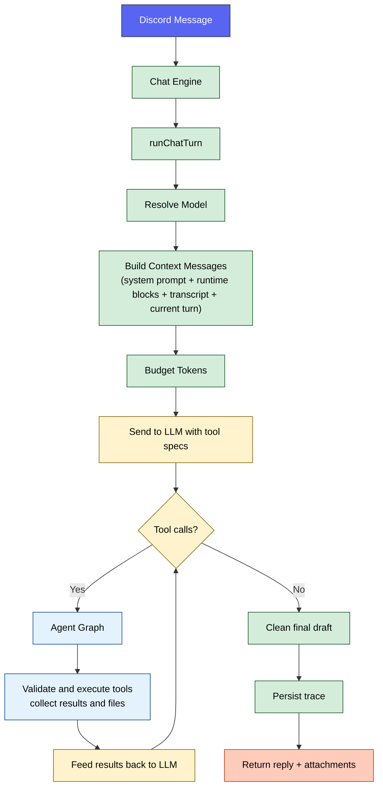
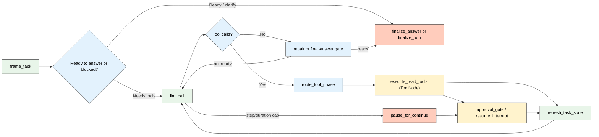

# 🔀 Runtime Pipeline

How a single message flows through Sage's single-agent runtime from Discord event to final reply.

  

---

## 🧭 Quick Navigation

- [Turn Flow](#turn-flow)
- [Context Assembly](#context-assembly)
- [Agent Graph](#agent-graph)
- [Trace Outputs](#trace-outputs)
- [Tool-Oriented Data Access](#tool-oriented-data-access)
- [Configuration](#configuration)
- [Related Documentation](#related-documentation)

---

## ⚡ Turn Flow

Every text turn follows this sequence:

**Step-by-step**

1. **Model resolution**: `runChatTurn` reads `AI_PROVIDER_MAIN_AGENT_MODEL`. Sage no longer ships a built-in agent-model fallback; runtime boot requires explicit AI-provider model configuration.
2. **Context composition**: `buildContextMessages` assembles the system prompt, `<current_turn>`, runtime instruction block, optional guild Sage Persona (`<guild_sage_persona>`), optional live voice context, optional `<focused_continuity>`, optional `<recent_transcript>`, and the current user turn wrapped in `<user_input>` (with any `<reply_target>` folded in as context-only preface content).
3. **Token budgeting**: `contextBudgeter` trims blocks against the configured budgets before the provider call.
4. **LLM request**: Sage sends the budgeted messages plus the active tool schemas for this turn.
5. **Agent graph**: Sage first frames the request into internal task state, then routes through the LangGraph-native runtime built on reducer-backed message state, durable tasks, `ToolNode` read batches, task-state refresh steps, and in-graph approval or continuation interrupts/resumes until the objective is satisfied, clarification is required, or the run pauses cleanly.
6. **Final reply**: plain text is cleaned, tool-produced files are attached, and the final payload is returned to Discord.
7. **Trace persistence**: LangGraph node and task execution is recorded in LangSmith, and Sage can additionally persist a compact `AgentTrace` ledger row with LangSmith references.

---

## 📦 Context Assembly

`buildContextMessages` composes the turn context in this order:

| Priority | Block | Source |
| :---: | :--- | :--- |
| 1 | Base system prompt | `composeSystemPrompt` with the user profile summary embedded in `<user_profile>` |
| 2 | Current turn | Structured `<current_turn>` metadata from `CurrentTurnContext` |
| 3 | Runtime instructions | Single-agent capabilities, silent native tool-use rules, approval guardrails, and runtime state |
| 4 | Guild Sage Persona | `ServerInstructions`, when present, rendered as `<guild_sage_persona>` |
| 5 | Live voice context | In-memory voice session context, only when Sage is active in voice |
| 6 | Focused continuity | `<focused_continuity>` window from same-speaker and direct-reply context |
| 7 | Recent transcript | Ambient `<recent_transcript>` ring-buffer context |
| 8 | Current user message | Triggering text and multimodal content wrapped as `<user_input>`, with replied-to content inlined first as context-only `<reply_target>` |

> [!NOTE]
> Channel summaries, archived summaries, social-graph data, attachment cache results, and wider message history are not preloaded into every turn. The model fetches them on demand through the split Discord tools when it decides they are needed.
> `discord_context.get_channel_summary` is a continuity surface, not historical evidence. For exact verification Sage should use `discord_messages.search_history`, `discord_messages.search_with_context`, or `discord_messages.get_context`.

All system-role blocks are merged into a single system message before the provider call. This keeps ordering valid for stricter providers while preserving the logical block boundaries in `budgetJson`.

---

## 🔄 Agent Graph

**Key behaviors**

- **Bounded windows**: `AGENT_GRAPH_MAX_STEPS` limits how many model/tool rounds can occur in one continuation window before Sage pauses with a resumable progress summary.
- **Calls per step**: `AGENT_GRAPH_MAX_TOOL_CALLS_PER_STEP` caps the number of tool calls the model can issue at once.
- **Message-native state**: the graph persists LangGraph/LangChain messages plus turn facts, approval state, trace metadata, and final delivery state instead of the old custom pending-tool-loop buffers.
- **Intent-framed state**: every turn starts with `frame_task`, which derives an internal objective, success criteria, current subgoal, next action, unresolved items, and evidence summary before tool budget is spent.
- **Read/write partitioning**: same-step duplicate read-only calls are collapsed, read-only batches execute through `ToolNode`, and mutating calls execute one at a time.
- **Task refresh discipline**: after meaningful evidence changes, `refresh_task_state` updates the plan-of-record so the next model round acts on the current subgoal instead of treating the turn like a fresh scratchpad.
- **Native tool contract**: the runtime consumes structured provider tool calls directly and feeds tool results back as LangChain tool messages.
- **Provider-neutral model node**: the graph now invokes Sage's `AiProviderChatModel`, which targets an operator-defined AI provider over the OpenAI-compatible chat-completions contract exposed at `AI_PROVIDER_BASE_URL`.
- **Native provider transcript**: follow-up model calls now preserve assistant `tool_calls` and real `tool` messages end to end instead of flattening tool results into synthetic user text.
- **Explicit final-answer gate**: plain text with no tool calls is not treated as automatically complete. Sage now repairs premature drafts, asks a concise clarifying question when needed, or routes through a dedicated `finalize_answer` node only when task state says the objective is ready to close.
- **Per-tool timeout**: each tool call is bounded by `AGENT_GRAPH_TOOL_TIMEOUT_MS`.
- **Durable execution**: every real tool invocation and post-approval execution runs inside a LangGraph `task(...)` boundary so replay and thread resume reuse checkpointed task outputs instead of repeating side effects.
- **Repair-aware validation feedback**: routed-tool validation failures now carry compact repair guidance into the next model round, including missing/unknown action recovery and the best matching action contract from the routed-tool docs.
- **Graph wall-clock cap**: the whole orchestration phase is bounded by `AGENT_GRAPH_MAX_DURATION_MS`.
- **Result truncation**: raw tool output is capped by `AGENT_GRAPH_MAX_RESULT_CHARS`, with a compact summary block added when the raw payload is too large.
- **Approval + continuation interrupts**: approval-gated writes pause before side effects, and long-running turns pause at the window boundary with a persisted continuation record and human-facing progress summary.
- **Checkpointed continuation**: resume keeps the same LangGraph thread and prior tool results, resets only the window-local counters, and can continue through another bounded window instead of rebuilding the turn from scratch.
- **File collection**: tools such as `image_generate` can return files that are merged into the final Discord response.

---

## 📊 Trace Outputs

Each turn can persist the following compact operator ledger fields to `AgentTrace`:

| Field | Description |
| :--- | :--- |
| `routeKind` | Canonical value: `single` |
| `terminationReason` | Why the graph finished or paused (`assistant_reply`, `continue_prompt`, `approval_interrupt`, `graph_timeout`, `max_windows_reached`) |
| `taskState` | Internal task objective/status snapshot, including unresolved-item count and next action |
| `langSmithRunId` | LangSmith run id for the turn |
| `langSmithTraceId` | LangSmith trace id for the turn |
| `budgetJson` | Token-budget allocation per block |
| `toolJson` | Tool names, args, statuses, and compacted results |
| `tokenJson` | Provider token usage |
| `replyText` | Final reply text sent back to Discord |

> [!TIP]
> Use LangSmith for node, task, and interrupt drill-down, `npm run db:studio` for Sage's compact ledger rows, or send a real chat ping in Discord for an end-to-end runtime health check.
> Tool-result reinjection is intentionally compact and machine-facing: successful results are bounded, failed results surface retryability plus compact repair metadata for routed-tool validation issues, repeated blocked calls are surfaced as explicit guardrail failures, approval-gated writes resume from an interrupt instead of replaying the write inline, and trace metadata records why the graph terminated.

---

## 🧰 Tool-Oriented Data Access

Most richer context is loaded on demand through the split Discord tools:

| Data | Tool action | Storage |
| :--- | :--- | :--- |
| User profile | `discord_context.get_user_profile` | PostgreSQL (`UserProfile`) |
| Channel summaries | `discord_context.get_channel_summary` | PostgreSQL (`ChannelSummary`) |
| Archived channel summaries | `discord_context.search_channel_summary_archives` | PostgreSQL plus pgvector-backed archive search |
| Sage Persona | `discord_context.get_server_instructions` | PostgreSQL (`ServerInstructions`, stored internally as guild Sage Persona config) |
| Social graph | `discord_context.get_social_graph`, `discord_context.get_top_relationships` | PostgreSQL (`RelationshipEdge`) plus optional Memgraph |
| Voice analytics | `discord_context.get_voice_analytics`, `discord_context.get_voice_summaries` | PostgreSQL (`VoiceSession`, `VoiceConversationSummary`) |
| Cached file text | `discord_files.list_channel`, `discord_files.list_server`, `discord_files.read_attachment` | PostgreSQL (`IngestedAttachment`) |
| Semantic file search | `discord_files.find_channel`, `discord_files.find_server` | pgvector (`AttachmentChunk`) |
| Message history | `discord_messages.search_history`, `discord_messages.search_with_context`, `discord_messages.get_context`, `discord_messages.search_guild`, `discord_messages.get_user_timeline` | PostgreSQL (`ChannelMessage`) plus pgvector (`ChannelMessageEmbedding`) |
| Invite generation | `discord_admin.get_invite_url` | Computed from `DISCORD_APP_ID` |

Some read actions are blocked in Autopilot mode, and all write/admin actions remain permission-gated.

---

## ⚙️ Configuration

These values reflect the starter values in `.env.example`:

| Variable | Description | Starter value |
| :--- | :--- | :--- |
| `AI_PROVIDER_MAIN_AGENT_MODEL` | Runtime main agent model for `runChatTurn` | *(required in `.env`)* |
| `AGENT_GRAPH_MAX_STEPS` | Max model/tool graph steps per turn | `6` |
| `AGENT_GRAPH_MAX_TOOL_CALLS_PER_STEP` | Max tool calls per graph step | `5` |
| `AGENT_GRAPH_TOOL_TIMEOUT_MS` | Per-tool execution timeout | `45000` |
| `AGENT_GRAPH_MAX_DURATION_MS` | Max wall-clock duration for one graph turn | `120000` |
| `AGENT_GRAPH_MAX_OUTPUT_TOKENS` | Max output tokens for graph model calls | `1800` |
| `AGENT_GRAPH_MAX_RESULT_CHARS` | Max chars per tool result | `8000` |
| `AGENT_GRAPH_GITHUB_GROUNDED_MODE` | Enable grounded GitHub search mode | `true` |
| `AGENT_GRAPH_RECURSION_LIMIT` | LangGraph recursion fail-safe above the legal hop count | `16` |
| `LANGSMITH_TRACING` | Enable optional LangSmith graph tracing | `false` |
| `LANGSMITH_PROJECT` | LangSmith project name | `sage` |
| `SAGE_TRACE_DB_ENABLED` | Persist compact `AgentTrace` ledger rows | `true` |

---

## 🔗 Related Documentation

- [🤖 Agentic Architecture](OVERVIEW.md) — High-level design and tool registry
- [🧠 Memory System](MEMORY.md) — How Sage stores memory and fetches richer context
- [🔍 Search Architecture](SEARCH.md) — SAG flow and search providers
- [🧩 Model Reference](../reference/MODELS.md) — Model resolution and health tracking
- [⚙️ Configuration](../reference/CONFIGURATION.md) — Full environment variable reference

<a href="#top">⬆️ Back to top</a>

