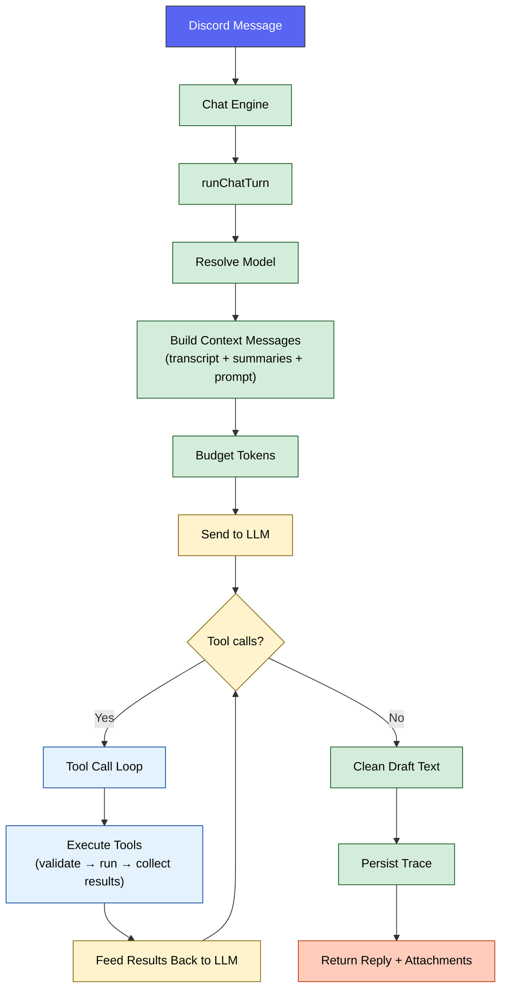
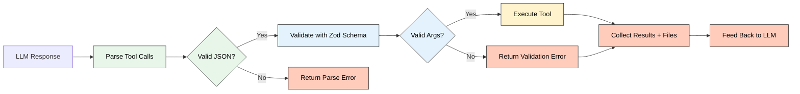

# 🔀 Runtime Pipeline

How a single message flows through Sage's single-agent runtime — from Discord event to verified reply.

  
  

---

## 🧭 Quick Navigation

- [Turn Flow](#turn-flow)
- [Context Assembly](#context-assembly)
- [Tool Call Loop](#tool-call-loop)
- [Trace Outputs](#trace-outputs)
- [Tool-Oriented Data Access](#tool-oriented-data-access)
- [Configuration](#configuration)
- [Related Documentation](#related-documentation)

---

## ⚡ Turn Flow

Every message follows this exact sequence:

**Step-by-step:**

1. **Model resolution** — `CHAT_MODEL` env var (fallback: `kimi`).
2. **Context composition** — `buildContextMessages` assembles system prompt, transcript, summaries, reply context, and user message.
3. **Token budgeting** — `contextBudgeter` enforces per-block token limits to keep the context window clean.
4. **LLM request** — prompt + OpenAI-compatible tool specs sent to the provider.
5. **Tool loop** — if the model emits tool call JSON, the loop validates, executes, and feeds results back. Repeats up to `AGENTIC_TOOL_MAX_ROUNDS`.
6. **Final reply** — plain-text answer is cleaned, attachments from tool results are collected.
7. **Trace persistence** — route, budget, tool, and quality metadata are stored (when `TRACE_ENABLED=true`).

---

## 📦 Context Assembly

`buildContextMessages` composes the turn context in this prioritized order:

| Priority | Block | Source |
|:---:|:---|:---|
| 1 | Base system prompt | `composeSystemPrompt` — personality, capabilities, tool protocol |
| 2 | Runtime instructions | Single-agent capabilities, agentic state, tool protocol |
| 3 | Channel profile summary | `ChannelSummary` (kind: `profile`) |
| 4 | Rolling channel summary | `ChannelSummary` (kind: `rolling`) |
| 5 | Recent transcript | Ring buffer + `ChannelMessage` table |
| 6 | Intent hint + reply context | Reply reference content, if applicable |
| 7 | Current user message | The triggering message/content |

> [!NOTE]
> Memory, social graph, and voice data are **not** pre-injected. They are fetched dynamically through the tool loop when the model decides it needs them.

All system blocks are merged into a single system message before provider calls. This ensures clean message sequencing even with strict providers that enforce role alternation.

---

## 🔄 Tool Call Loop

**Key behaviors:**

- **Bounded rounds:** Max `AGENTIC_TOOL_MAX_ROUNDS` (default: `6`) iterations.
- **Calls per round:** Max `AGENTIC_TOOL_MAX_CALLS_PER_ROUND` (default: `5`) tool calls per iteration.
- **Parallel read-only:** Read-only tools (static `readOnly` or per-call `readOnlyPredicate`) can execute concurrently (up to `AGENTIC_TOOL_MAX_PARALLEL_READ_ONLY`).
- **Timeout:** Per-tool timeout `AGENTIC_TOOL_TIMEOUT_MS` (default: `45000` ms).
- **Loop wall-clock cap:** End-to-end tool loop duration is bounded by `AGENTIC_TOOL_LOOP_TIMEOUT_MS` (default: `120000` ms).
- **Result truncation:** Tool output capped at `AGENTIC_TOOL_RESULT_MAX_CHARS` (default: `8000`).
- **File collection:** Image generation and other file-producing tools return `Buffer` attachments merged into the final response.

---

## 📊 Trace Outputs

Each turn can persist the following to `AgentTrace`:

| Field | Description |
|:---|:---|
| `routeKind` | Canonical value: `single` |
| `agentEventsJson` | Tool call events with timing metadata |
| `budgetJson` | Token budget allocation per block |
| `toolJson` | Tool call names, args, and results |
| `tokenJson` | Token usage from provider response |
| `qualityJson` | Quality metrics (when present) |
| `reasoningText` | Agent reasoning text (when present) |
| `replyText` | Final reply text |

> [!TIP]
> Use `npm run db:studio` to inspect traces via Prisma Studio, or the `/sage admin stats` command for runtime health.

---

## 🧰 Tool-Oriented Data Access

All memory and context data is loaded **on demand** through tools:

| Data | Tool | Storage |
|:---|:---|:---|
| User profile | `discord` (`action: "memory.get_user"`) | PostgreSQL (`UserProfile`) |
| Channel summaries | `discord` (`action: "memory.get_channel"`) | PostgreSQL (`ChannelSummary`) |
| Social relationships | `discord` (`action: "analytics.get_social_graph"`) | PostgreSQL (`RelationshipEdge`) + Memgraph |
| Voice analytics | `discord` (`action: "analytics.get_voice_analytics"`) | PostgreSQL (`VoiceSession`) |
| Voice session summaries | `discord` (`action: "analytics.get_voice_session_summaries"`) | PostgreSQL (`VoiceConversationSummary`) |
| Cached file content | `discord` (`action: "files.lookup_channel"`) | PostgreSQL (`IngestedAttachment`) |
| Cached file content (server-wide) | `discord` (`action: "files.lookup_server"`) | PostgreSQL (`IngestedAttachment`) |
| Semantic file search | `discord` (`action: "files.search_channel"`) | pgvector (`AttachmentChunk`) |
| Semantic file search (server-wide) | `discord` (`action: "files.search_server"`) | pgvector (`AttachmentChunk`) |
| Message history | `discord` (`action: "messages.search_history"`, optional `channelId`, permission-gated) | pgvector (`ChannelMessageEmbedding`) |
| Archived summaries | `discord` (`action: "memory.search_channel_archives"`) | pgvector embeddings |
| Server memory | `discord` (`action: "memory.get_server"`) | PostgreSQL (`GuildMemory`) |

Image generation runs through `image_generate` and returns attachment payloads. No preflight context graph execution is used.

---

## ⚙️ Configuration

| Variable | Description | Default |
|:---|:---|:---|
| `CHAT_MODEL` | Runtime chat model for `runChatTurn` | `kimi` |
| `AGENTIC_TOOL_LOOP_ENABLED` | Enable/disable tool loop | `true` |
| `AGENTIC_TOOL_MAX_ROUNDS` | Max tool loop iterations | `6` |
| `AGENTIC_TOOL_MAX_CALLS_PER_ROUND` | Max tool calls per iteration | `5` |
| `AGENTIC_TOOL_TIMEOUT_MS` | Per-tool execution timeout | `45000` |
| `AGENTIC_TOOL_LOOP_TIMEOUT_MS` | Max wall-clock duration for one tool loop turn | `120000` |
| `AGENTIC_TOOL_RESULT_MAX_CHARS` | Max chars per tool result | `8000` |
| `AGENTIC_TOOL_PARALLEL_READ_ONLY_ENABLED` | Enable parallel read-only execution | `true` |
| `AGENTIC_TOOL_MAX_PARALLEL_READ_ONLY` | Max concurrent read-only tools | `4` |
| `TRACE_ENABLED` | Enable trace persistence | `true` |

---

## 🔗 Related Documentation

- [🤖 Agentic Architecture](OVERVIEW.md) — High-level design and tool registry
- [🧠 Memory System](MEMORY.md) — How Sage stores and injects memory
- [🔍 Search Architecture](SEARCH.md) — SAG flow and search providers
- [🧩 Model Reference](../reference/MODELS.md) — Model resolution and health tracking
- [⚙️ Configuration](../reference/CONFIGURATION.md) — All environment variables

<a href="#top">⬆️ Back to top</a>

