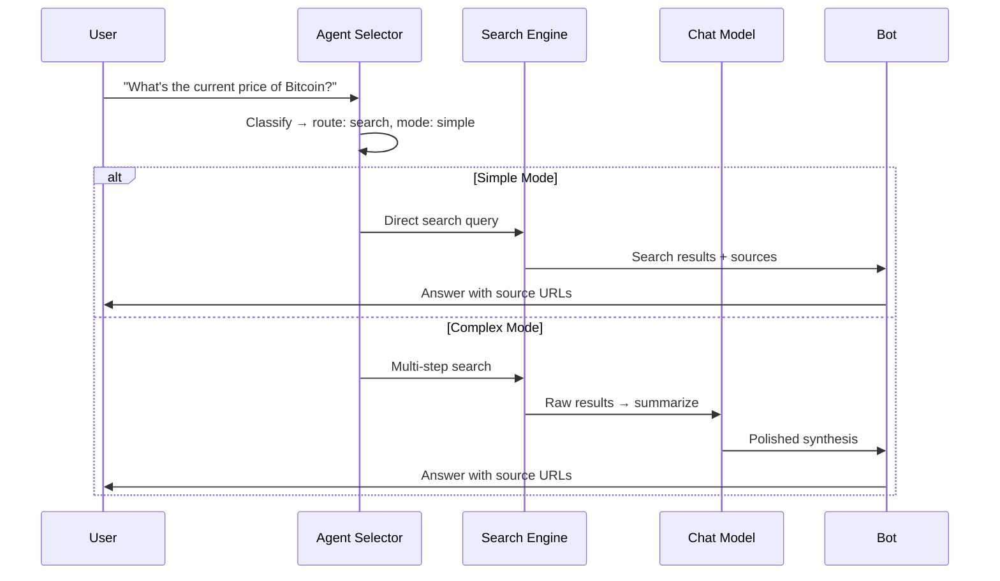

# 🔍 Search Architecture (SAG)

How Sage fetches live information from the web using Search-Augmented Generation.

---

## 🧭 Quick navigation

- [Overview](#overview)
- [Search Flow](#search-flow)
- [Search Modes](#search-modes)
- [Model Guardrails](#model-guardrails)
- [Tool Providers](#tool-providers)
- [Configuration](#configuration)

---

<a id="overview"></a>

## 🌐 Overview

Sage uses **Search-Augmented Generation (SAG)** to answer time-sensitive or factual queries. Instead of relying solely on training data, Sage can search the web, scrape pages, and synthesize results into a polished response.

```
User asks time-sensitive question
    → Router classifies as "search" route
    → Search models fetch live data
    → (Optional) Chat model summarizes results
    → User gets fresh, sourced answer
```

---

<a id="search-flow"></a>

## 🔀 Search Flow



---

<a id="search-modes"></a>

## 📋 Search Modes

The agent selector also determines the **search execution mode**:

| Mode | When Used | Behavior |
| :--- | :--- | :--- |
| `simple` | Direct factual lookups (prices, dates, definitions) | Search output returned directly |
| `complex` | Multi-step comparisons, synthesis, analysis | Search → chat summarization pipeline |

> [!TIP]
> If the router is uncertain about the mode, Sage defaults to `complex` for consistency and quality.

---

<a id="model-guardrails"></a>

## 🛡️ Model Guardrails

Search execution applies runtime guardrails to ensure the right models are used:

| Scenario | Models Used |
| :--- | :--- |
| Normal search (no URL) | `gemini-search` → `perplexity-fast` → `perplexity-reasoning` |
| URL in prompt (link scrape) | `nomnom` (prioritized) → `gemini-search` → `perplexity-fast` |

**Key rules:**

- `nomnom` is **only** injected when the user prompt contains a URL
- When injected, `nomnom` is prioritized (prepended to the chain)
- Normal search stays on the standard search model chain

**Source:** [`src/core/llm/model-resolver.ts`](../../src/core/llm/model-resolver.ts) and [`src/core/agentRuntime/toolIntegrations.ts`](../../src/core/agentRuntime/toolIntegrations.ts)

---

<a id="tool-providers"></a>

## 🧰 Tool Providers

Sage supports multiple search and scraping providers with automatic fallback:

### Web Search Providers

| Provider | Type | Configuration |
| :--- | :--- | :--- |
| Tavily | API-based search | `TAVILY_API_KEY` |
| Exa | API-based search | `EXA_API_KEY` |
| SearXNG | Self-hosted search | `SEARXNG_BASE_URL` |
| Pollinations | Fallback search | Built-in |

**Provider order:** Configured via `TOOL_WEB_SEARCH_PROVIDER_ORDER` (default: `tavily,exa,searxng,pollinations`)

### Web Scrape Providers

| Provider | Type | Configuration |
| :--- | :--- | :--- |
| Firecrawl | API-based scraper | `FIRECRAWL_API_KEY` |
| Crawl4AI | Self-hosted scraper | `CRAWL4AI_BASE_URL` |
| Jina Reader | API-based reader | Built-in |
| Raw Fetch | Direct HTTP | Built-in |

**Provider order:** Configured via `TOOL_WEB_SCRAPE_PROVIDER_ORDER` (default: `firecrawl,crawl4ai,jina,raw_fetch`)

---

<a id="configuration"></a>

## ⚙️ Configuration

| Variable | Description | Default |
| :--- | :--- | :--- |
| `TIMEOUT_SEARCH_MS` | Search timeout | `300000` |
| `TIMEOUT_SEARCH_SCRAPER_MS` | Scraper timeout | `480000` |
| `SEARCH_MAX_ATTEMPTS_SIMPLE` | Max retries for simple search | `2` |
| `SEARCH_MAX_ATTEMPTS_COMPLEX` | Max retries for complex search | `4` |
| `TOOL_WEB_SEARCH_TIMEOUT_MS` | Per-provider search timeout | `45000` |
| `TOOL_WEB_SEARCH_MAX_RESULTS` | Results per search call | `6` |
| `TOOL_WEB_SCRAPE_TIMEOUT_MS` | Per-provider scrape timeout | `45000` |
| `TOOL_WEB_SCRAPE_MAX_CHARS` | Max chars scraped per page | `12000` |

---

## 🔗 Related Documentation

- [🔀 Runtime Pipeline](PIPELINE.md) — Where search fits in the message flow
- [🧩 Model Reference](../reference/MODELS.md) — Search model chains and fallbacks
- [🧰 Self-Hosted Tool Stack](../operations/TOOL_STACK.md) — Setting up SearXNG and Crawl4AI locally
