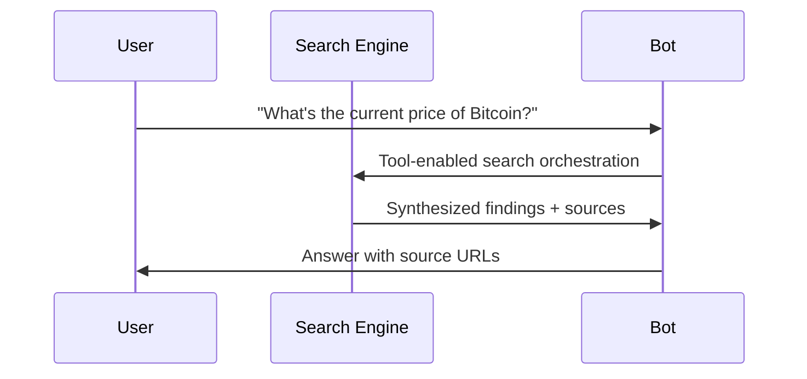

# 🔍 Search Architecture (SAG)

<p align="center">
  
</p>

How Sage fetches live information from the web using Search-Augmented Generation.

---

## 🧭 Quick navigation

- [Overview](#overview)
- [Search Flow](#search-flow)
- [Model Guardrails](#model-guardrails)
- [Tool Providers](#tool-providers)
- [Configuration](#configuration)

---

<a id="overview"></a>

## 🌐 Overview

Sage uses **Search-Augmented Generation (SAG)** to answer time-sensitive or factual queries. Instead of relying solely on training data, Sage can search the web, scrape pages, and synthesize results into a polished response.

```text
User asks time-sensitive question
    → Sage evaluates need for live information
    → Sage invokes web search tool dynamically
    → User gets fresh, sourced answer
```

---

<a id="search-flow"></a>

## 🔀 Search Flow


```mermaid
sequenceDiagram
    participant U as User
    participant S as Search Engine
    participant B as Bot

    U->>B: "What's the current price of Bitcoin?"
    B->>S: Tool-enabled search orchestration
    S->>B: Synthesized findings + sources
    B->>U: Answer with source URLs
```

---

---

<a id="model-guardrails"></a>

## 🛡️ Model Guardrails

Search execution applies runtime guardrails to ensure the right models are used:

| Scenario | Models Used |
| :--- | :--- |
| Tool orchestrator | `kimi` |
| Guarded fallback (if tool pass fails) | `gemini-search` → `perplexity-fast` → `perplexity-reasoning` (plus `nomnom` when URL-aware guarded fallback is active) |

**Key rules:**

- Sage runs tool orchestration first and only falls back to guarded search models when needed.
- Source/date normalization and capability validation still apply to search outputs.

**Source:** [`src/features/agent-runtime/agentRuntime.ts`](../../src/features/agent-runtime/agentRuntime.ts) and [`src/features/agent-runtime/toolIntegrations.ts`](../../src/features/agent-runtime/toolIntegrations.ts)

---

<a id="tool-providers"></a>

## 🧰 Tool Providers

Sage supports multiple search and scraping providers with automatic fallback:

### Web Search Providers

| Provider | Type | Configuration |
| :--- | :--- | :--- |
| Tavily | API-based search | `TAVILY_API_KEY` |
| Exa | API-based search | `EXA_API_KEY` |
| SearXNG | Self-hosted search | `SEARXNG_BASE_URL` |
| Pollinations | Fallback search | Built-in |

**Provider order:** Configured via `TOOL_WEB_SEARCH_PROVIDER_ORDER` (default: `tavily,exa,searxng,pollinations`)

### Web Scrape Providers

| Provider | Type | Configuration |
| :--- | :--- | :--- |
| Firecrawl | API-based scraper | `FIRECRAWL_API_KEY` |
| Crawl4AI | Self-hosted scraper | `CRAWL4AI_BASE_URL` |
| Jina Reader | API-based reader | Built-in |
| Nomnom (Pollinations) | LLM-based scraper | Built-in |
| Raw Fetch | Direct HTTP | Built-in |

**Provider order:** Configured via `TOOL_WEB_SCRAPE_PROVIDER_ORDER` (default: `crawl4ai,firecrawl,jina,nomnom,raw_fetch`)

---

<a id="configuration"></a>

## ⚙️ Configuration

| Variable | Description | Default |
| :--- | :--- | :--- |
| `TOOL_WEB_SEARCH_TIMEOUT_MS` | Per-provider search timeout | `45000` |
| `TOOL_WEB_SEARCH_MAX_RESULTS` | Results per search call | `6` |
| `TOOL_WEB_SCRAPE_TIMEOUT_MS` | Per-provider scrape timeout | `45000` |
| `TOOL_WEB_SCRAPE_MAX_CHARS` | Max chars scraped per page | `20000` |

---

## 🔗 Related Documentation

- [🔀 Runtime Pipeline](PIPELINE.md) — Where search fits in the message flow
- [🧩 Model Reference](../reference/MODELS.md) — Search model chains and fallbacks
- [🧰 Self-Hosted Tool Stack](../operations/TOOL_STACK.md) — Setting up SearXNG and Crawl4AI locally
