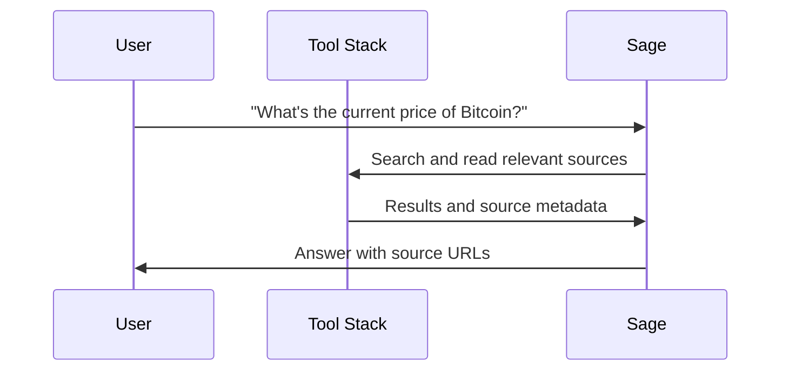

# 🔍 Search Architecture

<p align="center">
  
</p>

How Sage fetches live information from the web through bridge-native Code Mode execution and host-managed retrieval providers.

---

## 🧭 Quick navigation

- [Overview](#overview)
- [Search Flow](#search-flow)
- [Model Guardrails](#model-guardrails)
- [Tool Providers](#tool-providers)
- [Configuration](#configuration)

---

<a id="overview"></a>

## 🌐 Overview

Sage answers time-sensitive or factual queries by invoking bridge-native Code Mode execution from the same LangGraph runtime that handles the rest of the turn. Instead of relying solely on training data, Sage can search the public web, read exact pages, and page through large pages when freshness matters.

```text
User asks time-sensitive question
    → Sage evaluates need for live information
    → Sage executes JS that calls http.fetch(...) or other host retrieval paths
    → User gets fresh, sourced answer
```

---

<a id="search-flow"></a>

## 🔀 Search Flow


```mermaid
sequenceDiagram
    participant U as User
    participant T as Tool Stack
    participant B as Sage

    U->>B: "What's the current price of Bitcoin?"
    B->>T: Search and read relevant sources
    T->>B: Results and source metadata
    B->>U: Answer with source URLs
```

---

<a id="model-guardrails"></a>

## 🛡️ Runtime Guardrails

Search execution now follows the same provider-neutral runtime contract as the rest of Sage:

| Scenario | Runtime behavior |
| :--- | :--- |
| Code orchestration | Uses the configured `AI_PROVIDER_MAIN_AGENT_MODEL` |
| Search providers | Uses only the explicitly configured search and scrape providers |
| Multi-source synthesis | Happens in the normal runtime loop; there is no one-shot hidden research tool |
| Large pages | Page or chunk content inside Code Mode instead of exposing a separate public paging tool |

**Key rules:**

- Sage no longer ships built-in search-model chains or hidden fallback model ids.
- Search runs only through the configured search providers in `TOOL_WEB_SEARCH_PROVIDER_ORDER`.
- Source/date normalization, provider health cooldowns, and exact-page retrieval safeguards still apply inside the host retrieval layer.

**Source:** [`src/features/agent-runtime/agentRuntime.ts`](../../src/features/agent-runtime/agentRuntime.ts) and [`src/features/agent-runtime/bridgeBackends.ts`](../../src/features/agent-runtime/bridgeBackends.ts)

---

<a id="tool-providers"></a>

## 🧰 Tool Providers

Sage supports multiple search and scraping providers with automatic fallback:

### Web Search Providers

| Provider | Type | Configuration |
| :--- | :--- | :--- |
| Tavily | API-based search | `TAVILY_API_KEY` |
| Exa | API-based search | `EXA_API_KEY` |
| SearXNG | Self-hosted search | `SEARXNG_BASE_URL` |

**Provider order:** Configured via `TOOL_WEB_SEARCH_PROVIDER_ORDER` (default: `tavily,exa,searxng`)

### Web Scrape Providers

| Provider | Type | Configuration |
| :--- | :--- | :--- |
| Firecrawl | MCP-backed scraper | `MCP_PRESETS_ENABLED_CSV=firecrawl` plus `MCP_PRESET_FIRECRAWL_*` |
| Crawl4AI | Self-hosted scraper | `CRAWL4AI_BASE_URL` |
| Jina Reader | API-based reader | Built-in |
| Raw Fetch | Direct HTTP | Built-in |

**Provider order:** Configured via `TOOL_WEB_SCRAPE_PROVIDER_ORDER` (default: `crawl4ai,firecrawl,jina,raw_fetch`)

---

<a id="configuration"></a>

## ⚙️ Configuration

| Variable | Description | Default |
| :--- | :--- | :--- |
| `TOOL_WEB_SEARCH_TIMEOUT_MS` | Per-provider search timeout | `45000` |
| `TOOL_WEB_SEARCH_MAX_RESULTS` | Results per search call | `8` |
| `TOOL_WEB_SCRAPE_TIMEOUT_MS` | Per-provider scrape timeout | `45000` |

---

## 🔗 Related Documentation

- [🔀 Runtime Pipeline](PIPELINE.md) — Where search fits in the message flow
- [🧩 Model Reference](../reference/MODELS.md) — Runtime model budgets and verification
- [🧰 Self-Hosted Retrieval Stack](../operations/TOOL_STACK.md) — Setting up SearXNG and Crawl4AI locally
