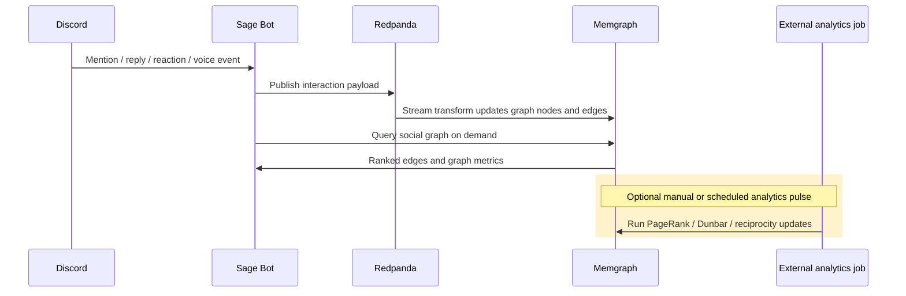

# 🕸️ Social Graph

<p align="center">
  
</p>

How Sage exports relationship signals to Memgraph and reads them back at runtime.

---

## 🧭 Quick navigation

- [Overview](#overview)
- [Architecture](#architecture)
- [GNN Pipeline](#gnn-pipeline)
- [Key Components](#key-components)
- [Data Flow](#data-flow)
- [Configuration](#configuration)
- [Related Documentation](#related-documentation)

---

<a id="overview"></a>

## 🌐 Overview

The social graph is optional infrastructure. When `KAFKA_BROKERS` is configured, Sage can export mentions, replies, reactions, and voice-session signals to **Redpanda** and **Memgraph**. The runtime can then read graph analytics back through the `discord` tool.

What is available today:

| Capability | Status | Source |
| :--- | :--- | :--- |
| Interaction export to Kafka/Redpanda | Active when `KAFKA_BROKERS` is non-empty | `src/platform/social-graph/kafkaProducer.ts` |
| Memgraph setup (topics, streams, indexes) | Active via setup script | `src/features/social-graph/setupSocialGraph.ts` |
| Runtime social-graph reads | Active | `src/features/social-graph/socialGraphQuery.ts` |
| PageRank, Dunbar, reciprocity pulse | Implemented but **not auto-scheduled by Sage bootstrap** | `src/features/social-graph/graphAnalyticsPulse.ts` |
| MAGE module procedures | Available in the social-graph compose stack | `config/services/self-host/docker-compose.social-graph.yml` |
| Guild community IDs | Intentionally omitted for now | `graphAnalyticsPulse.ts` |

> [!IMPORTANT]
> The repository includes the analytics pulse implementation, but Sage does not start it automatically. If you want recurring PageRank, Dunbar, or reciprocity updates, run or schedule that job yourself.

---

<a id="architecture"></a>

## 🏗️ Architecture

```mermaid
flowchart TD
    classDef discord fill:#5865f2,stroke:#333,color:white
    classDef kafka fill:#e8453c,stroke:#333,color:white
    classDef graph fill:#e8f5e9,stroke:#333,color:black
    classDef jobs fill:#fff3cd,stroke:#333,color:black
    classDef output fill:#e3f2fd,stroke:#333,color:black

    M[Message / reaction events]:::discord --> KP[Kafka producer]:::kafka
    V[Voice session events]:::discord --> KP

    KP --> RP[Redpanda]:::kafka
    RP --> MG[Memgraph streams]:::graph

    MG --> SQ[Social graph query]:::output
    SQ --> RT[Sage runtime]:::output

    MG --> AP[Analytics pulse<br/>manual or external scheduler]:::jobs
    AP --> PR[PageRank]:::jobs
    AP --> DL[Dunbar labels]:::jobs
    AP --> RI[Reciprocity]:::jobs
    AP --> GM[MAGE procedures]:::jobs
```

---

<a id="gnn-pipeline"></a>

## 🧠 GNN Pipeline

The repository keeps the broader 9-pillar design, but it is split across two categories:

### MAGE modules available in the Memgraph image

| Pillar | Namespace | Purpose |
| :--- | :--- | :--- |
| Temporal memory | `tgn_memory.*` | Sequence-aware interaction memory |
| Hyperbolic embeddings | `hyperbolic.*` | Hierarchical proximity representation |
| Heterogeneous attention | `het_attention.*` | Different weights for mention/reply/react/voice edges |
| Graph transformer | `graph_transformer.*` | Global structural attention |
| Cold start | `cold_start.*` | Bootstrap for sparse/new users |

### TypeScript-side analytics in this repo

| Pillar | Implemented in | Purpose |
| :--- | :--- | :--- |
| Emoji sentiment | `emojiSentiment.ts` | Signed reaction signals |
| Dunbar layers | `graphAnalyticsPulse.ts` | Rank-based labels such as `intimate` and `close` |
| Reciprocity | `graphAnalyticsPulse.ts` | Relative balance of A→B vs B→A interactions |
| Query shaping | `socialGraphQuery.ts` | Runtime-friendly response payloads for the `discord` tool |

The analytics pulse can call into Memgraph and write graph metrics, but it is not wired into the main Sage process lifecycle.

---

<a id="key-components"></a>

## 📦 Key Components

| Component | File | Purpose |
| :--- | :--- | :--- |
| Kafka producer | `src/platform/social-graph/kafkaProducer.ts` | Publishes interaction and voice events to Redpanda |
| Setup script | `src/features/social-graph/setupSocialGraph.ts` | Creates Kafka topics, Memgraph indexes, and streams |
| Analytics pulse | `src/features/social-graph/graphAnalyticsPulse.ts` | Batch job for PageRank, Dunbar labels, and reciprocity |
| Social graph query | `src/features/social-graph/socialGraphQuery.ts` | Memgraph-backed reader used by runtime analytics actions |
| Emoji sentiment | `src/features/social-graph/emojiSentiment.ts` | Reaction valence lookup |
| Migration | `src/features/social-graph/migratePostgresToMemgraph.ts` | Replays PostgreSQL relationship data through the event pipeline |
| Memgraph client | `src/platform/social-graph/memgraphClient.ts` | Thin Bolt client wrapper |

---

<a id="data-flow"></a>

## 🔀 Data Flow



At runtime, Sage primarily consumes the query layer, not the raw graph. That keeps Discord tool responses small and predictable.

---

<a id="configuration"></a>

## ⚙️ Configuration

These values match the starter `.env.example`:

| Variable | Description | Starter value |
| :--- | :--- | :--- |
| `MEMGRAPH_HOST` | Memgraph hostname | `localhost` |
| `MEMGRAPH_PORT` | Bolt protocol port | `7687` |
| `MEMGRAPH_USER` | Auth username | *(empty)* |
| `MEMGRAPH_PASSWORD` | Auth password | *(empty)* |
| `MEMGRAPH_KAFKA_BOOTSTRAP_SERVERS` | Kafka broker as seen inside the Memgraph container network | `redpanda:9092` |
| `KAFKA_BROKERS` | Kafka brokers as seen by the Sage process | `localhost:19092` |
| `KAFKA_INTERACTIONS_TOPIC` | Topic for mention/reply/reaction events | `sage.social.interactions` |
| `KAFKA_VOICE_TOPIC` | Topic for voice session events | `sage.social.voice-sessions` |

> [!TIP]
> Set `KAFKA_BROKERS=` (empty) to disable social-graph export entirely without removing any runtime code.

---

<a id="related-documentation"></a>

## 🔗 Related Documentation

- [🛠️ Social Graph Setup](../operations/SOCIAL_GRAPH_SETUP.md) — Docker, topics, streams, verification, and migration
- [🧠 Memory System](MEMORY.md) — How social-graph data enters runtime prompts
- [🎤 Voice System](VOICE.md) — Voice presence tracking that feeds into the graph
- [📋 Operations Runbook](../operations/RUNBOOK.md) — Production monitoring and maintenance
