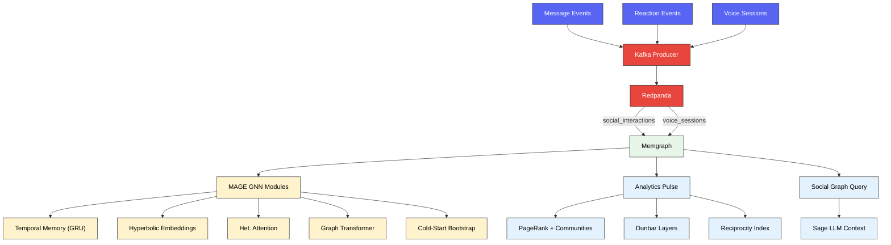
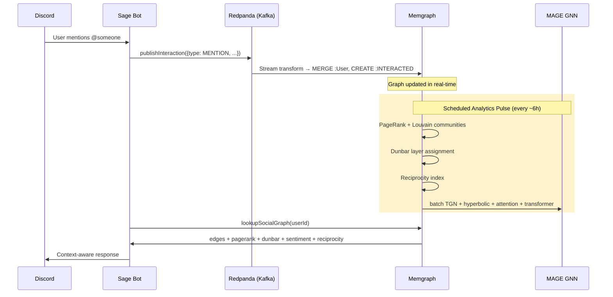

# 🕸️ Social Graph

  

How Sage builds and queries a real-time relationship graph from Discord interactions.

---

## 🧭 Quick navigation

- [Overview](#-overview)
- [Architecture](#️-architecture)
- [GNN Pipeline](#-gnn-pipeline)
- [Key Components](#-key-components)
- [Data Flow](#-data-flow)
- [Configuration](#️-configuration)
- [Related Documentation](#-related-documentation)

---

## 🌐 Overview

Sage streams every mention, reply, reaction, and voice session into a **Memgraph** graph database via **Redpanda** (Kafka-compatible). A 9-pillar GNN pipeline runs inside Memgraph (via MAGE modules) to produce per-user representations that capture trust, influence, hierarchy, and emotional tone — all queryable in real-time from any Sage tool call.

| Capability | What it tells Sage |
| :--- | :--- |
| **PageRank** | Who is influential in this server |
| **Community Detection** | Which cliques/sub-groups exist |
| **Dunbar Layers** | How close two users really are (intimate → distant) |
| **Reciprocity Index** | Is this relationship mutual or one-sided |
| **Temporal Memory** | How interaction patterns evolve over time |
| **Hyperbolic Embeddings** | Hierarchical proximity on a Poincaré disk |
| **Heterogeneous Attention** | Which interaction type matters most per user |
| **Cross-Clique Influence** | Structural influence between users who never interact directly |
| **Cold-Start Bootstrap** | Meaningful representation for brand-new users |

---

## 🏗️ Architecture

---

## 🧠 GNN Pipeline

Nine pillars produce a rich, learnable representation for every user in the graph.

### MAGE Modules (Python / PyTorch)

| # | Module | Cypher Namespace | What it does |
| :--- | :--- | :--- | :--- |
| 1 | `tgn_memory.py` | `tgn_memory.*` | GRU-based temporal memory — learns optimal decay from interaction sequences |
| 2 | `hyperbolic.py` | `hyperbolic.*` | Poincaré disk embeddings — leaders cluster at center, lurkers orbit boundary |
| 3 | `het_attention.py` | `het_attention.*` | Per-type attention heads (mention vs reply vs react vs voice) |
| 4 | `graph_transformer.py` | `graph_transformer.*` | Global self-attention — detects cross-clique influence |
| 8 | `cold_start.py` | `cold_start.*` | Metadata + neighbor induction for users with < 3 interactions |

### TypeScript Analytics (Node.js)

| # | Pillar | Implemented in | What it does |
| :--- | :--- | :--- | :--- |
| 5 | Emotional Contagion | `emojiSentiment.ts` | Emoji → valence scoring for signed edges |
| 6 | Dunbar Layers | `graphAnalyticsPulse.ts` | Rank-based tier assignment (5 → 15 → 50 → 150) |
| 7 | Reciprocity Index | `graphAnalyticsPulse.ts` | min(A→B, B→A) / max(A→B, B→A) per edge pair |
| 9 | Signed Networks | `emojiSentiment.ts` | Positive / negative / neutral edge classification |

---

## 📦 Key Components

| Component | File | Purpose |
| :--- | :--- | :--- |
| Kafka Producer | `kafkaProducer.ts` | Publishes interaction and voice events to Redpanda |
| Stream Transforms | `custom.py` | MAGE module that ingests Kafka messages into graph nodes/edges |
| Analytics Pulse | `graphAnalyticsPulse.ts` | Scheduled job: PageRank, community detection, Dunbar, reciprocity |
| Social Graph Query | `socialGraphQuery.ts` | Memgraph-backed reader used by `lookupSocialGraph` tool |
| Emoji Sentiment | `emojiSentiment.ts` | Valence lookup for reaction scoring |
| Setup Script | `setupSocialGraph.ts` | Creates Kafka topics, Memgraph indexes, and streams |
| Migration | `migratePostgresToMemgraph.ts` | One-time bootstrap from historical PostgreSQL data |
| Memgraph Client | `memgraphClient.ts` | Thin Bolt driver wrapper |

---

## 🔀 Data Flow

### Interaction Lifecycle

---

## ⚙️ Configuration

| Variable | Description | Default |
| :--- | :--- | :--- |
| `MEMGRAPH_HOST` | Memgraph hostname | `localhost` |
| `MEMGRAPH_PORT` | Bolt protocol port | `7687` |
| `MEMGRAPH_USER` | Auth username (empty = no auth) | *(empty)* |
| `MEMGRAPH_PASSWORD` | Auth password | *(empty)* |
| `MEMGRAPH_KAFKA_BOOTSTRAP_SERVERS` | Kafka brokers as seen by Memgraph (Docker internal) | `redpanda:9092` |
| `KAFKA_BROKERS` | Kafka brokers as seen by the bot process (host) | `localhost:19092` |
| `KAFKA_INTERACTIONS_TOPIC` | Topic for mentions, replies, reactions | `sage.social.interactions` |
| `KAFKA_VOICE_TOPIC` | Topic for voice session events | `sage.social.voice-sessions` |

> [!TIP]
> Set `KAFKA_BROKERS=` (empty) to completely disable social graph export without removing any code.

---

## 🔗 Related Documentation

- [🛠️ Social Graph Setup](../operations/SOCIAL_GRAPH_SETUP.md) — Docker, topics, streams, verification, migration
- [🧠 Memory System](MEMORY.md) — How social graph context enters the LLM prompt
- [🎤 Voice System](VOICE.md) — Voice presence tracking that feeds into the social graph
- [📋 Operations Runbook](../operations/RUNBOOK.md) — Production monitoring and maintenance
