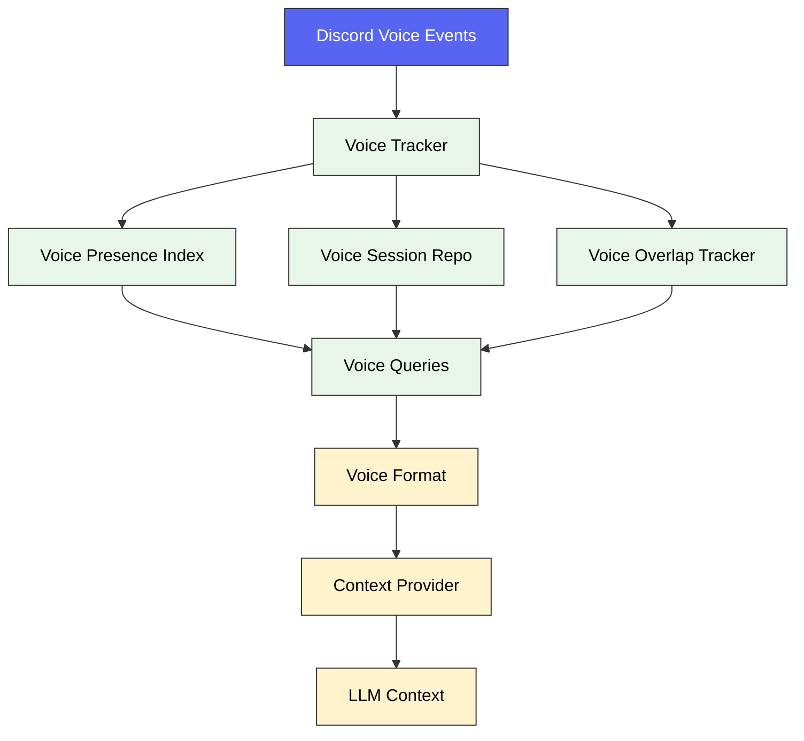

# 🎤 Voice System

How Sage interacts with Discord voice channels.

---

## 🧭 Quick navigation

- [Overview](#overview)
- [Architecture](#architecture)
- [Voice Features](#voice-features)
- [Configuration](#configuration)
- [Limitations](#limitations)

---

## 🌐 Overview

Sage has two voice-related capabilities:

| Feature | Status | Description |
| :--- | :--- | :--- |
| **Voice Awareness** | ✅ Stable | Tracks who is in voice, how long they've been there, and overlap data |
| **Voice Companion** | 🧪 Beta | Text-to-speech companion via `openai-audio` (BYOP required) |

> [!IMPORTANT]
> Sage does **not** listen to, record, or transcribe voice conversations. Voice Awareness only tracks **presence metadata** (join/leave events).

---

## 🏗️ Architecture

### Key Components

| Component | File | Purpose |
| :--- | :--- | :--- |
| Voice Manager | `voiceManager.ts` | Discord voice channel join/leave via slash commands |
| Voice Tracker | `voiceTracker.ts` | Tracks join/leave events and session durations |
| Presence Index | `voicePresenceIndex.ts` | Real-time snapshot of who is in which channel |
| Session Repo | `voiceSessionRepo.ts` | Persistence layer for voice session data |
| Overlap Tracker | `voiceOverlapTracker.ts` | Tracks simultaneous presence between users |
| Voice Queries | `voiceQueries.ts` | Query interface for voice data |
| Voice Format | `voiceFormat.ts` | Formats voice data into natural language for LLM context |

---

## ✨ Voice Features

### Voice Awareness (Stable)

Sage can answer questions like:

- *"Who's in voice right now?"*
- *"How long has @User been in voice?"*
- *"Who was in #general-voice earlier today?"*

This works by injecting voice presence data into the LLM's context window via a **context provider**.

### Voice Companion (Beta)

When enabled, Sage can join a voice channel and respond with speech:

| Command | Action |
| :--- | :--- |
| `/join` | Join the user's current voice channel |
| `/leave` | Disconnect from voice |

> [!NOTE]
> Voice Companion requires a BYOP key with `openai-audio` support.

---

## ⚙️ Configuration

| Variable | Description | Default |
| :--- | :--- | :--- |
| `VOICE_STT_MODEL` | Speech-to-text model | `openai-audio` |
| `VOICE_TTS_MODEL` | Text-to-speech model | — |
| `VOICE_MAX_DURATION_SEC` | Max session duration | — |

---

## ⚠️ Limitations

- Sage **cannot** transcribe or listen to voice conversations
- Voice Companion is **beta** and requires specific model support
- Join/leave are **command-driven only** (`/join`, `/leave`) — not exposed as runtime tools

---

## 🔗 Related Documentation

- [🎮 Commands Reference](../guides/COMMANDS.md#voice-commands-beta) — Voice slash commands
- [🔀 Runtime Pipeline](PIPELINE.md) — How voice context enters the pipeline
- [🧩 Model Reference](../reference/MODELS.md) — Audio model capabilities
