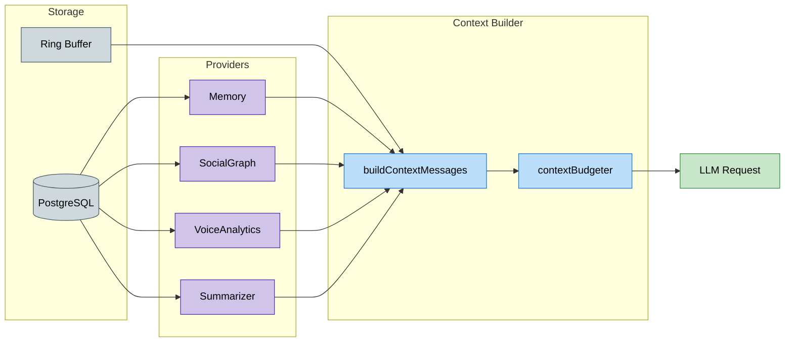

# 🧠 Sage Memory System Architecture

This document describes how Sage stores, summarizes, and injects memory into runtime prompts. It reflects current behavior in `src/core`.

---

## 🧭 Quick navigation

- [1) Memory sources and storage](#1-memory-sources-and-storage)
- [2) Data retention (transcripts)](#2-data-retention-transcripts)
- [3) Context assembly flow](#3-context-assembly-flow)
- [4) Working memory (context builder)](#4-working-memory-context-builder)
- [5) Short-term memory: rolling channel summary](#5-short-term-memory-rolling-channel-summary)
- [6) Long-term memory: channel profile](#6-long-term-memory-channel-profile)
- [7) Throttled user profile updates](#7-throttled-user-profile-updates)
- [8) Relationship graph and social tiers](#8-relationship-graph-and-social-tiers)
- [9) Voice awareness in memory](#9-voice-awareness-in-memory)
- [🔗 Related documentation](#related-documentation)

---

## 1) Memory sources and storage

| Memory type | Purpose | Storage | Key files |
| :--- | :--- | :--- | :--- |
| **User profile** | Long-term personalization summary per user. | `UserProfile` table. | `src/core/memory/profileUpdater.ts`, `src/core/memory/userProfileRepo.ts` |
| **Channel summaries** | Rolling + long-term channel context. | `ChannelSummary` table. | `src/core/summary/*` |
| **Raw transcript** | Recent messages for short-term context. | Ring buffer + optional `ChannelMessage` table storage. | `src/core/awareness/*`, `src/core/ingest/ingestEvent.ts` |
| **Relationship graph** | Probabilistic user connections from mentions/replies/voice overlap. | `RelationshipEdge` table. | `src/core/relationships/*`, `src/core/context/providers/socialGraphProvider.ts` |
| **Voice sessions** | Presence history and voice-duration analytics. | `VoiceSession` table. | `src/core/voice/*`, `src/core/context/providers/voiceAnalyticsProvider.ts` |

---

## 2) Data retention (transcripts)

- **In-memory ring buffer** uses:
  - `RAW_MESSAGE_TTL_DAYS` (default in `.env.example`: `3`)
  - `RING_BUFFER_MAX_MESSAGES_PER_CHANNEL` (default in `.env.example`: `200`)
- **DB transcript window** used for prompt context is bounded by:
  - `CONTEXT_TRANSCRIPT_MAX_MESSAGES` (default in `.env.example`: `15`)
  - `CONTEXT_TRANSCRIPT_MAX_CHARS` (default in `.env.example`: `12000`)

Transcript usage is size/window bounded. For longer context, increase transcript limits carefully.

---

## 3) Context assembly flow

---

## 4) Working memory (context builder)

**File:** `src/core/agentRuntime/contextBuilder.ts`

`buildContextMessages` composes turn context in prioritized blocks:

- Base system prompt (`composeSystemPrompt`)
- Channel profile summary
- Rolling channel summary
- Context packets from providers/actions (`contextPackets`)
- Recent transcript
- Intent hint + reply context/reference
- Current user message/content

Context is budgeted by `contextBudgeter` using these key limits:

| Budget | Env var |
| :--- | :--- |
| Max input tokens | `CONTEXT_MAX_INPUT_TOKENS` |
| Reserved output tokens | `CONTEXT_RESERVED_OUTPUT_TOKENS` |
| System prompt max | `SYSTEM_PROMPT_MAX_TOKENS` |
| Transcript block max | `CONTEXT_BLOCK_MAX_TOKENS_TRANSCRIPT` |
| Rolling summary max | `CONTEXT_BLOCK_MAX_TOKENS_ROLLING_SUMMARY` |
| Profile summary max | `CONTEXT_BLOCK_MAX_TOKENS_PROFILE_SUMMARY` |
| Memory block max | `CONTEXT_BLOCK_MAX_TOKENS_MEMORY` |
| Reply context max | `CONTEXT_BLOCK_MAX_TOKENS_REPLY_CONTEXT` |
| Provider/action packets max | `CONTEXT_BLOCK_MAX_TOKENS_PROVIDERS` |
| User message max | `CONTEXT_USER_MAX_TOKENS` |

---

## 5) Short-term memory: rolling channel summary

**Files:**

- `src/core/summary/channelSummaryScheduler.ts`
- `src/core/summary/summarizeChannelWindow.ts`

Scheduler behavior:

- Tick interval: `SUMMARY_SCHED_TICK_SEC` (default `60`)
- Requires at least `SUMMARY_ROLLING_MIN_MESSAGES` new messages (default `20`)
- Requires at least `SUMMARY_ROLLING_MIN_INTERVAL_SEC` since last summary (default `300`)
- Uses rolling window `SUMMARY_ROLLING_WINDOW_MIN` (default `60`)

Output is stored as `ChannelSummary` with `kind = 'rolling'`.

---

## 6) Long-term memory: channel profile

**File:** `src/core/summary/summarizeChannelWindow.ts`

Long-term profile summary updates when:

- `SUMMARY_PROFILE_MIN_INTERVAL_SEC` has elapsed (default `21600` in `.env.example`), or
- an admin manually triggers summarize command.

Output is stored as `ChannelSummary` with `kind = 'profile'`.

---

## 7) Throttled user profile updates

**Files:** `src/core/chat-engine.ts`, `src/core/memory/profileUpdater.ts`

Sage updates user profiles asynchronously with throttling:

- Update interval: `PROFILE_UPDATE_INTERVAL` (default `5`)
- Two-step pipeline:
  1. Analyst pass (`PROFILE_CHAT_MODEL`) updates profile narrative.
  2. Formatter pass (`FORMATTER_MODEL`) wraps into strict JSON.
- Per-user sequential guard prevents concurrent profile races.

Result is persisted to `UserProfile.summary`; failed formatter output keeps prior summary.

---

## 8) Relationship graph and social tiers

**Files:**

- `src/core/relationships/relationshipGraph.ts`
- `src/core/context/providers/socialGraphProvider.ts`

Relationship edges are updated from mentions/replies/voice overlap and rendered as narrative tiers:

- Best Friend
- Close Friend
- Friend
- Acquaintance
- New Connection

These social signals are injected as `SocialGraph` context packets to tune tone and familiarity.

---

## 9) Voice awareness in memory

Voice events are stored in `VoiceSession`.

`VoiceAnalytics` provider summarizes:

- who is currently in voice,
- how long the user has been active today,
- lightweight activity signals for response context.

Sage tracks voice presence and session duration only; it does not transcribe voice conversations.

---

## 🔗 Related documentation

- [🔀 Runtime pipeline](pipeline.md)
- [💾 Database architecture](database.md)
- [🔒 Security and privacy](../security_privacy.md)
