# Sage Memory System Architecture

This document describes how Sage stores, summarizes, and injects memory into LLM requests. It reflects the current runtime behavior in `src/core`.

## 1) Memory sources and storage

| Memory type | Purpose | Storage | Key files |
| --- | --- | --- | --- |
| **User profile** | Long-term personalization facts for a user. | `UserProfile` table. | `src/core/memory/profileUpdater.ts`, `src/core/memory/userProfileRepo.ts` |
| **Channel summaries** | Rolling + long-term summaries for a channel. | `ChannelSummary` table. | `src/core/summary/*` |
| **Raw transcript** | Recent messages for short-term context. | In-memory ring buffer; optional DB storage. | `src/core/awareness/*`, `src/core/ingest/ingestEvent.ts` |
| **Relationship graph** | Probabilistic user connections from messages + voice overlap. | `RelationshipEdge` table. | `src/core/relationships/*` |
| **Voice sessions** | Presence history and time-in-voice analytics. | `VoiceSession` table. | `src/core/voice/*` |

### Data retention (transcripts)

- **In-memory ring buffer** uses:
  - `RAW_MESSAGE_TTL_DAYS` (default: 3 days)
  - `RING_BUFFER_MAX_MESSAGES_PER_CHANNEL` (default: 200)
- **DB transcript storage** (`ChannelMessage` table) is trimmed per channel to:
  - `CONTEXT_TRANSCRIPT_MAX_MESSAGES` (default: 15)

The DB store is **size-bounded**, not time-based. If you want longer retention, increase `CONTEXT_TRANSCRIPT_MAX_MESSAGES`.

## 2) Context Assembly Flow

## 3) Working memory (context assembly)

**File:** `src/core/agentRuntime/contextBuilder.ts`

When a message is processed, `buildContextMessages` assembles the prompt by prioritizing structured context blocks. Key inputs include:

- **Base system prompt** (includes user profile + style hints via `composeSystemPrompt`)
- **Channel profile summary** (long-term)
- **Relationship hints** (social graph edges with emoji tiers)
- **Rolling channel summary** (short-term)
- **Narrative Expert packets** (Router-selected human-readable lookups)
- **Recent transcript** (raw message log)
- **Intent hint / reply context**
- **User message**

Context is budgeted by `contextBudgeter` using the following defaults (configurable in `.env`):

| Budget | Default | Env var |
| --- | --- | --- |
| Max input tokens | 65,536 | `CONTEXT_MAX_INPUT_TOKENS` |
| Reserved output tokens | 8,192 | `CONTEXT_RESERVED_OUTPUT_TOKENS` |
| System prompt max | 6,000 | `SYSTEM_PROMPT_MAX_TOKENS` |
| Transcript block max | 8,000 | `CONTEXT_BLOCK_MAX_TOKENS_TRANSCRIPT` |
| Rolling summary max | 4,800 | `CONTEXT_BLOCK_MAX_TOKENS_ROLLING_SUMMARY` |
| Profile summary max | 4,800 | `CONTEXT_BLOCK_MAX_TOKENS_PROFILE_SUMMARY` |
| Reply context max | 3,200 | `CONTEXT_BLOCK_MAX_TOKENS_REPLY_CONTEXT` |
| Expert packets max | 4,800 | `CONTEXT_BLOCK_MAX_TOKENS_EXPERTS` |
| Relationship hints max | 2,400 | `CONTEXT_BLOCK_MAX_TOKENS_RELATIONSHIP_HINTS` |
| User message max | 24,000 | `CONTEXT_USER_MAX_TOKENS` |

## 3) Short-term memory: rolling channel summary

**Files:**

- `src/core/summary/channelSummaryScheduler.ts`
- `src/core/summary/summarizeChannelWindow.ts`

**Trigger:** the channel summary scheduler runs every `SUMMARY_SCHED_TICK_SEC` (default: 60s), and only processes channels that have new messages.

**Conditions:**

- At least `SUMMARY_ROLLING_MIN_MESSAGES` new messages (default: 20)
- At least `SUMMARY_ROLLING_MIN_INTERVAL_SEC` since last summary (default: 300s)

**Window:**

- Rolling window length: `SUMMARY_ROLLING_WINDOW_MIN` (default: 60 minutes)
- Fetches up to 800 recent messages, bounded to 80,000 characters.

**Output:** a `StructuredSummary` JSON object containing:

- `summaryText`, `topics`, `threads`, `decisions`, `actionItems`, `sentiment`, `unresolved`, `glossary`

**Storage:** `ChannelSummary` with `kind = 'rolling'`.

## 4) Long-term memory: channel profile

**File:** `src/core/summary/summarizeChannelWindow.ts`

After a rolling summary, Sage optionally updates the long-term profile if:

- `SUMMARY_PROFILE_MIN_INTERVAL_SEC` has elapsed (default: 6 hours), or
- the summary is forced via the admin command.

The profile merges the previous long-term summary with the latest rolling summary, and stores the result in `ChannelSummary` with `kind = 'profile'`.

## 5) Throttled User Profile Updates

**File:** `src/core/chat/chatEngine.ts` & `src/core/memory/profileUpdater.ts`

Following its agentic design, Sage updates user profiles asynchronously in the background. To optimize performance and reduce duplicate processing, updates are **throttled**:

- **Update Interval**: Controlled by `PROFILE_UPDATE_INTERVAL` (default: 5 messages).
- **Process**:
  1. **Analyst pass** (`PROFILE_POLLINATIONS_MODEL`, default: `deepseek`) produces the updated profile text.
  2. **Formatter pass** (`FORMATTER_MODEL`, default: `qwen-coder`) wraps the text into JSON for validation.

The result is stored in `UserProfile.summary`. If the formatter fails, the previous summary is preserved.

## 6) Relationship Graph & Social Tiers

**Files:**

- `src/core/relationships/relationshipGraph.ts`
- `src/core/orchestration/experts/socialGraphExpert.ts`

Relationship edges are updated from **mentions** and **voice overlap**. The Social Graph Expert translates these raw interaction metrics into human-readable social tiers:

- **Best Friend** 🌟 (Highest interaction weight)
- **Close Friend** ✨
- **Friend** 👋
- **Acquaintance** 👤

```mermaid
graph TD
    A[Best Friend 🌟] --- B[Close Friend ✨]
    B --- C[Friend 👋]
    C --- D[Acquaintance 👤]
    D --- E[Stranger 🧊]

    subgraph Dynamics
    F[Mentions] --> Weight
    G[Replies] --> Weight
    H[Voice Overlap] --> Weight
    Weight --> Tiers
    end
```

These tiers are injected into the LLM context, allowing it to respond with appropriate social familiarity.

## 7) Voice Awareness in Memory

Voice events are ingested and stored as `VoiceSession` entries. The **Voice Analytics Expert** translates these sessions into natural language insights (e.g., "Active in voice for 45 minutes today") which are then used by the LLM to answer presence-related questions.
