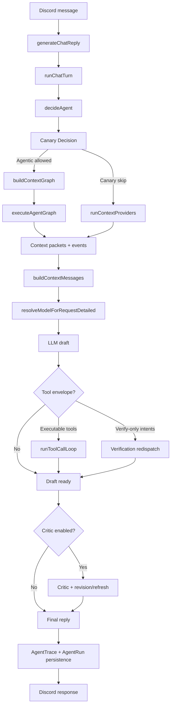

# Sage Runtime Pipeline (Agent Selector, Context Graph, Safety Gates)

This document describes the current end-to-end runtime implemented in `src/core/agentRuntime` and related modules.

---

## Quick Navigation

- [1) End-to-End Flow](#1-end-to-end-flow)
- [2) Agent Selection + Context Graph Construction](#2-agent-selection--context-graph-construction)
- [3) Graph Execution + Context Packets](#3-graph-execution--context-packets)
- [4) Tools, Verification Redispatch, and Cache](#4-tools-verification-redispatch-and-cache)
- [5) Critic Loop + Targeted Refresh](#5-critic-loop--targeted-refresh)
- [6) Model Selection + Health Fallbacks](#6-model-selection--health-fallbacks)
- [7) Tenant Overrides + Canary Guardrails](#7-tenant-overrides--canary-guardrails)
- [8) Tracing, Replay, and Release Gates](#8-tracing-replay-and-release-gates)

---

## 1) End-to-End Flow



---

## 2) Agent Selection + Context Graph Construction

Primary files:

- `src/core/orchestration/agentSelector.ts`
- `src/core/agentRuntime/graphBuilder.ts`
- `src/core/agentRuntime/canaryPolicy.ts`

Runtime behavior:

1. `decideAgent` classifies each request as `chat`, `coding`, `search`, or `creative`, and returns route temperature.
2. For `search`, router also returns `search_mode` (`simple` or `complex`); if missing/invalid, runtime defaults to `complex`.
3. `getStandardProvidersForAgent` assigns baseline context providers (route-aware).
4. `buildContextGraph` builds:
   - fanout graph when parallel provider fetch is allowed,
   - linear graph when parallelism is disabled or unnecessary.
5. Canary (`evaluateAgenticCanary`) decides if graph execution is used this turn.
6. If canary denies agentic path, runtime uses provider runner fallback directly (`runContextProviders`).

---

## 3) Graph Execution + Context Packets

Primary files:

- `src/core/agentRuntime/graphExecutor.ts`
- `src/core/agentRuntime/blackboard.ts`
- `src/core/context/runContext.ts`

Runtime behavior:

1. Graph executor runs nodes with per-node retry/timeout budgets.
2. Parallel execution is bounded by `AGENTIC_GRAPH_MAX_PARALLEL`.
3. Node outputs are normalized into context packets (`Memory`, `SocialGraph`, `VoiceAnalytics`, `Summarizer`).
4. Event stream captures graph lifecycle (`graph_started`, `node_completed`, `node_failed`, `graph_completed`).
5. Per-node runtime rows are persisted as `AgentRun` records.

---

## 4) Tools, Verification Redispatch, and Cache

Primary files:

- `src/core/agentRuntime/toolCallLoop.ts`
- `src/core/agentRuntime/toolPolicy.ts`
- `src/core/agentRuntime/toolCache.ts`
- `src/core/agentRuntime/toolVerification.ts`

Runtime behavior:

1. Tool calls execute through a bounded loop with malformed-envelope recovery prompts.
2. Deterministic tool policy gates classify risk (`read_only`, `external_write`, `high_risk`).
3. Blocklists and risk permissions are enforced before any execution.
4. Per-turn cache deduplicates repeated calls.
5. Verification intents (`verify_search_again`, `verify_chat_again`, `verify_code_again`) trigger independent re-answer + compare passes when executable tools are unavailable or route asks for verification.
6. Runtime forces plain-text fallback if verification responses keep returning tool envelopes.
7. Runtime injects a capability manifest into the system prompt that reflects route, context providers, and only policy-allowed tools for that turn.

Note:

- Runtime tools are intentionally minimal right now (`DEFAULT_RUNTIME_TOOLS` is empty), so many verification intents resolve via redispatch logic rather than concrete tool handlers.
- Voice join/leave are currently slash-command operations (`/join`, `/leave`), not runtime tool calls.

---

## 5) Critic Loop + Targeted Refresh

Primary files:

- `src/core/agentRuntime/criticAgent.ts`
- `src/core/agentRuntime/qualityPolicy.ts`
- `src/core/agentRuntime/agentRuntime.ts`

Runtime behavior:

1. Critic loop is bounded by `AGENTIC_CRITIC_MAX_LOOPS`.
2. Critic runs only on eligible routes (`chat`, `coding`, `search`) and skips voice/file turns.
3. If quality is below threshold, runtime requests revision.
4. For search route, critic can trigger a fresh search pass (`shouldRefreshSearchFromCritic`).
5. Search route execution mode controls finalization: `simple` returns search output directly, while `complex` runs a chat synthesis pass over search findings before final response.
6. For non-search revisions, runtime can redispatch targeted context providers before rewrite.
7. Critic outcomes and redispatch metadata are persisted in trace quality/budget payloads.

---

## 6) Model Selection + Health Fallbacks

Primary files:

- `src/core/llm/model-resolver.ts`
- `src/core/llm/model-health.ts`

Runtime behavior:

1. Resolver builds route-specific candidate chains (`chat`, `coding`, `search`, and image path where applicable).
2. Capability constraints (vision/audio/tools/search/reasoning) are applied when metadata is present.
3. Optional tenant allowlists filter candidate sets.
4. Candidate order is health-weighted using rolling outcome history.
5. Selection telemetry (candidate decisions + fallback reasons) is stored in runtime budget metadata.

---

## 7) Tenant Overrides + Canary Guardrails

Primary files:

- `src/core/agentRuntime/tenantPolicy.ts`
- `src/core/agentRuntime/canaryPolicy.ts`
- `src/core/agentRuntime/agentRuntime.ts`

Runtime behavior:

1. Tenant policy (`AGENTIC_TENANT_POLICY_JSON`) can override:
   - graph parallelism,
   - critic config,
   - tool policy flags/blocklist,
   - allowed models.
2. Canary policy controls rollout and rollback:
   - deterministic sampling (`AGENTIC_CANARY_PERCENT`),
   - route allowlist (`AGENTIC_CANARY_ROUTE_ALLOWLIST_CSV`),
   - rolling failure windows,
   - cooldown when failure rate crosses threshold.
3. If graph path is denied/fails, runtime safely falls back to provider runner mode.

---

## 8) Tracing, Replay, and Release Gates

Primary files:

- `src/core/agentRuntime/agent-trace-repo.ts`
- `src/core/agentRuntime/replayHarness.ts`
- `src/core/agentRuntime/outcomeScorer.ts`
- `src/scripts/replay-gate.ts`

Runtime behavior:

1. `AgentTrace` persists selector decision payload, context packet metadata, graph/events, quality, budget, and tool metadata.
2. `expertsJson` field name is retained for compatibility, but payload stores context packet metadata (providers/actions).
3. Replay harness scores recent traces and aggregates route-level quality metrics.
4. Replay gate script enforces thresholds including:
   - `REPLAY_GATE_MIN_AVG_SCORE`
   - `REPLAY_GATE_MIN_SUCCESS_RATE`
   - `REPLAY_GATE_MIN_TOTAL`
   - `REPLAY_GATE_REQUIRED_ROUTES_CSV`
   - `REPLAY_GATE_MIN_ROUTE_SAMPLES`
5. CI release-readiness runs migrations then executes `npm run release:agentic-check`.

Recommended pre-release command:

```bash
npm run release:agentic-check
```

---

## Related Documentation

- [Agentic Architecture](../AGENTIC_ARCHITECTURE.md)
- [Configuration Reference](../CONFIGURATION.md)
- [Operations Runbook](../operations/runbook.md)
- [Release Process](../RELEASE.md)
