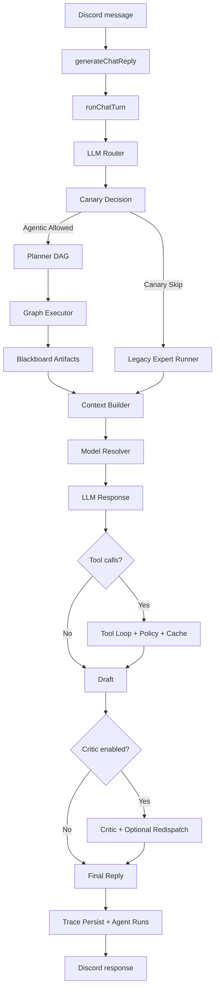

# Sage Runtime Pipeline (Planner, Graph Executor, Safety Gates)

This document describes the current end-to-end runtime as implemented in `src/core/agentRuntime` and related modules.

---

## Quick Navigation

- [1) End-to-End Flow](#1-end-to-end-flow)
- [2) Route + Plan Construction](#2-route--plan-construction)
- [3) Graph Execution + Blackboard](#3-graph-execution--blackboard)
- [4) Tools, Policy, and Cache](#4-tools-policy-and-cache)
- [5) Critic Loop + Targeted Redispatch](#5-critic-loop--targeted-redispatch)
- [6) Model Selection + Health Fallbacks](#6-model-selection--health-fallbacks)
- [7) Tenant Overrides + Canary Guardrails](#7-tenant-overrides--canary-guardrails)
- [8) Tracing, Replay, and Release Gates](#8-tracing-replay-and-release-gates)

---

## 1) End-to-End Flow



---

## 2) Route + Plan Construction

Primary files:

- `src/core/orchestration/llmRouter.ts`
- `src/core/agentRuntime/plannerAgent.ts`
- `src/core/agentRuntime/graphPolicy.ts`

Runtime behavior:

1. `decideRoute` classifies request intent (e.g., `chat`, `analyze`, `search`).
2. `getStandardExpertsForRoute` (in Planner) determines the necessary experts.
3. `buildPlannedExpertGraph` constructs the execution plan.
4. Planner strategy is route-aware:
   - dependency-aware DAG for multi-expert routes that benefit from partial ordering,
   - fanout graph for independent experts,
   - linear graph fallback when needed.
5. `validateAgentGraph` enforces acyclic graph and budget ceilings before execution.

---

## 3) Graph Execution + Blackboard

Primary files:

- `src/core/agentRuntime/graphExecutor.ts`
- `src/core/agentRuntime/blackboard.ts`
- `src/core/agentRuntime/agent-events.ts`

Runtime behavior:

1. Executor runs nodes with per-node timeout/retry budgets.
2. Parallel execution is bounded by `AGENTIC_GRAPH_MAX_PARALLEL`.
3. Node outputs are written as typed artifacts to blackboard state.
4. Event stream captures graph lifecycle (`graph_started`, `node_completed`, `node_failed`, `graph_completed`).
5. Per-node runtime rows are persisted via `AgentRun` records.

---

## 4) Tools, Policy, and Cache

Primary files:

- `src/core/agentRuntime/toolCallLoop.ts`
- `src/core/agentRuntime/toolPolicy.ts`
- `src/core/agentRuntime/toolCache.ts`

Runtime behavior:

1. Tool calls execute through a bounded loop with retry prompts for malformed envelopes.
2. Deterministic policy gates classify risk (`read_only`, `external_write`, `high_risk`).
3. Blocklists and risk permissions are enforced before any tool execution.
4. Successful tool results are cached per turn to reduce duplicate calls.

---

## 5) Critic Loop + Targeted Redispatch

Primary files:

- `src/core/agentRuntime/criticAgent.ts`
- `src/core/agentRuntime/qualityPolicy.ts`
- `src/core/agentRuntime/agentRuntime.ts`

Runtime behavior:

1. Critic loop is bounded by `AGENTIC_CRITIC_MAX_LOOPS`.
2. If quality is below threshold, the runtime requests revision.
3. Before revision, the runtime can redispatch targeted experts based on critic issues and inject refreshed packets.
4. Critic outcomes and redispatch metadata are persisted in trace quality/budget payloads.

---

## 6) Model Selection + Health Fallbacks

Primary files:

- `src/core/llm/model-resolver.ts`
- `src/core/llm/model-health.ts`

Runtime behavior:

1. Resolver builds route-specific candidate chains.
2. Capability constraints (vision/audio/tools/search/reasoning) are enforced when metadata is available.
3. Optional tenant allowlists filter candidate sets.
4. Candidate order is health-weighted using rolling outcome history.
5. Detailed selection telemetry (candidate decisions + fallback reasons) is recorded in runtime budget metadata.

---

## 7) Tenant Overrides + Canary Guardrails

Primary files:

- `src/core/agentRuntime/tenantPolicy.ts`
- `src/core/agentRuntime/canaryPolicy.ts`
- `src/core/agentRuntime/agentRuntime.ts`

Runtime behavior:

1. Tenant policy (`AGENTIC_TENANT_POLICY_JSON`) can override:
   - graph parallelism,
   - critic config,
   - tool policy flags/blocklist,
   - allowed models.
2. Canary policy controls rollout and rollback:
   - deterministic sampling (`AGENTIC_CANARY_PERCENT`),
   - route allowlist,
   - rolling error-budget windows,
   - cooldown when failure rate crosses threshold.
3. When canary denies agentic path, runtime safely falls back to legacy expert runner.

---

## 8) Tracing, Replay, and Release Gates

Primary files:

- `src/core/agentRuntime/agent-trace-repo.ts`
- `src/core/agentRuntime/replayHarness.ts`
- `src/core/agentRuntime/outcomeScorer.ts`
- `src/scripts/replay-gate.ts`

Runtime behavior:

1. `AgentTrace` persists router, experts, graph/events, quality, budget, and tool payloads.
2. Replay harness scores recent traces and aggregates route-level quality metrics.
3. Replay gate script enforces rollout thresholds:
   - `REPLAY_GATE_MIN_AVG_SCORE`
   - `REPLAY_GATE_MIN_SUCCESS_RATE`
4. CI release-readiness runs migrations then executes `npm run release:agentic-check`.

Recommended pre-release command:

```bash
npm run release:agentic-check
```

---

## Related Documentation

- [Agentic Architecture](../AGENTIC_ARCHITECTURE.md)
- [Configuration Reference](../CONFIGURATION.md)
- [Operations Runbook](../operations/runbook.md)
- [Release Process](../RELEASE.md)
