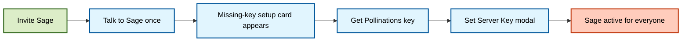

# 🌸 Bring Your Own Pollen (BYOP)

<p align="center">
  
</p>

Sage's built-in hosted/server-key flow uses a BYOP model: communities provide a Pollinations API key for that integration path. Sage itself is MIT-licensed; Pollinations usage and hosting costs remain separate from the software license, and self-hosted chat turns can target other OpenAI-compatible providers.

---

## 🧭 Quick navigation

- [How It Works](#how-it-works)
- [Setup Guide](#setup-guide-for-admins)
- [Key Safety Notes](#key-safety-notes)
- [FAQ](#faq)

---

<a id="how-it-works"></a>

## 🔑 How It Works

For the built-in Pollinations-backed flow, Sage needs a server key to answer in that guild. This can be provided in two ways:

1. **Server-wide key (BYOP):** A server admin uses Sage's setup card and modal to store a server provider key for the community.
2. **Host-level key (`SERVER_PROVIDER_API_KEY`):** Optional fallback key the bot owner can set for the whole deployment.

This key powers:

- 💬 Text chat
- 👁️ Vision
- 🎨 Image generation and editing
- 🎤 Voice-related features when enabled

### Activation lifecycle



---

<a id="setup-guide-for-admins"></a>

## 🚀 Setup Guide (For Admins)

**Prerequisite:** You must be a server admin or have the **Manage Guild** permission.

### Step 1: Trigger the setup card

Send a normal message that invokes Sage, such as:

```text
@Sage hello
```

If the guild does not yet have a usable key, Sage responds with the setup card.

### Step 2: Get your Pollinations key

Click `Get Pollinations Key`, complete the Pollinations login flow, and copy the `sk_...` token from the redirect URL.

> [!TIP]
> You can also manage keys directly from the Pollinations dashboard at `enter.pollinations.ai`.

### Step 3: Save the server key

Click `Set Server Key`, paste the `sk_...` token into the modal, and submit it.

Sage validates the key before storing it for the current guild.

### Step 4: Check or clear later

Use the same setup card controls:

- `Check Key` verifies status
- `Clear Key` removes the server-wide key

---

<a id="key-safety-notes"></a>

## 🔐 Key Safety Notes

- The key is server-wide and used for requests originating from that server.
- Treat your `sk_...` key like a password.
- Sage's current setup flow uses buttons and modals instead of public command text, which helps avoid accidental channel leakage.
- If you need to revoke access, clear the key in Sage and/or rotate it in Pollinations.

---

<a id="faq"></a>

## ❓ FAQ

**Q: Do my members need to pay?**  
**A:** The server key covers member AI usage. Pollinations.ai may offer free tiers, but provider usage and hosting costs are separate from Sage's MIT software license.

---

## 📚 Related Documentation

- [⚙️ Configuration Reference](../reference/CONFIGURATION.md) — All env vars
- [🐝 Pollinations Integration](../reference/POLLINATIONS.md) — How Sage connects upstream
- [🔒 Security & Privacy](../security/SECURITY_PRIVACY.md) — What Sage stores
