# 🌸 Bring Your Own Pollen (BYOP)

<p align="center">
  
</p>

Sage's current hosted/server-key flow uses BYOP: a server admin connects a Pollinations secret key for that guild.

Sage itself remains MIT-licensed and provider-flexible when self-hosted. This page covers only the Pollinations-specific hosted/server-key path.

---

## 🧭 Quick navigation

- [How It Works](#how-it-works)
- [Setup Guide](#setup-guide-for-admins)
- [Key Safety Notes](#key-safety-notes)
- [FAQ](#faq)

---

<a id="how-it-works"></a>

## 🔑 How It Works

For the current hosted/server-key path, Sage needs a usable Pollinations key for the guild.

That can happen in two ways:

1. **Server-wide key:** a server admin completes the setup card flow and stores a guild key.
2. **Host-level fallback:** the operator has configured a deployment-level provider key path that Sage can use for the hosted experience.

The BYOP path currently powers:

- text chat
- vision-aware chat
- image generation and image editing
- any guild turn that depends on the current hosted key path

### Activation lifecycle

```mermaid
flowchart LR
    classDef start fill:#dcedc8,stroke:#33691e,stroke-width:2px,color:black
    classDef step fill:#e1f5fe,stroke:#01579b,stroke-width:2px,color:black
    classDef finish fill:#ffccbc,stroke:#bf360c,stroke-width:2px,color:black

    A[Invite Sage]:::start
      --> B[Talk to Sage once]:::step
      --> C[Setup card appears]:::step
      --> D[Get Pollinations key]:::step
      --> E[Set Server Key modal]:::step
      --> F[Sage active for the guild]:::finish
```



---

<a id="setup-guide-for-admins"></a>

## 🚀 Setup Guide (For Admins)

### Step 1: Trigger the setup card

Invoke Sage normally:

```text
@Sage hello
```

If the guild has no usable key path yet, Sage responds with the setup card.

### Step 2: Get your Pollinations key

Click `Get Pollinations Key`, complete the Pollinations login flow, and copy the `sk_...` token from the redirect URL.

> [!TIP]
> You can also manage keys directly from the Pollinations dashboard at `enter.pollinations.ai`.

### Step 3: Save the server key

Click `Set Server Key`, paste the `sk_...` token into the modal, and submit it.

Sage validates the key before storing it for the current guild.

### Step 4: Check or clear later

Use the same setup card controls:

- `Check Key` verifies status
- `Clear Key` removes the server-wide key

---

<a id="key-safety-notes"></a>

## 🔐 Key Safety Notes

- The key is guild-scoped and used for requests originating from that server.
- Treat `sk_...` keys like passwords.
- Sage's setup flow uses buttons and modals so keys are not pasted into public chat.
- If you need to revoke access, clear the key in Sage and rotate it in Pollinations.

---

<a id="faq"></a>

## ❓ FAQ

**Q: Do my members need their own key?**  
**A:** No. The BYOP server key covers the guild.

**Q: Does this change self-hosted provider flexibility?**  
**A:** No. Sage's runtime chat remains provider-flexible through `AI_PROVIDER_BASE_URL`. BYOP is only the current hosted/server-key path.

**Q: Where do I read more about the upstream integration?**  
**A:** See [🐝 Pollinations Integration](../reference/POLLINATIONS.md).

---

## 📚 Related Documentation

- [⚙️ Configuration Reference](../reference/CONFIGURATION.md)
- [🐝 Pollinations Integration](../reference/POLLINATIONS.md)
- [🔒 Security & Privacy](../security/SECURITY_PRIVACY.md)
