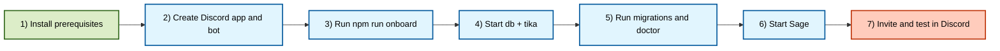

# 📖 Getting Started

<p align="center">
  
</p>

Set up Sage from source, create the Discord app, and get your first live chat turn working.

<p align="center">
  
  
  
</p>

**Outcome:** a running Sage instance, a valid bot invite, working database migrations, and a clear provider setup path.

---

## 🧭 Quick navigation

- [✅ Before You Begin](#before-you-begin)
- [🗺️ Setup at a Glance](#setup-at-a-glance)
- [Step 1: Install Required Software](#step-1-install-required-software)
- [Step 2: Create Your Discord Bot](#step-2-create-your-discord-bot)
- [Step 3: Download and Configure Sage](#step-3-download-and-configure-sage)
- [Step 4: Start Required Services](#step-4-start-required-services)
- [Step 5: Start Sage](#step-5-start-sage)
- [Step 6: Invite Sage to Your Server](#step-6-invite-sage-to-your-server)
- [Step 7: Optional Server-Key Activation](#step-7-optional-server-key-activation)
- [✅ Verification Checklist](#verification-checklist)

---

<a id="before-you-begin"></a>

## ✅ Before You Begin

You will need:

- A Discord account
- A machine running Windows, macOS, or Linux
- Internet access
- Permission to create a Discord application for the server you want to test in

Everything else is installed in the steps below.

---

<a id="setup-at-a-glance"></a>

## 🗺️ Setup at a Glance


```mermaid
flowchart LR
    classDef start fill:#dcedc8,stroke:#33691e,stroke-width:2px,color:black
    classDef step fill:#e1f5fe,stroke:#01579b,stroke-width:2px,color:black
    classDef endNode fill:#ffccbc,stroke:#bf360c,stroke-width:2px,color:black

    S1["1) Install prerequisites"]:::start
      --> S2["2) Create Discord app and bot"]:::step
      --> S3["3) Run npm run onboard"]:::step
      --> S4["4) Start db + tika"]:::step
      --> S5["5) Run migrations and doctor"]:::step
      --> S6["6) Start Sage"]:::step
      --> S7["7) Invite and test in Discord"]:::endNode
```

---

<a id="step-1-install-required-software"></a>

## 1️⃣ Install Required Software

### 1.1 Install Node.js

Sage requires Node.js `>=22.12.0`.

1. Visit <https://nodejs.org/en>
2. Install Node.js `22.12.0` or newer
3. Restart your terminal after installation

Verify:

```bash
node --version
npm --version
```

### 1.2 Install Docker Desktop

Docker runs the repo's support services locally.

1. Visit <https://www.docker.com/products/docker-desktop/>
2. Install Docker Desktop
3. Start Docker Desktop before you continue

> [!TIP]
> Sage itself runs as a Node.js process. The repo's compose files are for support services such as PostgreSQL, Tika, SearXNG, and Crawl4AI.

### 1.3 Install Git

1. Visit <https://git-scm.com/downloads/>
2. Install Git for your OS

---

<a id="step-2-create-your-discord-bot"></a>

## 2️⃣ Create Your Discord Bot

### 2.1 Create the Discord application

1. Open <https://discord.com/developers/applications>
2. Click **New Application**
3. Name it and create it

### 2.2 Copy the Application ID

1. Open **General Information**
2. Copy **Application ID**
3. Save it for `DISCORD_APP_ID`

### 2.3 Create the bot and copy the token

1. Open **Bot**
2. Create the bot if needed
3. Click **Reset Token** or **Copy Token**
4. Save it for `DISCORD_TOKEN`

> [!WARNING]
> Never share your bot token. Treat it like a production secret.

### 2.4 Enable the required gateway intent

On the **Bot** page, enable:

- **MESSAGE CONTENT INTENT**

You should also give the bot permission to read and send messages in the channels where you plan to use it.

---

<a id="step-3-download-and-configure-sage"></a>

## 3️⃣ Download and Configure Sage

### 3.1 Clone and install

```bash
git clone https://github.com/BokX1/Sage.git
cd Sage
npm ci
```

### 3.2 Run the onboarding wizard

```bash
npm run onboard
```

The wizard will guide you through:

| Prompt | Meaning |
| :--- | :--- |
| `DISCORD_TOKEN` | Bot token from the Discord Developer Portal |
| `DISCORD_APP_ID` | Discord application ID |
| `DATABASE_URL` | Local Docker default or your own PostgreSQL URL |
| `AI_PROVIDER_BASE_URL` | Your OpenAI-compatible chat-completions base URL |
| AI provider setup mode | Host Codex auth, host key now, server activation later, or both |
| `AI_PROVIDER_API_KEY` | Optional host-level key for the configured provider |
| `AI_PROVIDER_MAIN_AGENT_MODEL` | Main runtime model |
| `AI_PROVIDER_PROFILE_AGENT_MODEL` | Profile update model |
| `AI_PROVIDER_SUMMARY_AGENT_MODEL` | Summary model |

The wizard also supports automation-friendly flags:

```bash
npm run onboard -- \
  --discord-token "YOUR_TOKEN" \
  --discord-app-id "YOUR_APP_ID" \
  --database-url "postgresql://..." \
  --api-key "YOUR_PROVIDER_KEY" \
  --model your-main-model \
  --yes \
  --non-interactive \
  --start-docker \
  --migrate \
  --doctor
```

> [!TIP]
> Run `npm run onboard -- --help` any time you want the current CLI contract. The docs in this repo are written to match that command output.

---

<a id="step-4-start-required-services"></a>

## 4️⃣ Start Required Services

Start PostgreSQL and Tika:

```bash
docker compose -f config/services/core/docker-compose.yml up -d db tika
```

Then apply the tracked Prisma baseline:

```bash
npm run db:migrate
```

Optional local research stack:

```bash
docker compose -f config/services/self-host/docker-compose.tools.yml up -d
```

---

<a id="step-5-start-sage"></a>

## 5️⃣ Start Sage

For development:

```bash
npm run dev
```

For a production-style local run:

```bash
npm run build
npm start
```

Before testing in Discord, it is worth running:

```bash
npm run doctor
```

And if you want a live provider probe:

```bash
npm run doctor -- --llm-ping
```

Expected healthy signals:

- `npm run doctor` reports no blocking failures
- If you use shared host Codex auth, `npm run auth:codex:status` reports an active login
- Sage logs in successfully to Discord
- database migrations are already applied

---

<a id="step-6-invite-sage-to-your-server"></a>

## 6️⃣ Invite Sage to Your Server

### 6.1 Generate the invite URL

`npm run onboard` prints the recommended invite shape automatically after setup.

You can also build it manually:

```text
https://discord.com/oauth2/authorize?client_id=YOUR_DISCORD_APP_ID&scope=bot&permissions=1133568
```

### 6.2 Authorize the bot

1. Open the invite URL
2. Select your test server
3. Complete the authorization flow

### 6.3 Test the chat-first entrypoints

Try any of these:

- `Sage, hello`
- `@Sage what changed today?`
- Reply to a Sage message with `go deeper on this`

---

<a id="step-7-optional-server-key-activation"></a>

## 7️⃣ Optional Server-Key Activation

Use this step if you are relying on Sage's in-Discord server activation flow instead of only host-level credentials.

1. Mention Sage in the guild once
2. If the server does not have a usable key path yet, Sage posts the setup card
3. A server admin clicks `Get Pollinations Key`
4. The admin completes the Pollinations flow and copies the `sk_...` key
5. The admin clicks `Set Server Key` and submits the key in the modal

> [!NOTE]
> This server-key flow is part of Sage's current hosted/Pollinations-specific path. Self-hosted runtime chat remains provider-flexible through `AI_PROVIDER_BASE_URL`, and the host can now prefer a shared Codex OAuth login via `npm run auth:codex:login`.

---

<a id="verification-checklist"></a>

## ✅ Verification Checklist

- [ ] `npm run db:migrate` completed successfully
- [ ] `npm run doctor` passes
- [ ] Sage appears in your server member list
- [ ] `Sage, hello` produces a Discord reply
- [ ] `@Sage explain this code` works
- [ ] If you use shared host Codex auth, `npm run auth:codex:status` shows an active login
- [ ] If you skipped `AI_PROVIDER_API_KEY`, the setup card appears when the server has no usable key

Useful smoke prompts:

- `Sage, summarize what this project does`
- `Sage, search the latest Node.js docs for fetch timeout behavior`
- `Sage, draw a watercolor mountain skyline`

---

## 🎯 What’s Next?

- [⚡ Quick Start](QUICKSTART.md) for the shortest path
- [💬 Conversation & Controls](COMMANDS.md) for the current Discord UX
- [⚙️ Configuration](../reference/CONFIGURATION.md) for all env vars
- [🔧 Troubleshooting](TROUBLESHOOTING.md) if anything is off
- [📋 Operations Runbook](../operations/RUNBOOK.md) for validation and incident handling
