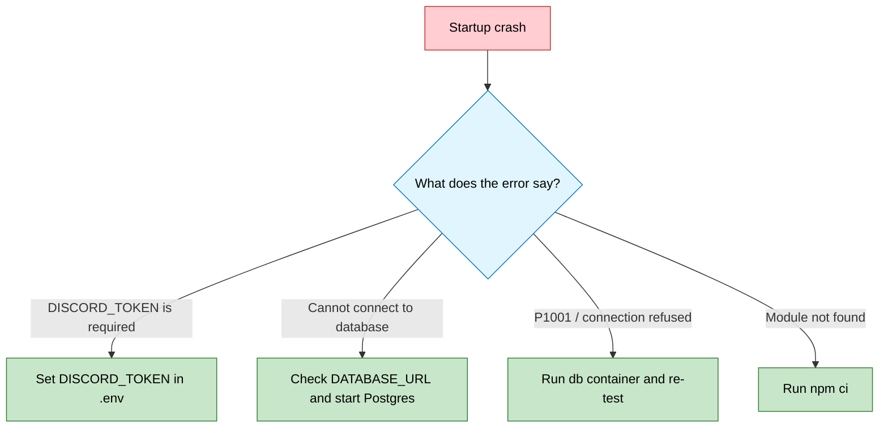

# 🔧 Troubleshooting

<p align="center">
  
</p>

Fast fixes for common Sage issues.

> [!TIP]
> Start with `npm run doctor`. It catches most setup and configuration problems.

---

## 🧭 Quick navigation

- [🚦 Quick Diagnostics](#quick-diagnostics)
- [🔴 Startup Issues](#startup-issues)
- [🟡 Response Issues](#response-issues)
- [🔵 Interaction Issues](#interaction-issues)
- [🟣 Database Issues](#database-issues)
- [⚡ Performance Issues](#performance-issues)
- [🆘 Still Having Issues?](#still-having-issues)

---

<a id="quick-diagnostics"></a>

## 🚦 Quick Diagnostics

Run:

```bash
npm run doctor
```

For live provider checks:

```bash
npm run doctor -- --llm-ping
```

For a direct model/key probe:

```bash
npm run ai-provider:probe
```

---

<a id="startup-issues"></a>

## 🔴 Startup Issues

### Bot crashes on startup



### “DISCORD_TOKEN is required”

Add your bot token to `.env` and restart Sage.

### “P1001: Cannot connect to database”

Start the local database if you are using the repo defaults:

```bash
docker compose -f config/services/core/docker-compose.yml up -d db
npm run db:migrate
```

---

<a id="response-issues"></a>

## 🟡 Response Issues

### Bot is online but not responding

Check these in order:

| Check | What to verify |
| :--- | :--- |
| Invocation path | mention, wake word, or reply |
| Channel permissions | Sage can read and send messages |
| Provider health | `npm run doctor -- --llm-ping` |
| Guild key path | setup card / `Check Key` if you rely on the hosted flow |

### “No API key” or missing-key guidance in a guild

1. Trigger Sage once so the setup card appears
2. If you want the hosted/server-key path, have an admin complete the Pollinations key flow
3. If you want a host-level fallback instead, set `AI_PROVIDER_API_KEY` in `.env`

### Response is truncated

Review:

```env
CONTEXT_MAX_INPUT_TOKENS=120000
CONTEXT_RESERVED_OUTPUT_TOKENS=4096
CHAT_MAX_OUTPUT_TOKENS=4096
```

---

<a id="interaction-issues"></a>

## 🔵 Interaction Issues

### Slash commands still appear in Discord

Discord may still be showing application commands cached from an older Sage build.

Fix:

1. restart the latest Sage build once
2. let startup clear the legacy commands
3. reopen the command picker

### “Unknown interaction” error

This usually means the interaction timed out before Sage could respond.

Check:

- provider health
- network stability
- `TIMEOUT_CHAT_MS`

### Duplicate approval cards or noisy tool chatter

Sage should coalesce equivalent pending requests and keep tool protocol out of visible replies.

If you still see duplicates:

1. make sure you are on the latest build
2. expire or resolve stale review items
3. retry once and confirm Sage reuses the same review request

---

<a id="database-issues"></a>

## 🟣 Database Issues

### Missing tables or columns

Apply the tracked baseline migration:

```bash
npm run db:migrate
```

### Development-only full reset

```bash
npx prisma migrate reset --force --skip-generate
```

> [!WARNING]
> The reset command deletes data. Do not use it on production data.

---

<a id="performance-issues"></a>

## ⚡ Performance Issues

### High memory usage

Reduce:

```env
RING_BUFFER_MAX_MESSAGES_PER_CHANNEL=120
CONTEXT_TRANSCRIPT_MAX_MESSAGES=12
RAW_MESSAGE_TTL_DAYS=1
```

### Slow responses

Check:

- provider latency
- current model choice
- prompt and transcript budgets
- whether optional local services are unavailable and forcing slower fallbacks

---

<a id="still-having-issues"></a>

## 🆘 Still Having Issues?

1. Enable debug logs:

   ```env
   LOG_LEVEL=debug
   ```

2. Run:

   ```bash
   npm run doctor -- --llm-ping
   ```

3. Inspect traces:

   ```bash
   npm run db:studio
   ```

4. Open an issue: <https://github.com/BokX1/Sage/issues>

Include:

- the exact error message
- `npm run doctor` output
- steps to reproduce
- Node.js version and operating system
