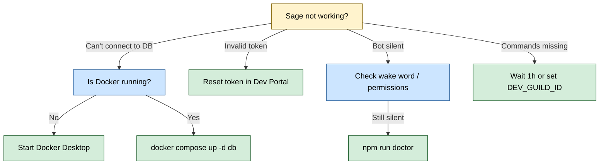

# 📋 Sage Runbook

A practical guide for operating and maintaining Sage (self-hosted).

---

## 🧭 Quick navigation

- [⚡ Quick Reference](#quick-reference)
- [✅ Startup Checklist](#startup-checklist)
- [🔧 Environment Requirements](#environment-requirements)
- [🗄️ Database Management](#database-management)
- [🏥 Health Checks](#health-checks)
- [📋 Logs](#logs)
- [🔄 Restart Notes](#restart-notes)
- [🆘 Common Issues](#common-issues)
- [📈 Performance Tips](#performance-tips)
- [🚢 Production Deployment](#production-deployment)

---

<a id="quick-reference"></a>

## ⚡ Quick Reference

### Start Sage

```bash
npm run dev              # Development (with hot-reload)
npm run build && npm start  # Production
```

### Check health

```bash
npm run doctor           # Check configuration and database
npm run agentic:replay-gate  # Replay quality gate
npm run eval:gate        # Judge-eval quality gate
npm run agentic:consistency-check  # Stage 9 cross-phase consistency gate
npm run release:agentic-check  # Full release gate (check + consistency + replay + eval)
```

### Database operations

```bash
npx prisma db push       # Sync schema (no migrations)
npm run db:studio        # Open visual database browser
docker compose -f config/ci/docker-compose.yml up -d db tika  # Start DB + Tika
```

---

<a id="startup-checklist"></a>

## ✅ Startup Checklist

Before starting Sage, verify:

| Check | Command/Action | Expected Result |
| :--- | :--- | :--- |
| Docker running | Open Docker Desktop | Green “Running” status |
| Database up | `docker compose -f config/ci/docker-compose.yml up -d db` | Container starts |
| Tika up (file ingestion) | `docker compose -f config/ci/docker-compose.yml up -d tika` | `sage-tika` is running on port `9998` |
| Config valid | `npm run doctor` | All checks pass |
| Token correct | Check `.env` file | No spaces/quotes in token |

---

<a id="environment-requirements"></a>

## 🔧 Environment Requirements

### Minimum required

| Variable | Description | How to Get |
| :--- | :--- | :--- |
| `DISCORD_TOKEN` | Bot authentication | Discord Developer Portal → Bot → Token |
| `DISCORD_APP_ID` | Application identifier | Developer Portal → General Information |
| `DATABASE_URL` | Database connection | Auto-configured with Docker |

### Recommended settings

| Variable | Recommended Value | Why |
| :--- | :--- | :--- |
| `INGESTION_ENABLED` | `true` | Enables memory features |
| `TRACE_ENABLED` | `true` | Helps debug issues |
| `AUTOPILOT_MODE` | `manual` | Predictable behavior |
| `DEV_GUILD_ID` | Your server ID | Fast command registration (development) |

### Agentic rollout controls

| Variable | Recommended Value | Why |
| :--- | :--- | :--- |
| `AGENTIC_CANARY_ENABLED` | `true` | Enables rollout guardrails |
| `AGENTIC_CANARY_PERCENT` | `100` in stable, lower during canary | Control traffic exposure |
| `AGENTIC_CANARY_MAX_FAILURE_RATE` | `0.30` (or stricter) | Triggers automatic cooldown on regressions |
| `AGENTIC_VALIDATORS_ENABLED` | `true` | Blocks deterministic response regressions |
| `AGENTIC_PERSIST_STATE_ENABLED` | `true` | Keeps canary/model-health state stable across restarts |
| `AGENTIC_MANAGER_WORKER_ENABLED` | `false` by default; enable only in scoped rollout | Controls advanced decomposition blast radius |
| `AGENTIC_TENANT_POLICY_JSON` | Explicit per-guild policy JSON | Per-tenant model/tool/critic governance |

### Agentic staged rollout order

Use this route order for rollout and promotion:

1. `search`
2. `coding`
3. `chat`
4. `creative`

Per stage:

1. Set `AGENTIC_CANARY_ROUTE_ALLOWLIST_CSV` to the active route set.
2. Keep `AGENTIC_CANARY_PERCENT` conservative for first deployment of each stage.
3. Keep `AGENTIC_MANAGER_WORKER_ENABLED=false` unless the stage explicitly includes manager-worker validation.
4. Run `npm run release:agentic-check`.
5. Promote only if all gates pass and no degraded-mode events are observed.

### Stage 9 consistency gate

Run this before enabling Stage 10 work:

```bash
npm run agentic:consistency-check
```

This verifies roadmap/docs/script consistency across all implemented stages and fails on drift.

### Optional enhancements

| Variable | When to Use |
| :--- | :--- |
| `LLM_API_KEY` | Optional global key (or use `/sage key set` per server) |
| `ADMIN_USER_IDS_CSV` | To enable admin commands |
| `LOG_LEVEL=debug` | When troubleshooting |

See [Configuration Reference](../reference/CONFIGURATION.md) for all options.

---

<a id="database-management"></a>

## 🗄️ Database Management

### Sync schema (no migrations)

After updates or a fresh install:

```bash
npx prisma db push
```

**What it does:** Syncs database tables to match `prisma/schema.prisma` without generating/applying migrations.

### Browse data

```bash
npm run db:studio
```

**What it does:** Opens a visual interface at `http://localhost:5555` to view and edit database records.

### Reset database

⚠️ **Warning:** This deletes all data.

```bash
npx prisma db push --force-reset --accept-data-loss
```

If you are using the Docker Compose Postgres volume and want to wipe it entirely:

```bash
docker compose -f config/ci/docker-compose.yml down -v   # Remove containers and volumes
docker compose -f config/ci/docker-compose.yml up -d db  # Start fresh database
npx prisma db push                                       # Recreate tables
```

---

<a id="health-checks"></a>

## 🏥 Health Checks

### In Discord

| Command | What It Checks | Who Can Use |
| :--- | :--- | :--- |
| `/ping` | Bot is online and responsive | Everyone |
| `/llm_ping` | AI connectivity and latency | Admins only |

### In terminal

```bash
npm run doctor
```

**Checks performed:**

- ✅ Required environment variables set
- ✅ Database connection works
- ✅ Discord token valid
- ✅ LLM connectivity (if `LLM_DOCTOR_PING=1`)

Optional Tika check (recommended when file ingestion is enabled):

```bash
curl -sS -X PUT "http://127.0.0.1:9998/tika" \
  -H "Accept: text/plain" \
  -H "Content-Type: text/plain" \
  --data "healthcheck"
```

---

<a id="logs"></a>

## 📋 Logs

Sage uses structured logging via Pino.

### Change log level

In `.env`:

```env
LOG_LEVEL=debug   # Most verbose
LOG_LEVEL=info    # Normal (default)
LOG_LEVEL=warn    # Warnings only
LOG_LEVEL=error   # Errors only
```

### Key log messages

| Message | Meaning |
| :--- | :--- |
| `Logged in as Sage#1234` | Successfully connected to Discord |
| `Successfully reloaded application (/) commands GLOBALLY.` | Slash commands finished registering for runtime use |
| `Agent Selector decision` | How a message was classified by route |
| `Agent runtime: built context` | Context being sent to AI |
| `Channel summary scheduler tick` | Automatic summary processing |

### Common warning signs

| Log Pattern | What It Means | Action |
| :--- | :--- | :--- |
| `Database connection failed` | Can’t reach PostgreSQL | Check Docker is running |
| `Rate limited` | Too many AI requests | Wait or set a key |
| `Formatter retry failed` | AI returned invalid JSON | Usually self-recovers |
| `Token invalid` | Discord rejected the token | Reset token in Developer Portal |

---

<a id="restart-notes"></a>

## 🔄 Restart Notes

### Safe to restart anytime

Restarting Sage is safe:

- ✅ Commands re-register automatically
- ✅ Summary scheduler resumes
- ✅ Database data persists

### What happens on restart

1. Slash commands re-register (global: up to 1 hour, guild: instant)
2. Message backfill fetches recent messages from each channel
3. Summary scheduler starts fresh timer
4. Voice sessions track new activity (previous sessions saved)

---

<a id="common-issues"></a>

## 🆘 Common Issues



### “Cannot connect to database”

1. Is Docker Desktop running?
2. Is the database container up?

   ```bash
   docker compose -f config/ci/docker-compose.yml up -d db
   ```

3. Wait ~10 seconds for initialization

### “Invalid token”

1. Discord Developer Portal → Bot → Reset Token
2. Copy new token to `.env`
3. Restart Sage

### Bot not responding

1. Is Sage online in your server?
2. Are you using wake word / mention / reply?
3. Does Sage have message permissions in the channel?
4. Run `npm run doctor`

### Commands not showing

- Global commands: wait up to 1 hour
- For fast testing: set `DEV_GUILD_ID`
- Ensure the invite includes `applications.commands` scope

---

<a id="performance-tips"></a>

## 📈 Performance Tips

### Reduce memory usage

```env
RING_BUFFER_MAX_MESSAGES_PER_CHANNEL=100
CONTEXT_TRANSCRIPT_MAX_MESSAGES=10
```

### Speed up responses

- Keep `CHAT_MODEL=openai-large` as baseline; switch to `CHAT_MODEL=kimi` only if you need lower latency over answer quality/consistency
- Set an API key for higher rate limits
- Reduce context sizes (see above)

### Handle high traffic

- Increase rate limits carefully
- Consider hosting on a VPS for better uptime
- Monitor with `LOG_LEVEL=info`

---

<a id="production-deployment"></a>

## 🚢 Production Deployment

### Build for production

```bash
npm run build
npm start
```

### Recommended hosting

| Provider | Notes |
| :--- | :--- |
| Railway | Easy deployment, free tier available |
| Render | Simple setup, auto-deploys from GitHub |
| DigitalOcean | Droplets for full control |
| VPS (any) | Full control, requires more setup |

### Production checklist

- [ ] `NODE_ENV=production`
- [ ] Remove `DEV_GUILD_ID` (or set to empty)
- [ ] Set appropriate `LOG_LEVEL` (info or warn)
- [ ] Configure admin access (`ADMIN_USER_IDS_CSV`)
- [ ] Secure database credentials
- [ ] Set up a process manager (pm2) for auto-restart
- [ ] Set canary policy values for your rollout stage
- [ ] Run `npm run agentic:consistency-check` and resolve any drift findings
- [ ] Run `npm run release:agentic-check` before promoting builds
