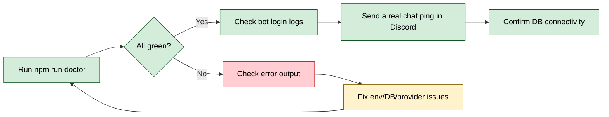
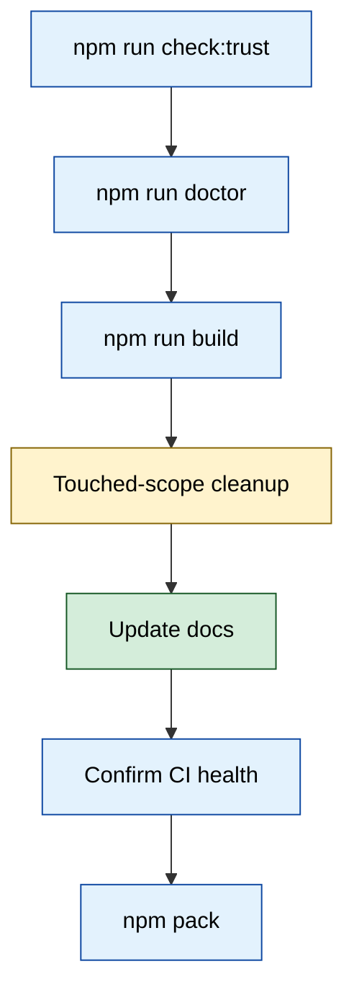
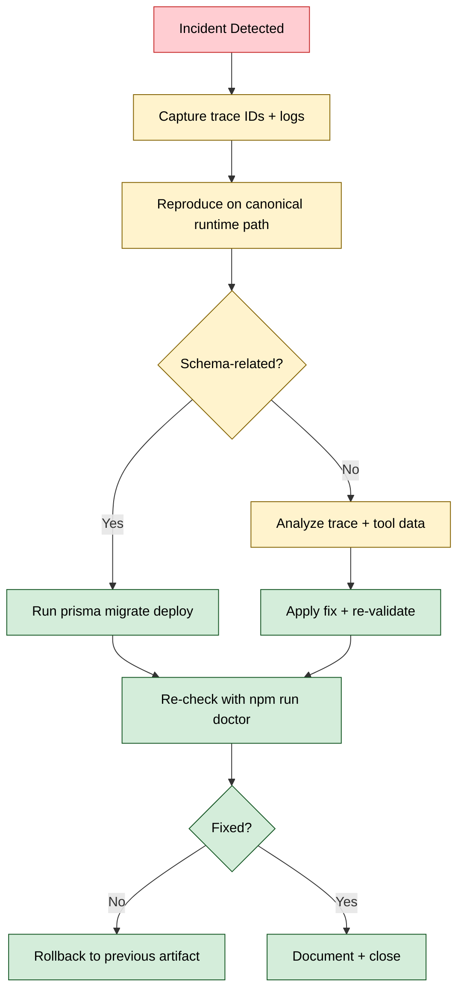

# 📋 Operations Runbook

Production operations, monitoring, validation, and incident response for Sage.

<p align="center">
  
  
</p>

---

## 🧭 Quick Navigation

- [Daily Health Checks](#daily-health-checks)
- [Monitoring](#monitoring)
- [Validation Checklist](#validation-checklist)
- [Release Validation](#release-validation)
- [Incident Response](#incident-response)
- [Common Maintenance Tasks](#common-maintenance-tasks)
- [Data & Security Notes](#data--security-notes)
- [Related Documentation](#related-documentation)

---

<a id="daily-health-checks"></a>

## 🏥 Daily Health Checks


```mermaid
flowchart LR
    classDef check fill:#d4edda,stroke:#155724,color:black
    classDef action fill:#fff3cd,stroke:#856404,color:black
    classDef alert fill:#ffcdd2,stroke:#c62828,color:black

    A[Run npm run doctor]:::check --> B{All green?}:::check
    B -->|Yes| C[Check bot login logs]:::check
    C --> D[Send a real chat ping in Discord]:::check
    D --> E[Confirm DB connectivity]:::check

    B -->|No| F[Check error output]:::alert
    F --> G[Fix env/DB/provider issues]:::action
    G --> A
```

**Daily checklist:**

1. Run `npm run doctor`
2. Verify bot login in logs:

   ```text
   [info] Logged in as Sage#1234!
   ```

3. Confirm database connectivity and migration state
4. Send `@Sage health check` or `Sage, are you online?`
5. If the hosted Pollinations BYOP path is in use, verify the setup card appears in a no-key test guild

> [!TIP]
> Use `npm run doctor -- --llm-ping` to include an LLM connectivity check. Alternative env-var syntax also works: `LLM_DOCTOR_PING=1 npm run doctor`.

---

<a id="monitoring"></a>

## 📊 Monitoring

### Log Patterns

| Pattern | Severity | Meaning |
|:---|:---|:---|
| `[info] Logged in as Sage#1234` | ✅ | Bot started successfully |
| `Cleared legacy Discord application commands...` | ✅ | Startup removed stale slash-command registrations from older builds |
| `[error] P1001` | 🔴 | Database connection lost |
| `[error] ECONNREFUSED` | 🔴 | Service unavailable |
| `[error] 520` | 🟡 | LLM response truncated |

### Trace Inspection

For detailed response diagnostics, inspect `AgentTrace` rows:

```bash
# Open Prisma Studio for visual database browsing
npm run db:studio
```

The compact `AgentTrace` ledger includes:

- `routeKind` — canonical value: `single`
- `terminationReason` — why the graph ended
- `langSmithRunId` — LangSmith run id
- `langSmithTraceId` — LangSmith trace id
- `budgetJson` — token budget allocation
- `toolJson` — tool names, args, results
- `tokenJson` — provider token usage
- `replyText` — final reply

Use LangSmith as the primary graph, task, and node trace surface. `AgentTrace` is Sage's compact Postgres ledger for operators.

### Discord checks

- Send `@Sage health check` or `Sage, are you online?`
- Verify Sage replies in-channel
- In a no-key hosted guild, verify the setup card and admin-only key controls still work

---

<a id="validation-checklist"></a>

## ✅ Validation Checklist

Use this flow for operational verification and release preparation:


```mermaid
flowchart TD
    classDef gate fill:#e3f2fd,stroke:#0d47a1,color:black
    classDef cleanup fill:#fff3cd,stroke:#856404,color:black
    classDef docs fill:#d4edda,stroke:#155724,color:black

    A[npm run check:trust]:::gate --> B[npm run doctor]:::gate
    B --> C[npm run build]:::gate
    C --> D[Touched-scope cleanup]:::cleanup
    D --> E[Update docs]:::docs
    E --> F[Confirm CI health]:::gate
    F --> G[npm pack]:::gate
```

1. **Run `npm run check:trust`** — lint + typecheck + static test audit + repeated/shuffled test validation
2. **Run `npm run doctor`** — runtime health check
3. **Run `npm run build`** — compile TypeScript
4. **Touched-scope cleanup pass:**
   - Dead code, duplication, unused imports/exports
   - Stale/noise comments
   - Legacy/unneeded code or module cleanup
5. **Update related docs** in `docs/` when behavior/configuration/operations guidance changed
6. **Confirm CI security jobs are healthy:**
   - `CodeQL` should be green
   - `dependency-review` should be green when `ENABLE_DEPENDENCY_REVIEW=true` and Dependency Graph is enabled
7. **Create a release artifact** with `npm pack` when needed

---

<a id="release-validation"></a>

## 🚢 Release Validation

Use when preparing a local release artifact:

```bash
npm run check:trust
npm run build
npm run doctor
# Perform touched-scope cleanup and docs sync
npm pack
```

Then run `.github/workflows/release-supply-chain.yml` for:

- Package artifact
- CycloneDX SBOM
- Build provenance attestation

<a id="incident-response"></a>

## 🚨 Incident Response


```mermaid
flowchart TD
    classDef detect fill:#ffcdd2,stroke:#c62828,color:black
    classDef investigate fill:#fff3cd,stroke:#856404,color:black
    classDef resolve fill:#d4edda,stroke:#155724,color:black

    A[Incident Detected]:::detect --> B[Capture trace IDs + logs]:::investigate
    B --> C[Reproduce on canonical runtime path]:::investigate
    C --> D{Schema-related?}:::investigate
    D -->|Yes| E[Run prisma migrate deploy]:::resolve
    D -->|No| F[Analyze trace + tool data]:::investigate
    F --> G[Apply fix + re-validate]:::resolve
    E --> H[Re-check with npm run doctor]:::resolve
    G --> H
    H --> I{Fixed?}:::resolve
    I -->|No| J[Rollback to previous artifact]:::resolve
    I -->|Yes| K[Document + close]:::resolve
```

**Response steps:**

1. **Capture** trace IDs and relevant logs
2. **Reproduce** with the captured inputs on the canonical runtime path and run `npm run check:trust` for deterministic validation
3. **Diagnose** — check if schema-related: run `npx prisma migrate deploy` and re-check
4. **Roll back** by deploying the previous app artifact and verified database state if needed
5. **Document** the incident and resolution

---

<a id="common-maintenance-tasks"></a>

## 🔧 Common Maintenance Tasks

### Database

```bash
# Apply pending migrations
npx prisma migrate deploy

# Open visual database browser
npm run db:studio

# Development-only full reset (⚠️ deletes all data)
npx prisma migrate reset --force --skip-generate
```

### Social Graph

```bash
# Set up Kafka topics and Memgraph streams
npm run social-graph:setup

# Migrate historical PostgreSQL data to Memgraph
npx ts-node -P config/tooling/tsconfig.app.json src/cli/social-graph/migratePostgresToMemgraph.ts
```

### Tool Stack

```bash
# Start local services (SearXNG, Crawl4AI, Tika)
docker compose -f config/services/self-host/docker-compose.tools.yml up -d

# Verify tool connectivity
npm run tools:smoke
```

### Diagnostics

```bash
# Full health check
npm run doctor

# Health check with LLM ping
npm run doctor -- --llm-ping

# Run the trust gate
npm run check:trust
```

---

<a id="data--security-notes"></a>

## 🔒 Data & Security Notes

- Secrets are read from environment variables only — never hardcoded
- Do not log raw keys or user-provided secrets
- Keep database backups current before production migrations
- If enabling `dependency-review`, ensure Dependency Graph is enabled in repository settings and set `ENABLE_DEPENDENCY_REVIEW=true`
- Admin actions use Discord-native permissions (`Manage Server` or `Administrator`)

> [!WARNING]
> Always back up your database before running schema migrations in production.

---

<a id="related-documentation"></a>

## 🔗 Related Documentation

- [🚀 Deployment Guide](DEPLOYMENT.md) — Production deployment options
- [🧰 Self-Hosted Tool Stack](TOOL_STACK.md) — Local SearXNG/Crawl4AI/Tika setup
- [🛠️ Social Graph Setup](SOCIAL_GRAPH_SETUP.md) — Memgraph + Redpanda infrastructure
- [⚙️ Configuration](../reference/CONFIGURATION.md) — All environment variables
- [🚢 Release Process](../reference/RELEASE.md) — SemVer workflow and CI checks
- [🔒 Security & Privacy](../security/SECURITY_PRIVACY.md) — Data handling and retention

<p align="right"><a href="#top">⬆️ Back to top</a></p>
