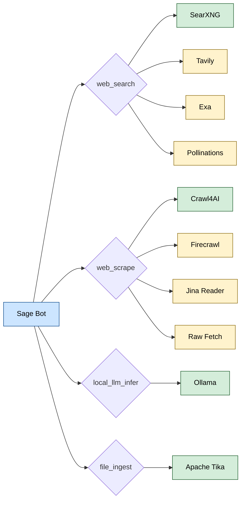

# 🧰 Self-Hosted Tool Stack

Run Sage with a local-first tool stack for maximum privacy and control, with hosted providers as automatic fallback.

---

## 🧭 Quick navigation

- [Overview](#overview)
- [Architecture](#architecture)
- [Setup](#setup)
- [Configuration](#configuration)
- [Validation](#validation)
- [Management](#management)

---

<a id="overview"></a>

## 🌐 Overview

Sage's tool layer supports both self-hosted and hosted providers. By running local services, you get:

| Benefit | Description |
| :--- | :--- |
| 🔒 **Privacy** | Search queries and scraped pages stay on your infrastructure |
| ⚡ **Speed** | No external API latency for local tools |
| 💰 **Cost** | No API key costs for local services |
| 🔄 **Fallback** | Automatic failover to hosted providers when local services are down |

---

<a id="architecture"></a>

## 🏗️ Architecture



> [!TIP]
> 🟢 Green = self-hosted (local) · 🟡 Yellow = hosted (API key required or built-in)

---

<a id="setup"></a>

## 🚀 Setup

### 1️⃣ Start local services

```bash
docker compose -f config/self-host/docker-compose.tools.yml up -d
```

This starts:

| Service | Container | URL | Purpose |
| :--- | :--- | :--- | :--- |
| SearXNG | `sage-searxng` | `http://127.0.0.1:18080` | Meta-search aggregator |
| Crawl4AI | `sage-crawl4ai` | `http://127.0.0.1:11235` | AI-powered web scraper |
| Ollama | `sage-ollama` | `http://127.0.0.1:11434` | Local LLM inference |
| Tika | `sage-tika` | `http://127.0.0.1:9998` | Attachment/document text extraction |

### 2️⃣ Pull an Ollama model

```bash
docker exec sage-ollama ollama pull llama3.1:8b
```

### 3️⃣ Configure `.env`

```env
# Self-host first, hosted fallback
TOOL_WEB_SEARCH_PROVIDER_ORDER=searxng,tavily,exa,pollinations
TOOL_WEB_SCRAPE_PROVIDER_ORDER=crawl4ai,firecrawl,jina,raw_fetch

# Local endpoints
SEARXNG_BASE_URL=http://127.0.0.1:18080
CRAWL4AI_BASE_URL=http://127.0.0.1:11235
OLLAMA_BASE_URL=http://127.0.0.1:11434
OLLAMA_MODEL=llama3.1:8b
FILE_INGEST_TIKA_BASE_URL=http://127.0.0.1:9998
```

### 4️⃣ (Optional) Add hosted fallback keys

```env
TAVILY_API_KEY=tvly-...
EXA_API_KEY=...
FIRECRAWL_API_KEY=fc-...
```

---

<a id="configuration"></a>

## ⚙️ Configuration

### Provider Order

The `PROVIDER_ORDER` variables control which provider is tried first. Providers are tried left-to-right; the first one that succeeds wins:

```text
searxng → tavily → exa → pollinations
  ↑ local       ↑ hosted fallbacks
```

| Variable | Default | Description |
| :--- | :--- | :--- |
| `TOOL_WEB_SEARCH_PROVIDER_ORDER` | `tavily,exa,searxng,pollinations` | Search provider order |
| `TOOL_WEB_SCRAPE_PROVIDER_ORDER` | `firecrawl,crawl4ai,jina,raw_fetch` | Scrape provider order |

> [!NOTE]
> For self-host-first, put local providers (`searxng`, `crawl4ai`) at the beginning of the list.

### SearXNG Options

| Variable | Default | Description |
| :--- | :--- | :--- |
| `SEARXNG_BASE_URL` | *(empty)* | SearXNG endpoint |
| `SEARXNG_SEARCH_PATH` | `/search` | Search path |
| `SEARXNG_CATEGORIES` | `general` | Search categories |
| `SEARXNG_LANGUAGE` | `en-US` | Result language |

### Ollama Options

| Variable | Default | Description |
| :--- | :--- | :--- |
| `OLLAMA_BASE_URL` | `http://127.0.0.1:11434` | Ollama endpoint |
| `OLLAMA_MODEL` | `llama3.1:8b` | Default model |

---

<a id="validation"></a>

## ✅ Validation

Run the smoke test to verify all tools are working:

```bash
npm run tools:smoke
```

The smoke script checks:

| Tool | Status |
| :--- | :--- |
| `web_search` | Required |
| `web_scrape` | Required |
| `wikipedia_lookup` | Required |
| `github_repo_lookup` | Required |
| `npm_package_lookup` | Required |
| `stack_overflow_search` | Required |
| `local_llm_models` | Optional (warns if Ollama is down) |

Attachment extraction health check (Tika):

```bash
curl -sS -X PUT "http://127.0.0.1:9998/tika" \
  -H "Accept: text/plain" \
  -H "Content-Type: text/plain" \
  --data "hello from sage"
```

Expected output contains `hello from sage`.

---

<a id="management"></a>

## 🔧 Management

### Stop services

```bash
docker compose -f config/self-host/docker-compose.tools.yml down
```

### View logs

```bash
docker compose -f config/self-host/docker-compose.tools.yml logs -f
```

### Restart a specific service

```bash
docker compose -f config/self-host/docker-compose.tools.yml restart sage-searxng
```

Attachment extraction service restart:

```bash
docker compose -f config/self-host/docker-compose.tools.yml restart sage-tika
```

---

## 🔗 Related Documentation

- [⚙️ Configuration](../reference/CONFIGURATION.md) — Full environment variable reference
- [🔍 Search Architecture](../architecture/SEARCH.md) — How search models use these tools
- [🚀 Deployment Guide](DEPLOYMENT.md) — Full production deployment
