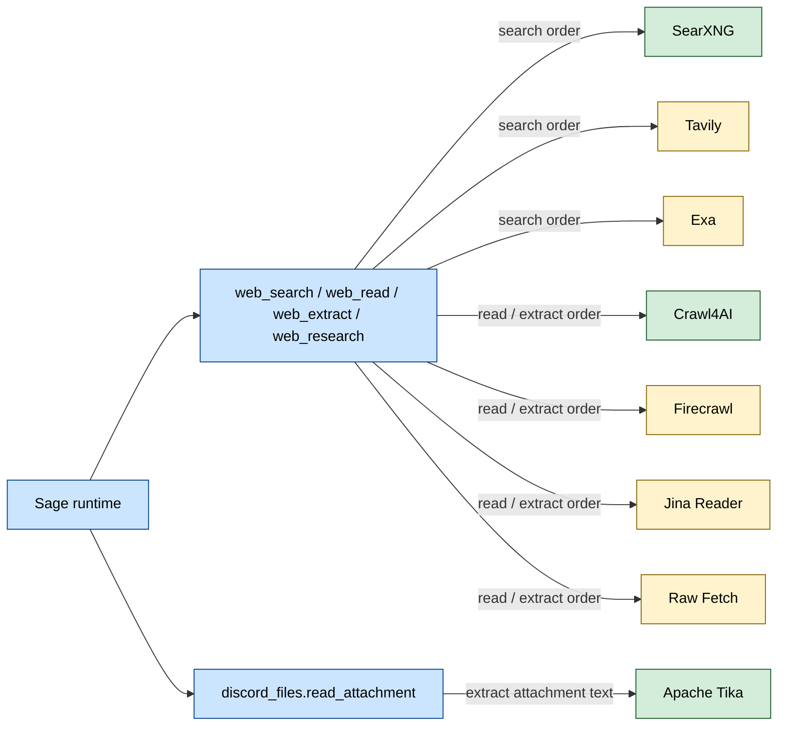

# 🧰 Self-Hosted Tool Stack

<p align="center">
  
</p>

Run Sage with a local-first tool stack for maximum privacy and control, with hosted providers as automatic fallback.

---

## 🧭 Quick navigation

- [Overview](#overview)
- [Architecture](#architecture)
- [Setup](#setup)
- [Configuration](#configuration)
- [Validation](#validation)
- [Management](#management)

---

<a id="overview"></a>

## 🌐 Overview

Sage's tool layer supports both self-hosted and hosted providers. By running local services, you get:

| Benefit | Description |
| :--- | :--- |
| 🔒 **Privacy** | Search queries and scraped pages stay on your infrastructure |
| ⚡ **Speed** | No external API latency for local tools |
| 💰 **Cost** | No API key costs for local services |
| 🔄 **Fallback** | Automatic failover to hosted providers when local services are down |

---

<a id="architecture"></a>

## 🏗️ Architecture


```mermaid
flowchart LR
    classDef local fill:#d4edda,stroke:#155724,color:black
    classDef hosted fill:#fff3cd,stroke:#856404,color:black
    classDef sage fill:#cce5ff,stroke:#004085,color:black

    S["Sage runtime"]:::sage --> W["web_search / web_read / web_extract / web_research"]:::sage
    S --> FI["discord_files.read_attachment"]:::sage

    W -->|"search order"| S1["SearXNG"]:::local
    W -->|"search order"| S2["Tavily"]:::hosted
    W -->|"search order"| S3["Exa"]:::hosted

    W -->|"read / extract order"| C1["Crawl4AI"]:::local
    W -->|"read / extract order"| C2["Firecrawl"]:::hosted
    W -->|"read / extract order"| C3["Jina Reader"]:::hosted
    W -->|"read / extract order"| C4["Raw Fetch"]:::hosted

    FI -->|"extract attachment text"| T1["Apache Tika"]:::local
```

> [!TIP]
> 🟢 Green = self-hosted (local) · 🟡 Yellow = hosted (API key required or built-in)

---

<a id="setup"></a>

## 🚀 Setup

### 1️⃣ Start local services

```bash
docker compose -f config/services/self-host/docker-compose.tools.yml up -d
```

> [!IMPORTANT]
> `config/services/self-host/searxng/settings.yml` is a local-dev template. Replace `server.secret_key` before exposing SearXNG beyond localhost.

This starts:

| Service | Container | URL | Purpose |
| :--- | :--- | :--- | :--- |
| SearXNG | `sage-searxng` | http://127.0.0.1:18080 | Meta-search aggregator |
| Crawl4AI | `sage-crawl4ai` | http://127.0.0.1:11235 | AI-powered web scraper |
| Tika | `sage-tika` | http://127.0.0.1:9998 | Attachment/document text extraction |

### 2️⃣ Configure `.env`

```env
# Self-host first, hosted fallback
TOOL_WEB_SEARCH_PROVIDER_ORDER=searxng,tavily,exa
TOOL_WEB_SCRAPE_PROVIDER_ORDER=crawl4ai,firecrawl,jina,nomnom,raw_fetch

# Local endpoints
SEARXNG_BASE_URL=http://127.0.0.1:18080
CRAWL4AI_BASE_URL=http://127.0.0.1:11235
FILE_INGEST_TIKA_BASE_URL=http://127.0.0.1:9998
```

### 3️⃣ (Optional) Add hosted fallback keys

```env
TAVILY_API_KEY=tvly-...
EXA_API_KEY=...
FIRECRAWL_API_KEY=fc-...
```

---

<a id="configuration"></a>

## ⚙️ Configuration

### Provider Order

The `PROVIDER_ORDER` variables control which provider is tried first. Providers are tried left-to-right; the first one that succeeds wins:

```text
searxng → tavily → exa
  ↑ local       ↑ hosted fallbacks
```

| Variable | Default | Description |
| :--- | :--- | :--- |
| `TOOL_WEB_SEARCH_PROVIDER_ORDER` | `tavily,exa,searxng` | Search provider order |
| `TOOL_WEB_SCRAPE_PROVIDER_ORDER` | `crawl4ai,firecrawl,jina,nomnom,raw_fetch` | Scrape provider order |

> [!NOTE]
> The default search order is API-first (`tavily` first); the default scrape order is local-first (`crawl4ai` first). When running the self-hosted stack, set `TOOL_WEB_SEARCH_PROVIDER_ORDER=searxng,tavily,exa` to prefer your local SearXNG instance.

### SearXNG Options

| Variable | Default | Description |
| :--- | :--- | :--- |
| `SEARXNG_BASE_URL` | *(empty)* | SearXNG endpoint |
| `SEARXNG_SEARCH_PATH` | `/search` | Search path |
| `SEARXNG_CATEGORIES` | `general` | Search categories |
| `SEARXNG_LANGUAGE` | `en-US` | Result language |

---

<a id="validation"></a>

## ✅ Validation

Run the smoke test to verify all tools are working:

```bash
npm run tools:smoke
```

The smoke script executes the runtime tool surface itself from shared tool metadata, so the smoke inventory, prompt guidance, website capability grid, and validation hints stay aligned.

Discord domain tools are intentionally reported as skipped here because they require live guild/current-turn context. Run the dedicated live LangGraph smoke against a disposable guild/channel to validate the Discord read lane plus approval/resume write path end to end:

```bash
npm run langgraph:discord:smoke
```

Set these optional `.env` values first:

- `SAGE_DISCORD_SMOKE_GUILD_ID`
- `SAGE_DISCORD_SMOKE_CHANNEL_ID`
- `SAGE_DISCORD_SMOKE_USER_ID`
- `SAGE_DISCORD_SMOKE_REVIEWER_ID`

The smoke script checks representative non-Discord tools from the current registry:

| Tool | Status |
| :--- | :--- |
| `system_time` | Required |
| `system_tool_stats` | Required |
| `web_search` | Required |
| `npm_info` | Required |
| `wikipedia_search` | Required |
| `stack_overflow_search` | Required |
| `image_generate` | Optional |

Optional MCP-backed tools are included automatically when their servers are configured and available. For example, enabling the GitHub MCP preset adds namespaced tools such as `mcp__github__search_code` to the live smoke inventory.

Attachment extraction health check (Tika):

```bash
curl -sS -X PUT "http://127.0.0.1:9998/tika" \
  -H "Accept: text/plain" \
  -H "Content-Type: text/plain" \
  --data "hello from sage"
```

Expected output contains `hello from sage`.

---

<a id="management"></a>

## 🔧 Management

### Stop services

```bash
docker compose -f config/services/self-host/docker-compose.tools.yml down
```

### View logs

```bash
docker compose -f config/services/self-host/docker-compose.tools.yml logs -f
```

### Restart a specific service

```bash
docker compose -f config/services/self-host/docker-compose.tools.yml restart sage-searxng
```

Attachment extraction service restart:

```bash
docker compose -f config/services/self-host/docker-compose.tools.yml restart sage-tika
```

---

## 🔗 Related Documentation

- [⚙️ Configuration](../reference/CONFIGURATION.md) — Full environment variable reference
- [🗂️ Config Layout](../../config/README.md) — Config ownership and canonical file paths
- [🔍 Search Architecture](../architecture/SEARCH.md) — How search models use these tools
- [🚀 Deployment Guide](DEPLOYMENT.md) — Full production deployment
