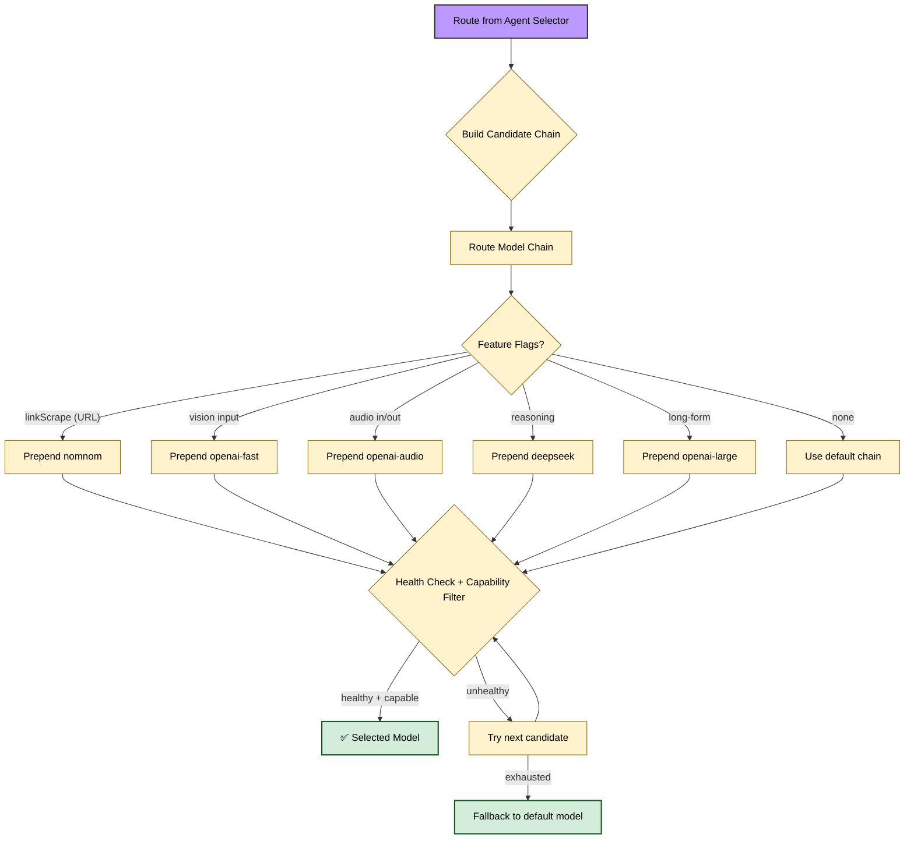

# 🧩 Model Reference

How Sage selects, resolves, and falls back across multiple AI models at runtime.

> [!NOTE]
> Model selection is fully automatic. You don't need to configure anything unless you want to override defaults.

---

## 🧭 Quick navigation

- [Route-Based Model Chains](#route-based-model-chains)
- [Model Resolution Flow](#model-resolution-flow)
- [Health-Based Fallbacks](#health-based-fallbacks)
- [Model Capabilities](#model-capabilities)
- [Configuration Overrides](#configuration-overrides)

---

<a id="route-based-model-chains"></a>

## 🔗 Route-Based Model Chains

The agent selector classifies each message into a **route** (`chat`, `coding`, `search`, `creative`). Each route has a preferred model chain — an ordered list of candidates tried in sequence:

| Route | Model Chain (first = preferred) | Use Case |
| :--- | :--- | :--- |
| `chat` | `openai-large` → `kimi` → `claude-fast` | General conversation |
| `coding` | `kimi` → `qwen-coder` → `deepseek` | Code generation, review, debugging |
| `search` | `gemini-search` → `perplexity-fast` → `perplexity-reasoning` | Web search + live facts |
| `image` | `imagen-4` → `flux` → `flux-2-dev` → `klein` | Image generation |

> [!TIP]
> The `creative` route uses the same chain as `chat` but with higher temperature (1.0–1.4) for more expressive responses.

Chains are defined in `ROUTE_MODEL_CHAINS`[^1].

---

<a id="model-resolution-flow"></a>

## 🔀 Model Resolution Flow



### Key Resolution Rules

1. **Allowlist first** — If `allowedModels` is provided, candidates are filtered to that list
2. **Feature-flag injection** — Vision, audio, reasoning, and long-form flags prepend specialized models
3. **Health filtering** — Unhealthy models (high error rate) are skipped automatically
4. **Capability matching** — Models must support required capabilities (vision, tools, search, etc.)
5. **Default fallback** — If all candidates fail, the `CHAT_MODEL` env var value is used

---

<a id="health-based-fallbacks"></a>

## 🏥 Health-Based Fallbacks

Sage tracks model health scores at runtime. When a model's error rate exceeds thresholds, it's automatically deprioritized:

```text
Model Request → Success? → Update Health Score
                  ↓ No
             Mark Degraded → Skip in Future Chains
```

Models recover automatically as their success rate improves over time[^2].

---

<a id="model-capabilities"></a>

## 📊 Model Capabilities

The model catalog tracks what each model can do. Models are matched against route requirements:

| Capability | Description | Required By |
| :--- | :--- | :--- |
| `vision` | Can process image inputs | Vision/creative routes |
| `audioIn` | Can accept audio input | Voice features |
| `audioOut` | Can produce audio output | Voice TTS |
| `tools` | Supports function calling | Agentic tool loop |
| `search` | Built-in web search | Search route |
| `reasoning` | Extended chain-of-thought | Complex analysis |

<details>
<summary><strong>How capabilities are detected</strong></summary>

1. **Runtime catalog** — Fetched from Pollinations API at startup, includes capability metadata
2. **Fallback catalog** — Built-in static definitions used when API is unavailable
3. **Heuristic inference** — Model names containing patterns like `search`, `perplexity`, `nomnom` auto-flag search capability[^3]

</details>

---

<a id="configuration-overrides"></a>

## ⚙️ Configuration Overrides

You can override model defaults via environment variables:

| Variable | Description | Default |
| :--- | :--- | :--- |
| `CHAT_MODEL` | Base model for chat route | `openai-large` |
| `SUMMARY_MODEL` | Model for channel summaries | `openai-large` |
| `FORMATTER_MODEL` | Model for JSON formatting | `qwen-coder` |
| `PROFILE_CHAT_MODEL` | Model for user profile updates | `deepseek` |

> [!WARNING]
> Changing these values affects all routes that use the corresponding model. The route-based chains (`ROUTE_MODEL_CHAINS`) are hardcoded and not configurable via env vars — they're tuned for optimal performance per route.

---

## 🔗 Related Documentation

- [⚙️ Configuration](CONFIGURATION.md) — All environment variables
- [🔀 Runtime Pipeline](../architecture/PIPELINE.md) — How models fit into the message flow
- [🤖 Agentic Architecture](../architecture/OVERVIEW.md) — High-level system design

---

[^1]: [`src/core/llm/model-resolver.ts`](../../src/core/llm/model-resolver.ts), lines 50–55
[^2]: [`src/core/llm/model-health.ts`](../../src/core/llm/model-health.ts)
[^3]: [`src/core/llm/model-catalog.ts`](../../src/core/llm/model-catalog.ts)
