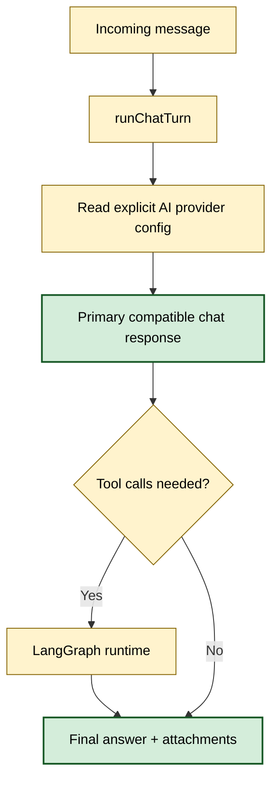

# 🧩 Model Reference

How Sage selects, constrains, and validates models in the current LangGraph-native runtime.

> [!NOTE]
> Message handling runs through one agent loop. The runtime model, profile model, and summary model are all explicitly configured through `AI_PROVIDER_*` variables.

---

## 🧭 Quick Navigation

- [Runtime Contract](#runtime-contract)
- [Model Resolution Flow](#model-resolution-flow)
- [Model Profiles](#model-profiles)
- [Search Providers](#search-providers)

---

## 🎯 Runtime Contract

Sage is provider-neutral at the runtime layer:

- Runtime chat uses `AI_PROVIDER_BASE_URL` plus `AI_PROVIDER_MAIN_AGENT_MODEL`
- Profile updates use `AI_PROVIDER_PROFILE_AGENT_MODEL`
- Channel summaries use `AI_PROVIDER_SUMMARY_AGENT_MODEL`
- `AI_PROVIDER_MODEL_PROFILES_JSON` is optional; use the live doctor/probe checks to verify whether the main agent model really supports Sage's strict structured-output contract
- Sage does not fetch a remote model catalog and does not ship built-in fallback model ids

This behavior is implemented in `runChatTurn` and the shared AI-provider transport/model adapter.

---

## 🔀 Model Resolution Flow

```mermaid
flowchart TD
    classDef logic fill:#fff3cd,stroke:#856404,stroke-width:1px,color:black
    classDef model fill:#d4edda,stroke:#155724,stroke-width:2px,color:black

    A[Incoming message]:::logic --> B[runChatTurn]:::logic
    B --> C[Read explicit AI provider config]:::logic
    C --> D[Primary compatible chat response]:::model
    D --> E{Tool calls needed?}:::logic
    E -->|Yes| F[LangGraph runtime]:::logic
    F --> G[Final answer + attachments]:::model
    E -->|No| G
```

### Key Rules

1. Chat turns use one explicitly configured runtime model per turn.
2. Tool usage extends capability without changing the runtime into a different route or agent.
3. Image and web capabilities come from tools plus the configured model-profile data, not from a separate runtime catalog.
4. Provider reasoning stays internal to the model. Sage does not surface or persist provider reasoning text in normal operation.

---

## 📊 Model Profiles

Sage trusts the operator-provided profile map in `AI_PROVIDER_MODEL_PROFILES_JSON` when you provide one.

Each model profile can describe:

| Field | Purpose |
| :--- | :--- |
| `maxContextTokens` | Input budget Sage should respect |
| `maxOutputTokens` | Output cap Sage should reserve for |
| `safetyMarginTokens` | Buffer for provider differences and explicit output reservations |
| `visionEnabled` | Whether image inputs are allowed |
| `strictStructuredOutputs` | Whether the model can satisfy Sage's strict decision/verification JSON-schema contract |

If a configured model is missing from the profile map, Sage falls back to the base runtime budgets instead of guessing. `strictStructuredOutputs` is now an optional trusted hint, not a boot requirement.

---

## 🔎 Search Providers

The web stack now uses only the explicitly configured search providers from `TOOL_WEB_SEARCH_PROVIDER_ORDER`.

---

## 🔗 Implementation References

- [`src/features/agent-runtime/agentRuntime.ts`](../../src/features/agent-runtime/agentRuntime.ts)
- [`src/platform/llm/model-budget-config.ts`](../../src/platform/llm/model-budget-config.ts)
- [`src/platform/llm/ai-provider-client.ts`](../../src/platform/llm/ai-provider-client.ts)
- [`src/platform/llm/ai-provider-chat-model.ts`](../../src/platform/llm/ai-provider-chat-model.ts)

## 🔗 Related Documentation

- [⚙️ Configuration](CONFIGURATION.md)
- [🔀 Runtime Pipeline](../architecture/PIPELINE.md)
- [🤖 Agentic Architecture](../architecture/OVERVIEW.md)
