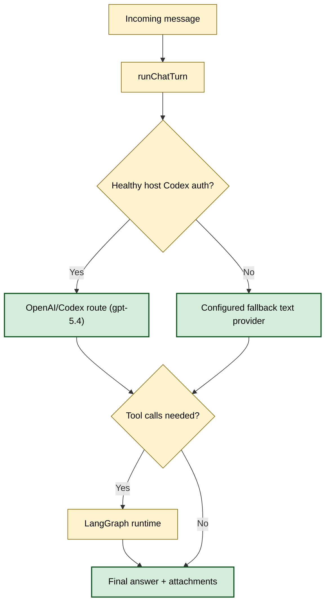

# 🧩 Model Reference

How Sage selects, constrains, and validates models in the current LangGraph-native runtime.

> [!NOTE]
> Message handling runs through one agent loop. The fallback/default text provider is still configured through `AI_PROVIDER_*`, but healthy host Codex auth now overrides all three text lanes automatically with the built-in OpenAI/Codex route.

---

## 🧭 Quick Navigation

- [Runtime Contract](#runtime-contract)
- [Model Resolution Flow](#model-resolution-flow)
- [Model Profiles](#model-profiles)
- [Live Verification](#live-verification)
- [Search Providers](#search-providers)

---

## 🎯 Runtime Contract

Sage is provider-neutral at the runtime layer:

- If healthy host Codex auth exists, runtime chat, profile updates, and channel summaries all route to OpenAI/Codex with the built-in `gpt-5.4` model
- Otherwise runtime chat uses `AI_PROVIDER_BASE_URL` plus `AI_PROVIDER_MAIN_AGENT_MODEL`
- Profile updates then use `AI_PROVIDER_PROFILE_AGENT_MODEL`
- Channel summaries then use `AI_PROVIDER_SUMMARY_AGENT_MODEL`
- `AI_PROVIDER_MODEL_PROFILES_JSON` is optional; use the live doctor/probe checks to verify whether the main agent model really supports Sage's Chat Completions tool-calling contract
- Sage does not fetch a remote model catalog; the only built-in text route is the host-auth-driven OpenAI/Codex override

This behavior is implemented in `runChatTurn` and the shared AI-provider transport/model adapter.

---

## 🔀 Model Resolution Flow


```mermaid
flowchart TD
    classDef logic fill:#fff3cd,stroke:#856404,stroke-width:1px,color:black
    classDef model fill:#d4edda,stroke:#155724,stroke-width:2px,color:black

    A[Incoming message]:::logic --> B[runChatTurn]:::logic
    B --> C{"Healthy host Codex auth?"}:::logic
    C -->|Yes| D["OpenAI/Codex route (gpt-5.4)"]:::model
    C -->|No| E["Configured fallback text provider"]:::model
    D --> F{Tool calls needed?}:::logic
    E --> F
    F -->|Yes| G[LangGraph runtime]:::logic
    G --> H[Final answer + attachments]:::model
    F -->|No| H
```

### Key Rules

1. Chat turns use one resolved provider route per turn: Codex when host auth is healthy, otherwise the configured fallback/default provider.
2. Tool usage extends capability without changing the runtime into a different route or agent.
3. Image and web capabilities come from tools plus the configured model-profile data, not from a separate runtime catalog.
4. Provider reasoning stays internal to the model. Sage does not surface or persist provider reasoning text in normal operation.

---

## 📊 Model Profiles

Sage trusts the operator-provided profile map in `AI_PROVIDER_MODEL_PROFILES_JSON` when you provide one.

Each model profile can describe:

| Field | Purpose |
| :--- | :--- |
| `maxContextTokens` | Input budget Sage should respect |
| `maxOutputTokens` | Output cap Sage should reserve for |
| `safetyMarginTokens` | Buffer for provider differences and explicit output reservations |
| `visionEnabled` | Whether image inputs are allowed |

If a configured model is missing from the profile map, Sage falls back to the base runtime budgets instead of guessing. Live provider compatibility is verified with the Chat Completions tool-calling probe instead of static model-profile capability flags.

---

<a id="live-verification"></a>

## ✅ Live Verification

The recommended verification path is:

```bash
npm run doctor -- --llm-ping
```

For a targeted direct probe:

```bash
npm run ai-provider:probe -- \
  --base-url https://your-provider.example/v1 \
  --model your-main-model \
  --api-key your-key
```

`AI_PROVIDER_MODEL_PROFILES_JSON` can tune limits, but it should not be treated as proof that a provider/model really supports Sage's tool-calling contract.

---

## 🔎 Search Providers

The web stack now uses only the explicitly configured search providers from `TOOL_WEB_SEARCH_PROVIDER_ORDER`.

---

## 🔗 Implementation References

- [`src/features/agent-runtime/agentRuntime.ts`](../../src/features/agent-runtime/agentRuntime.ts)
- [`src/platform/llm/model-budget-config.ts`](../../src/platform/llm/model-budget-config.ts)
- [`src/platform/llm/ai-provider-client.ts`](../../src/platform/llm/ai-provider-client.ts)
- [`src/platform/llm/ai-provider-chat-model.ts`](../../src/platform/llm/ai-provider-chat-model.ts)

## 🔗 Related Documentation

- [⚙️ Configuration](CONFIGURATION.md)
- [🔀 Runtime Pipeline](../architecture/PIPELINE.md)
- [🤖 Agentic Architecture](../architecture/OVERVIEW.md)
