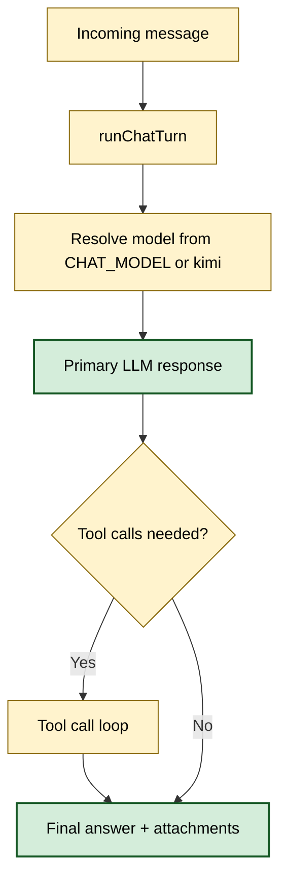

# 🧩 Model Reference

How Sage selects and tracks models in the current single-agent runtime.

> [!NOTE]
> Message handling now runs through one agent loop. The primary runtime model is controlled by `CHAT_MODEL`, while profile and summary work use their own background-model settings.

---

## 🧭 Quick Navigation

- [Default Runtime Model](#default-runtime-model)
- [Model Resolution Flow](#model-resolution-flow)
- [Health Tracking](#health-tracking)
- [Search Fallback Models](#search-fallback-models)
- [Model Capabilities](#model-capabilities)
- [Configuration Overrides](#configuration-overrides)

---

## 🎯 Default Runtime Model

For chat turns, Sage resolves a single runtime model from configuration:

- Uses `CHAT_MODEL` when set
- Falls back to `kimi` when `CHAT_MODEL` is empty
- Executes tool calls inside the same runtime loop rather than switching to route-specific runtimes

This behavior is implemented in `runChatTurn` in `src/features/agent-runtime/agentRuntime.ts`.

---

## 🔀 Model Resolution Flow

```mermaid
flowchart TD
    classDef logic fill:#fff3cd,stroke:#856404,stroke-width:1px,color:black
    classDef model fill:#d4edda,stroke:#155724,stroke-width:2px,color:black

    A[Incoming message]:::logic --> B[runChatTurn]:::logic
    B --> C[Resolve model from CHAT_MODEL or kimi]:::logic
    C --> D[Primary LLM response]:::model
    D --> E{Tool calls needed?}:::logic
    E -->|Yes| F[Tool call loop]:::logic
    F --> G[Final answer + attachments]:::model
    E -->|No| G
```

### Key Rules

1. Chat turns use one runtime model per turn.
2. Tool usage extends capability without changing the runtime into a different route or agent.
3. Image and web capabilities come from tools plus model capabilities, not from a separate selector pipeline.

---

## 🏥 Health Tracking

Sage records model outcomes and maintains rolling health scores in `ModelHealthState`.

- Health snapshots are persisted only when `TRACE_ENABLED=true` and the database path is available.
- If `TRACE_ENABLED=false`, health tracking is memory-only even with a healthy database.
- The runtime also falls back to in-memory tracking if persistence fails.
- Health data is used for diagnostics and degraded-mode signaling, not for multi-agent routing.

---

## 🔎 Search Fallback Models

The main chat runtime still uses `CHAT_MODEL`, but the web stack has guarded fallback models for search-heavy recovery paths:

- `gemini-search`
- `perplexity-fast`
- `perplexity-reasoning`

Those fallbacks are used by the web/search integrations when needed; they are not separate top-level chat routes.

---

## 📊 Model Capabilities

Model capability data comes from the runtime catalog with fallback definitions.

| Capability | Description |
| :--- | :--- |
| `vision` | Accepts image inputs |
| `audioIn` | Accepts audio inputs |
| `audioOut` | Produces audio outputs |
| `tools` | Supports function/tool calling |
| `search` | Supports search-oriented behavior |
| `reasoning` | Better long-form or complex reasoning |
| `codeExec` | Supports code execution flows when the provider exposes them |

When runtime catalog fetch fails, Sage uses fallback model metadata plus manual capability overrides from `model-catalog.ts`.

---

## ⚙️ Configuration Overrides

| Variable | Description | Starter value |
| :--- | :--- | :--- |
| `CHAT_MODEL` | Runtime chat model for `runChatTurn` | `kimi` |
| `SUMMARY_MODEL` | Model for channel summaries | `deepseek` |
| `PROFILE_CHAT_MODEL` | Model for user profile updates | `deepseek` |
| `LLM_MODEL_LIMITS_JSON` | Manual token-limit override map | *(empty)* |

> [!WARNING]
> Changing `CHAT_MODEL` affects every chat turn because model selection is centralized in the single-agent runtime.

---

## 🔗 Implementation References

- [`src/features/agent-runtime/agentRuntime.ts`](../../src/features/agent-runtime/agentRuntime.ts)
- [`src/platform/llm/model-health.ts`](../../src/platform/llm/model-health.ts)
- [`src/platform/llm/model-catalog.ts`](../../src/platform/llm/model-catalog.ts)

## 🔗 Related Documentation

- [⚙️ Configuration](CONFIGURATION.md)
- [🔀 Runtime Pipeline](../architecture/PIPELINE.md)
- [🤖 Agentic Architecture](../architecture/OVERVIEW.md)
