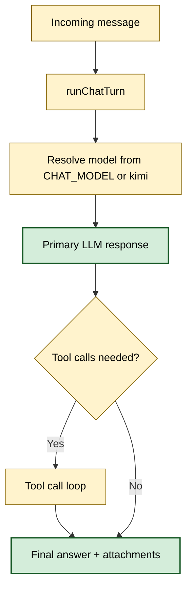

# 🧩 Model Reference

  

How Sage selects and tracks models in the current single-agent runtime.

> [!NOTE]
> Message handling now runs through one agent loop. Model behavior is primarily driven by `CHAT_MODEL` and tool availability.

---

## 🧭 Quick Navigation

- [Default Runtime Model](#default-runtime-model)
- [Model Resolution Flow](#model-resolution-flow)
- [Health Tracking](#health-tracking)
- [Model Capabilities](#model-capabilities)
- [Configuration Overrides](#configuration-overrides)

---

## 🎯 Default Runtime Model

For chat turns, Sage resolves a single runtime model from configuration:

- Uses `CHAT_MODEL` when set.
- Falls back to `kimi` when `CHAT_MODEL` is empty.
- Executes tool calls (memory/search/image/etc.) inside the same runtime loop.

This behavior is implemented in `runChatTurn` in `src/core/agentRuntime/agentRuntime.ts`.

---

## 🔀 Model Resolution Flow

```mermaid
flowchart TD
    classDef logic fill:#fff3cd,stroke:#856404,stroke-width:1px,color:black
    classDef model fill:#d4edda,stroke:#155724,stroke-width:2px,color:black

    A[Incoming message]:::logic --> B[runChatTurn]:::logic
    B --> C[Resolve model from CHAT_MODEL or kimi]:::logic
    C --> D[Primary LLM response]:::model
    D --> E{Tool calls needed?}:::logic
    E -->|Yes| F[Tool call loop]:::logic
    F --> G[Final answer + attachments]:::model
    E -->|No| G
```

### Key Rules

1. Model choice is single-agent, not route-mapped.
2. Tool usage extends capability without switching to route-specific runtimes.
3. Attachments from tools are returned with the final response payload.

---

## 🏥 Health Tracking

Sage records model outcomes (success/failure, optional latency) and maintains rolling health scores.

- Health state is persisted when trace persistence is available.
- Runtime falls back to in-memory mode if persistence is unavailable.
- Health snapshots are exposed for diagnostics and operational checks.

---

## 📊 Model Capabilities

Model capability data comes from a runtime catalog with fallback definitions.

| Capability | Description |
| :--- | :--- |
| `vision` | Accepts image inputs |
| `audioIn` | Accepts audio inputs |
| `audioOut` | Produces audio outputs |
| `tools` | Supports function/tool calling |
| `search` | Supports web/search-oriented behavior |
| `reasoning` | Better long-form or complex reasoning |
| `codeExec` | Supports code execution flows (provider-dependent) |

When runtime catalog fetch fails, Sage uses fallback model metadata and manual capability overrides.

---

## ⚙️ Configuration Overrides

| Variable | Description | Default |
| :--- | :--- | :--- |
| `CHAT_MODEL` | Runtime chat model for `runChatTurn` | `kimi` |
| `SUMMARY_MODEL` | Model for channel summaries | `deepseek` |
| `PROFILE_CHAT_MODEL` | Model for user profile updates | `deepseek` |

> [!WARNING]
> Changing `CHAT_MODEL` affects all chat turns because model selection is centralized in the single-agent runtime.

---

## 🔗 Implementation References

- [`src/core/agentRuntime/agentRuntime.ts`](../../src/core/agentRuntime/agentRuntime.ts)
- [`src/core/llm/model-health.ts`](../../src/core/llm/model-health.ts)
- [`src/core/llm/model-catalog.ts`](../../src/core/llm/model-catalog.ts)

## 🔗 Related Documentation

- [⚙️ Configuration](CONFIGURATION.md)
- [🔀 Runtime Pipeline](../architecture/PIPELINE.md)
- [🤖 Agentic Architecture](../architecture/OVERVIEW.md)
