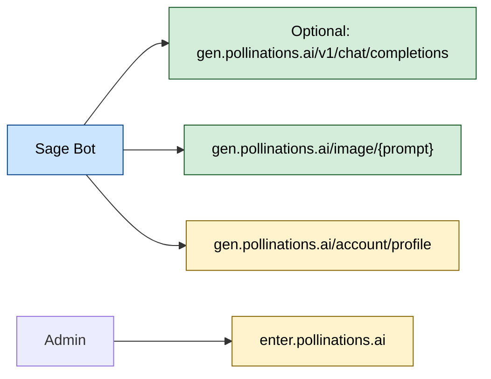

# 🐝 Pollinations.ai Integration

<p align="center">
  
</p>

This guide documents Sage's **Pollinations.ai provider integration**: the current hosted/server-key flow, the built-in image generation/editing path, and how to point Sage's OpenAI-compatible chat runtime at Pollinations when you want to use it as the upstream endpoint.

This document is written for:

- **Users** (how to use Sage in Discord)
- **Server admins** (how BYOP keys work)
- **Self-hosters** (which `.env` settings matter)
- **Reviewers** (what Sage calls upstream, and how to verify it)

> [!IMPORTANT]
> Sage can target another OpenAI-compatible endpoint for self-hosted runtime chat requests via `AI_PROVIDER_BASE_URL`, but Sage's built-in image generation and hosted server-key validation flow remain Pollinations-specific today.



---

## 🧭 Quick navigation

- [✅ What the current Pollinations-specific integration covers](#-what-the-current-pollinations-specific-integration-covers)
- [🔗 Hosts and endpoints (the “unified” surface)](#-hosts-and-endpoints-the-unified-surface)
- [🌸 BYOP: server-wide keys in Discord](#-byop-server-wide-keys-in-discord)
- [⚙️ Self-host configuration (`.env`)](#-self-host-configuration-env)
- [🧠 Text + vision (OpenAI-compatible chat)](#-text--vision-openai-compatible-chat)
- [🎨 Image generation + image editing](#-image-generation--image-editing)
- [✅ Verify Pollinations upstream (smoke tests)](#-verify-pollinations-upstream-smoke-tests)
- [🧯 Troubleshooting](#-troubleshooting)
- [🔗 Resources](#-resources)

---

## ✅ What the current Pollinations-specific integration covers

| Capability | What users see in Discord | What Sage calls upstream |
|---|---|---|
| **Optional chat endpoint** | Runtime conversations when `AI_PROVIDER_BASE_URL` points at Pollinations | OpenAI-compatible `chat/completions` on `gen.pollinations.ai` |
| **Optional vision endpoint** | Image analysis when `AI_PROVIDER_BASE_URL` points at Pollinations and the chosen model supports vision | `chat/completions` with `image_url` content parts |
| **Image generation** | “Sage, draw …” → image attachment | `GET /image/{prompt}` on `gen.pollinations.ai` |
| **Image editing** | Reply to an image: “make it watercolor” → edited image | Same image endpoint + `image=<url>` parameter |

In the current repo, Pollinations-specific surfaces are the BYOP key-validation flow plus built-in image generation/editing. Runtime chat itself is provider-agnostic and uses whatever OpenAI-compatible endpoint you configure via `AI_PROVIDER_BASE_URL`.

---

## 🔗 Hosts and endpoints (the “unified” surface)

Sage uses these Pollinations hosts:

- **Dashboard + accounts + keys**: <https://enter.pollinations.ai> (manage keys, usage, account)
- **OpenAI-compatible API base**: `gen.pollinations.ai/v1`
- **Image bytes endpoint**: `gen.pollinations.ai/image/{prompt}`

> [!NOTE]
> Sage's current integration uses the `enter.pollinations.ai` dashboard plus `gen.pollinations.ai` API endpoints.

---

## 🌸 BYOP: server-wide keys in Discord

Sage supports **Bring Your Own Pollen (BYOP)** for its built-in Pollinations integration: a **server admin** sets a Pollinations **Secret key** once, and Sage uses it for that server.

### Key types (what to paste)

- Use **Secret keys** that start with `sk_...`
- Sage trims accidental leading/trailing whitespace before validating and storing a key.
- Do **not** paste keys in public channels. Use Sage’s setup modal and ephemeral admin-only responses.

### How the hosted setup card flow works

1. Trigger Sage in a guild with no usable key.
2. Sage gives an auth link to Pollinations:
   - <https://enter.pollinations.ai/authorize?redirect_url=https://pollinations.ai/&permissions=profile,balance,usage>
3. After you sign in, Pollinations redirects you to a URL containing:
   - <https://pollinations.ai/#api_key=sk_...>
4. Copy the `sk_...` part and submit it through `Set Server Key`

### How Sage validates your key

Before storing, Sage verifies the key by calling:

- `GET gen.pollinations.ai/account/profile` with header `Authorization: Bearer sk_...`

If that succeeds, Sage stores the key **scoped to the current Discord server**.
Sage accepts successful authenticated profile responses and extracts account fields (`id`, `username`, balance) when available.

### Key precedence (what Sage actually uses)

When Sage needs a key, it resolves in this order:

1. **Server key** (set through Sage's setup card + modal for the guild)
2. **Optional shared host auth path** if the deployment already has usable host Codex auth or a host API key fallback configured
3. If neither exists, Sage returns setup guidance and cannot complete hosted/server-key-path chat requests until a key is configured.

---

## ⚙️ Self-host configuration (`.env`)

If you want Sage's OpenAI-compatible chat runtime to use Pollinations, these are the minimum settings (see `.env.example` for the full list):

```env
AI_PROVIDER_BASE_URL=https://gen.pollinations.ai/v1
AI_PROVIDER_MAIN_AGENT_MODEL=your-main-agent-model

# Optional: Shared host fallback key for the configured chat provider
AI_PROVIDER_API_KEY=
```

If you want Sage to prefer shared host Codex auth instead, run `npm run auth:codex:login` on the host and keep `AI_PROVIDER_API_KEY` as the fallback path. When that host login is healthy, Sage routes the main, profile, and summary text lanes to OpenAI/Codex automatically; it does not try to reuse Codex auth against Pollinations endpoints.

### Recommended: keep `AI_PROVIDER_BASE_URL` at the `/v1` root

Use the `/v1` root here. The OpenAI-compatible client adds the chat endpoint path itself, and keeping the base URL at the API root avoids double-path mistakes.

### Common model overrides (optional)

These are common overrides if you want Pollinations to back more than the primary runtime turn:

```env
# Main baseline chat model for runtime turns
AI_PROVIDER_MAIN_AGENT_MODEL=your-main-agent-model

# Profile/memory updates
AI_PROVIDER_PROFILE_AGENT_MODEL=your-profile-agent-model

# Channel summaries
AI_PROVIDER_SUMMARY_AGENT_MODEL=your-summary-agent-model
```

> [!NOTE]
> Image generation uses the model configured via `IMAGE_PROVIDER_MODEL` (Pollinations currently defaults to `imagen-4` in hosted deployments). See the Image section below for details.

---

## 🧠 Text + vision (OpenAI-compatible chat)

If you point `AI_PROVIDER_BASE_URL` at Pollinations, Sage uses the OpenAI-compatible endpoint:

- `POST gen.pollinations.ai/v1/chat/completions`

Runtime request shaping:

- Sage consolidates multiple system instructions into one system message block before sending.
- Sage then normalizes message sequencing for strict providers (for example to avoid invalid role alternation).
- Sage bounds client-side timeout and retry overrides to safe ranges (timeout: `1000`-`300000` ms, retries: `0`-`5`) to avoid invalid values causing immediate aborts or skipped execution attempts.

### Vision message shape (conceptual)

When users attach an image, Sage can send multimodal content:

```json
{
  "model": "your-chat-model",
  "messages": [
    {
      "role": "user",
      "content": [
        { "type": "text", "text": "Describe this image." },
        { "type": "image_url", "image_url": { "url": "<image-url>" } }
      ]
    }
  ]
}
```

> [!TIP]
> If you’re self-hosting and debugging, test with the official API docs for the current request schema.

---

## 🎨 Image generation + image editing

Sage can:

- **Generate** images from a text prompt
- **Edit** images when the user replies to an image (image-to-image)

### What users do in Discord

No special command surface is required.

**Generate**

- `Sage, draw a neon cyberpunk street scene at night`

**Edit**

- Reply to an image and say:
  - `Sage, make this look like a watercolor poster`

### What Sage calls upstream

Sage fetches raw image bytes from Pollinations:

- `GET gen.pollinations.ai/image/{prompt}`

Sage appends query parameters:

- `model` (configured via `IMAGE_PROVIDER_MODEL`; current Pollinations default: `imagen-4`)
- `seed` (random per request)
- `nologo=true`
- `key=sk_...` (only when BYOP/global key is available)

When editing, Sage also includes:

- `image=<url>` (the source image URL)

> [!NOTE]
> Pollinations supports additional image parameters (e.g., sizes) in some setups and clients, but Sage documents only what it currently uses by default.

### “Agentic” prompt refinement (why results look better)

Before requesting the image, Sage runs a **prompt refiner**:

- Uses an LLM to rewrite the user’s request into an image-optimized prompt
- Pulls in **recent conversation context** (last ~10 messages)
- Includes reply context and the input image (when editing)

This is why “make it more cyberpunk” works even without restating the full prompt.

---

## 🔊 Voice (STT) in Sage

Sage's optional Discord voice transcription features (local STT) are handled by Sage's optional local voice service, not Pollinations.

See: `docs/architecture/VOICE.md`.

---

## ✅ Verify Pollinations upstream (smoke tests)

These are fast checks you can run outside Discord to confirm upstream connectivity.

### 1) Check your key is valid

```bash
POLLINATIONS_API="https://gen.pollinations.ai"
curl -sS "$POLLINATIONS_API/account/profile" -H "Authorization: Bearer sk_YOUR_KEY" | head
```

### 2) Chat completion

```bash
POLLINATIONS_API="https://gen.pollinations.ai"
curl -sS "$POLLINATIONS_API/v1/chat/completions" -H "Authorization: Bearer sk_YOUR_KEY" -H "Content-Type: application/json" -d '{
    "model": "your-chat-model",
    "messages": [{"role":"user","content":"Say hello in one sentence."}]
  }' | head
```

### 3) Image generation

```bash
POLLINATIONS_API="https://gen.pollinations.ai"
curl -L "$POLLINATIONS_API/image/a%20cat%20wearing%20sunglasses?model=imagen-4&seed=123&nologo=true&key=sk_YOUR_KEY" --output test_image
```

---

## 🧯 Troubleshooting

### "Invalid API key" on set

- Re-open Sage's setup card, click `Get Pollinations Key`, and ensure you copied the exact `sk_...` token from the redirected URL.
- Confirm the key was created in the current Pollinations dashboard flow and not copied with extra characters.

### Shared deployment is slow or rate-limited

- Configure a server key via BYOP.
- Pollinations traffic varies by model and load; retry can help.

### Image edit didn’t use the image I replied to

- Make sure you used Discord **Reply** (not just quoted text).
- Sage uses images from: message attachments, replied-to message attachments, stickers, embed preview images (when available), and direct image URLs ending in common extensions (for example, `.png`, `.jpg`, `.webp`, `.gif`).
- If you invoke Sage with an image but no text (mention/wakeword only), Sage will apply a default “describe the image” prompt.

### Voice transcription does nothing

- Ensure the bot is in a voice channel (`Sage, join my voice channel`)
- Ensure `VOICE_STT_ENABLED=true`
- Ensure the local voice service is running and reachable at `VOICE_SERVICE_BASE_URL` (see `config/services/self-host/docker-compose.voice.yml`)

---

## 🔗 Resources

- Pollinations homepage: <https://pollinations.ai>
- Dashboard (keys, usage): <https://enter.pollinations.ai>
- API reference: <https://enter.pollinations.ai/api/docs>
- Featured apps: <https://pollinations.ai/apps>

---

<p align="center">
  <sub>This page documents Sage's optional Pollinations provider surfaces. Sage's LangGraph runtime itself is provider-agnostic and targets any OpenAI-compatible chat endpoint configured through `AI_PROVIDER_BASE_URL`.</sub>
</p>
